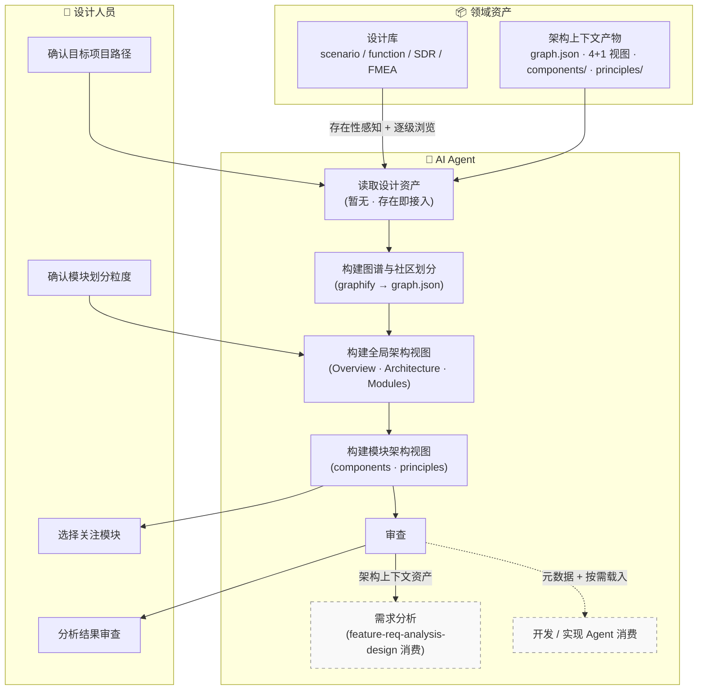
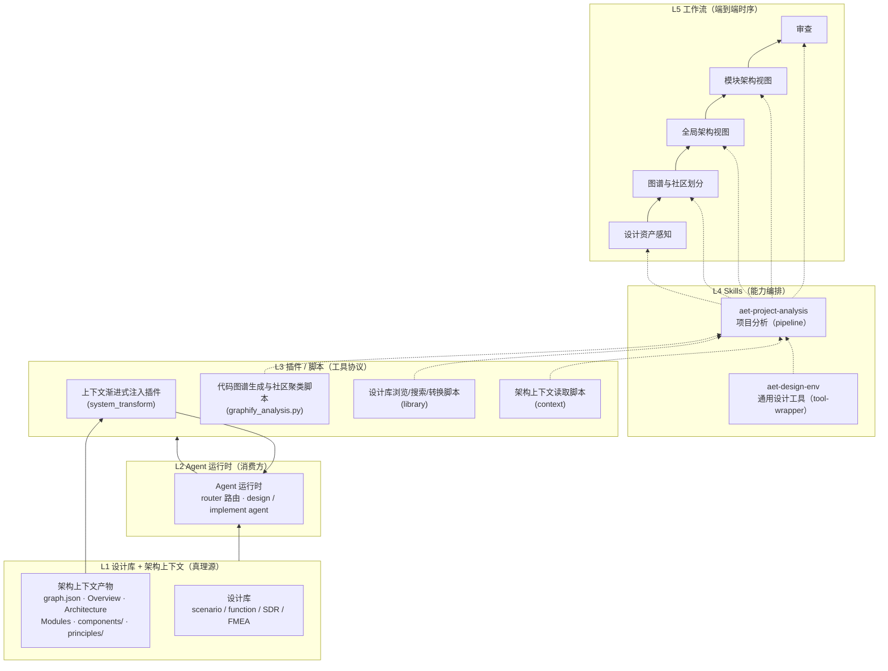
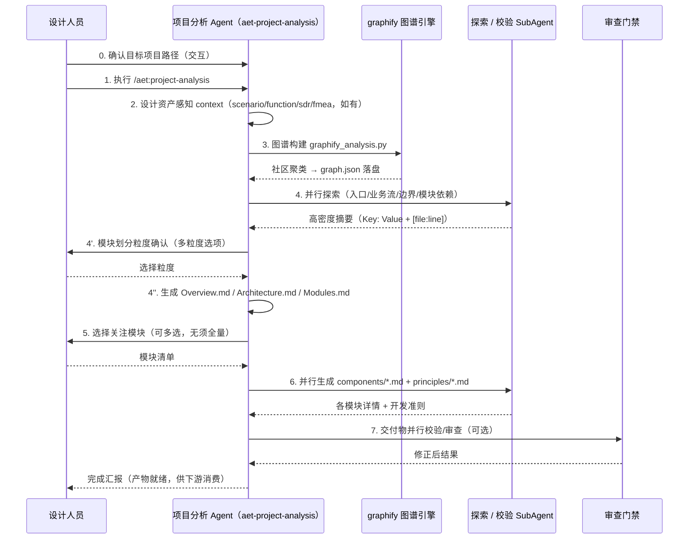
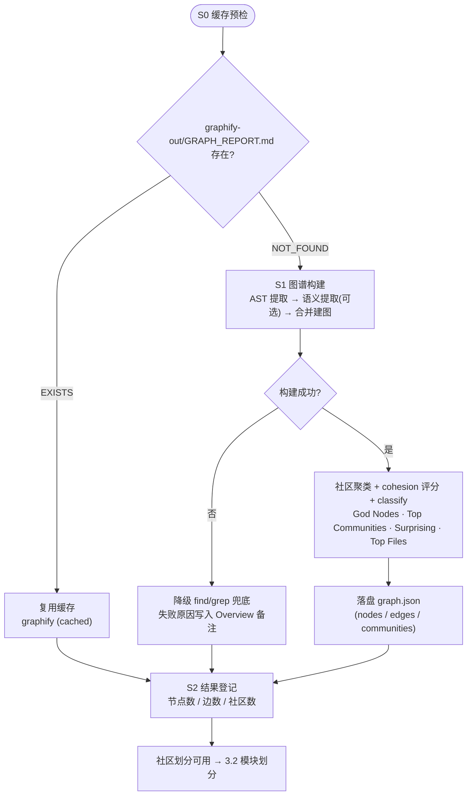
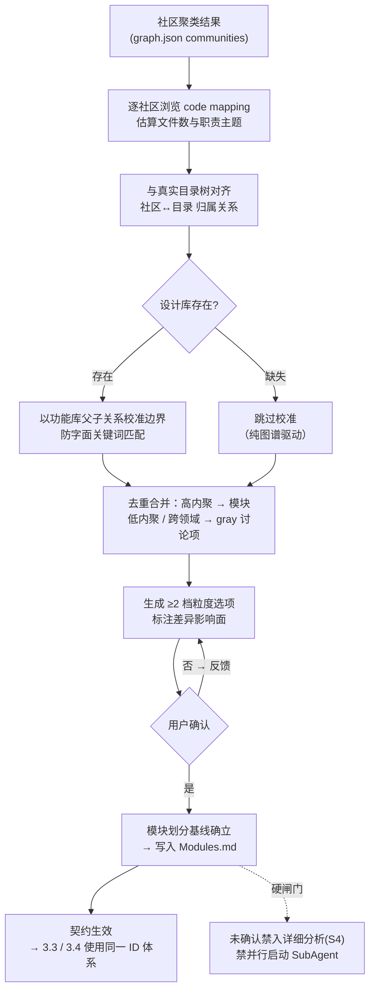
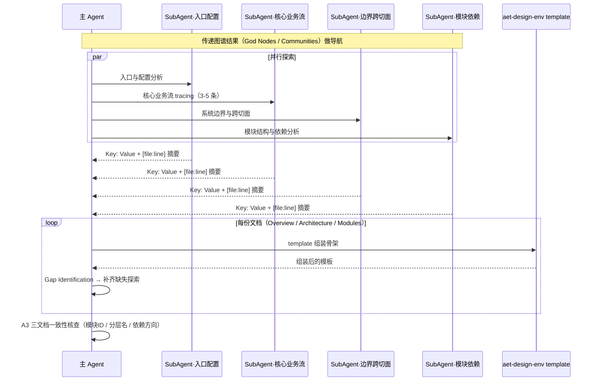
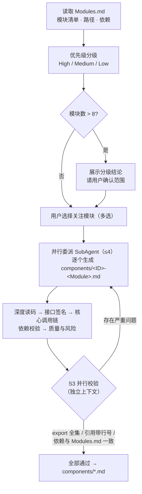
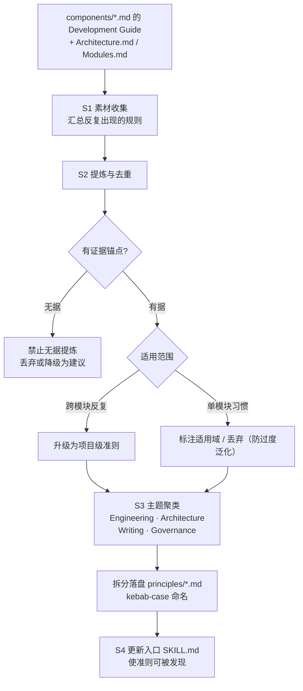
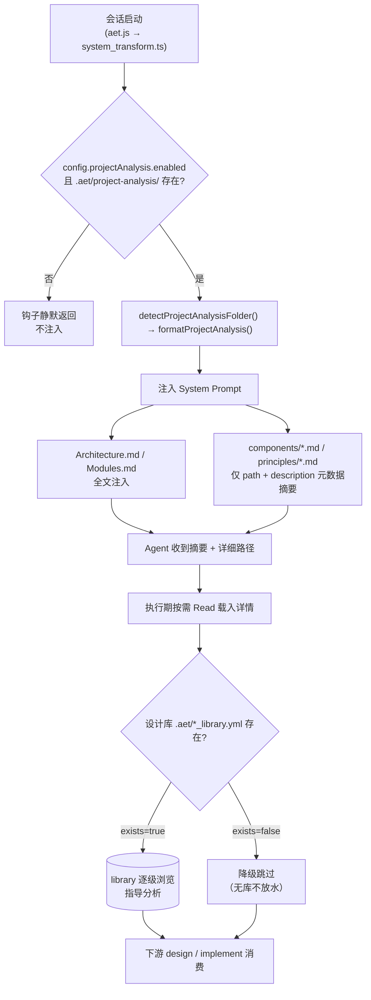
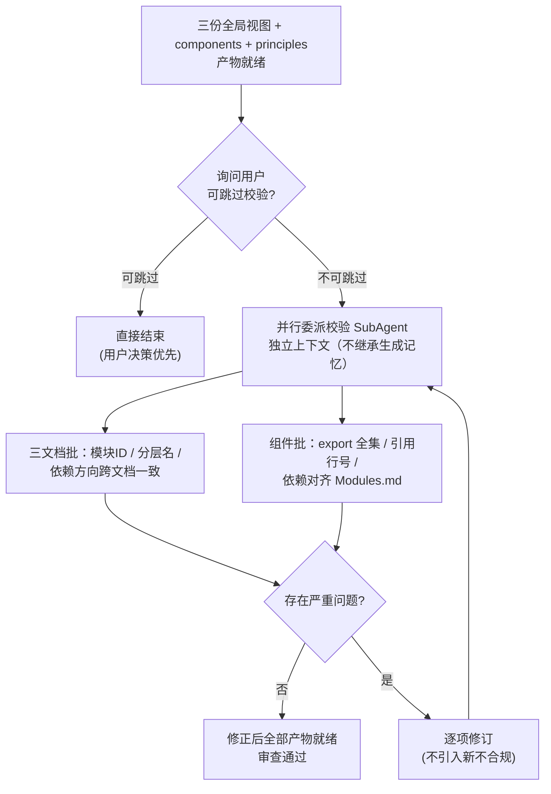

# AET 特性设计文档 · 架构上下文

## 需求描述

**背景与问题**：单个 AI Agent 面对"原始仓库 → 可复用、可审查的架构认知"的长程任务时，普遍存在四类失效：
1. **盲目探索与规模膨胀** —— 无图直接遍历大仓库：`find` / `grep` 命中满天飞、无方向深挖，Token 与耗时暴涨，结论还被抽样偏差带偏；项目越大失效越明显；
2. **模块划分靠主观印象** —— 把目录树当模块树，分不清"目录 / 叶子 / 社区"，凭印象编造模块边界；层级识别错误静默带进下游所有文档；
3. **上下文爆炸与漂移** —— 一次性吞入整库 / 整仓库，架构、模块、组件、原则同批进入主上下文，关键信息被稀释，越往后越漂移；
4. **全量分析无重点、反复返工** —— 每个模块同等深度剖解，长程任务难收敛；下游真正要的模块细节缺失、不要的冗余堆积，回头补钻即返工。

**特性目标**：把"仓库理解"建成**结构化、可审查、可复用、渐进注入**的架构上下文流水线 —— 输入目标项目路径与（可选）设计资产，**先图谱聚类客观划分社区**，再生成 4+1 **全局视图**与**模块划分**，随后**按需选择**关注模块产出组件级详情与**开发准则**，最终以"元数据注入 + 按需载入"交付给下游需求分析与功能设计。多阶段产物全部落盘为可复用资产。

**范围**：
- **含**：代码图谱构建与社区划分（`graph.json`）、模块划分确认（社区 → 模块）、4+1 全局视图（Overview / Architecture / Modules）、模块选择与详细分析（`components/*.md`）、开发准则提取（`principles/*.md`）、架构上下文渐进式注入、交付物评审门禁、SubAgent 并行分析与密度约束。
- **不含**：需求分析与功能设计（由 `feature-req-analysis-design.md` 承担，本特性是其**架构上下文前置**）、漂移检测与变更流程（`aet-req-drift-detect` / `aet-req-refine`）、实现 / 测试 / 发布 / 运维域、设计库内容建设（上游沉淀，本特性只读）。

**价值主张**：模块划分从"目录猜想"升级为"**社区聚类的客观依据 + 人工确认**"；先划分、再逐个探索，对项目规模敏感度低，大型项目也能保持结论可信与上下文克制；架构上下文以"**元数据摘要 + 详细路径**"渐进注入，详情按需载入，杜绝一次性大灌。**doc 是特性的载体**，图谱 schema、流程、检查项全部落盘为可执行 Skill / SOP / 模板与 checklist。

---

## 1. 总体方案

### 1.1 特性位置总览

特性位于 AET 设计域**前置**，由三层协作构成：**设计人员**（确认目标路径、确认模块划分粒度、选择关注模块、批注审查）、**AI Agent**（编排执行核心分析流程）、**领域资产**（设计库 + 架构上下文产物，上游沉淀 / 一手生成）。核心流程为「读取设计资产（暂无 · 存在即接入）→ 构建图谱与社区划分 → 构建全局架构视图 → 构建模块架构视图 → 审查（审查门禁）」；下游需求分析（`feature-req-analysis-design.md`）与**实现 Agent** 作为消费方以虚线框标示，不属于本特性流程本体。总览如下：



**三层职责划分**：

| 角色层 | 职责 | 与特性的交互方式 |
|---|---|---|
| **设计人员** | 确认目标项目路径、模块划分粒度、选择关注模块、分析结果审查批注 | 对话框交互（路径确认、粒度选项确认、模块多选）+ 交付物审查 |
| **AI Agent** | 编排核心分析流水线：设计资产感知 → 图谱与社区划分 → 全局视图 → 模块视图 → 审查；SubAgent 承担并行探索与校验 | 主 Agent 执行编排，SubAgent 探索 / 校验，防止上下文污染 |
| **领域资产** | 设计库（存在即接入，指导模块划分与分析）；架构上下文产物（graph.json / 4+1 视图 / components / principles，供下游消费） | 存在性感知（`context`）+ 逐级浏览（`library`），**禁止直读**；产物落盘 `.aet/project-analysis/` |

### 1.2 总体设计原则

本特性遵循 AET 设计域的三条正交原则（与需求分析特性同构），并**新增一条本特性特有的分级不变量**：

1. **Skill 分层建模**（`<>` 包裹）：每个 SKILL.md 用 `<role>` / `<policy>` / `<guideline>` / `<instruct>` / `<constraint>` / `<condition>` 等标签分离"角色、目标、边界、步骤、红线、路由"。分析主体（图谱构建 / 视图分析师 / 模块剖析 / 评审员）彼此独立，生成偏好发散、评审偏好收敛；改进角色不动步骤，改约束不动流程。
2. **SOP 拆分、按需加载**：SKILL.md 只保留编排骨架（阶段序列与完成标准），具体执行步骤拆到 `workflows/sop-*.md`，**每阶段执行时才加载对应 SOP**。主上下文常驻的只有骨架，细则用完即弃，互不叠加。
3. **脚本构建为可移植执行件**：Node 工具脚本（`aet-design-env.mjs`）由 `scripts/src/*.ts` 构建为**零第三方依赖单文件 mjs**；图谱脚本为**单文件 python**（`graphify_analysis.py`），自动检测 `~/.aet/venv`，未装则降级到 find/grep 兜底。
4. **先划分、后探索；先元数据、后详情**（本特性特有的分级不变量）：① 模块划分必须以**社区聚类**为先导、以用户确认为终点，禁止跳过划分直接盲目探索；② 对下游只暴露**元数据摘要 + 详细路径**，模型按需载入各模块与准则的详情，杜绝整库 / 整文件进入主上下文。

### 1.3 架构设计（4+1 视图）

#### 1.3.1 逻辑视图（自下而上）

本特性横跨设计域支撑栈的下五层，依赖方向自下而上（下层被上层引用，上层编排下层）：



- **L1 设计库 + 架构上下文**：唯一持久化真理源，只读不写；设计库由 `context` 探测存在性、`library` 逐级浏览；架构上下文产物是本特性**一手写盘**、下游只读资产。
- **L2 Agent 运行时**：最终消费方；接收注入的"摘要 + 路径"，详情按需载入；**永不直读整库**。
- **L3 插件 / 脚本**：把"上下文渐进式注入插件（`system_transform`）、代码图谱生成与社区聚类脚本（`graphify_analysis.py`）、设计库浏览/搜索/转换脚本（`library`）、架构上下文读取脚本（`context`）"固化为确定性脚本协议，Agent 通过 bash 调用并读 stdout，而非靠提示词劝说。
- **L4 Skills**：`aet-project-analysis` 编排整个分析流水线，`aet-design-env` 提供通用工具能力。
- **L5 工作流**：`设计资产感知 → 图谱与社区划分 → 全局架构视图 → 模块架构视图 → 审查` 的阶段链，产物（graph.json → 全局视图 → components/principles）作为阶段间契约。

**分层不变量**：下层是真理源与确定性协议，上层是编排与消费；改动下层协议时上层无需变化（如 graphify 换成其它图谱引擎，`graph.json` 的 communities 输出结构变化但 L4/L5 仍读同一 schema）。

#### 1.3.2 进程视图

**主流程时序**（Mermaid sequence），展示用户（设计人员）在链路上的全部触点（步骤编号对齐 §1.4 用户执行流程）：



**上下文感知与库浏览的进程形态**：`context` 每个库插件独立探测 `.aet/*.yml`，输出 `<exists>/<path>/<instruction>` XML 元数据驱动技能**存在性二分支**（存在 → 进入该库指导模块划分；缺失 → 降级为纯图谱驱动）。`library` 每次只返回一层的折叠视图，**感知 ≠ 浏览**。

**并行进程**：图谱社区的深度探索、模块详情生成、交付物校验均可委派 SubAgent（探索类 ≤4、校验类按产物数），探索类任务限定输出密度（`Key: Value` + `[file:line]`），把整文件挡在主上下文之外 —— 这是大型项目"先划分、再逐个探索"得以成立的关键形态。

#### 1.3.3 开发视图（组件与文件映射）

| 组件 | 路径 | 职责 |
|---|---|---|
| 项目分析技能 | `skills/aet-project-analysis/SKILL.md`（演进自 `aet-analyzing-project`，待建） | pipeline(5)：S1 设计资产感知 → S2 图谱与社区划分 → S3 全局视图 → S4 模块分析 → S5 评审 |
| 项目分析 SOP | `skills/aet-project-analysis/workflows/sop-{asset-perception,graph-community,overview,architecture,modules,module-detail,principles,review}.md` | 每阶段执行细则，按需加载 |
| 图谱脚本 | `skills/aet-project-analysis/script/graphify_analysis.py` | graphify 驱动（venv 自动切换），输出 `graph.json` + 社区聚类结果 |
| 图谱 schema | `skills/aet-project-analysis/assets/graph-schema.md` | `graph.json` 结构说明（nodes / edges / communities / cohesion） |
| 模板集 | `skills/aet-project-analysis/references/_templates/project-analysis/` | `overview-template.md` · `architecture-template.md` · `modules-template.md` · `module-detail-template.md` · `principles-template.md` |
| 通用设计工具 | `skills/aet-design-env/SKILL.md` + `scripts/aet-design-env.mjs` | tool-wrapper；`context / template / checklist / library` 6 子命令；无依赖 bundle |
| 架构上下文注入 | `src/plugins/opencode/hooks/system_transform.ts` · `.platform/utils/project-analysis.js` | 元数据注入（Architecture/Modules 全文；components/principles 仅 path+description） |
| 入口 Agent | `commands/project-analysis.md` → `agents/project-analysis/prompts/main.md`（待建） | `/aet:project-analysis` 命令路由到 aet-project-analysis agent |
| 工作流注册 | `src/config/workflow.json` → `project-analysis` | stages：`graph-build` / `global-views` / `module-analysis` / `review` |
| 红队 / 校验 | `skills/aet-project-analysis/references/deliverable-review.md`（复用 `references/deliverable-review.md`） | 产物事实核查与计分 |

**模板 / 清单同源**：`overview-template.md` 等（生成骨架）与 checklist（审查项）共用组件，组件 frontmatter 的 `checklist:` 字段与正文**共址演化** —— 生成时组装骨架，审查时组装清单，避免"模板一套检查项另一套"的漂移（复用 `aet-design-env` `template` / `checklist` 子命令）。

#### 1.3.4 物理视图（部署形态）

| 部署件 | 说明 |
|---|---|
| 编码 Agent 宿主 | Skills 以目录形态装入 OpenCode / Claude Code / xiaoo 等宿主；`/aet:project-analysis` 由宿主插件注入命令 |
| Node.js 运行时 | ≥ 18；执行 `aet-design-env.mjs` 等无依赖 bundle |
| Python 运行时 | 执行 `graphify_analysis.py`；优先 `~/.aet/venv`（install.sh 预装 graphify），缺失自动回退系统 python / 兜底 find+grep |
| Git 仓库 | 提供代码真理、`base_commit` 基线（供后续漂移检测） |
| 盘上资产库 | `.aet/*_library.yml`（scenario / function / security_sdr / reliability_sdr / fmea，可选） |
| 架构上下文产物 | `.aet/project-analysis/`：`graph.json` · `Overview.md` · `Architecture.md` · `Modules.md` · `components/*.md` · `principles/*.md`；`graphify-out/` 为图谱缓存读源 |

#### 1.3.5 场景视图（+1）· 驱动架构的关键用例

| 场景 | 行为 | 架构为之做出的取舍 |
|---|---|---|
| S1 有设计库 → 资产指导划分 | `context scenario-lib/function-lib` 存在 → 社区映射候选模块时**对照功能库 / 场景库校准边界**，语义锚定，不字面匹配 | 存在性条件分支 + 逐级展开协议 |
| S2 无设计库 → 纯图谱驱动 | 库缺失 → 跳过资产感知阶段，社区聚类直接作为模块划分候选，标记"纯图谱驱动" | 条件注入二分支；"无库不放水但降级" |
| S3 大型项目 | 图谱先划分全部社区 → 用户确认重点范围 → 仅对进入范围内的社区逐个深度探索，避免盲目 | 先划分后探索；探索 SubAgent ≤4 + 密度约束 |
| S4 关注模块选择 | Modules.md 生成后由用户选择关注模块，**无须全量分析**，未选模块仅保留全局层描述 | 模块级按需加载；组件详情景象由用户选择触发 |
| S5 下游消费注入 | 会话启动钩子注入元数据摘要，design/implement 只持"path + description" | 渐进式注入协议（元数据先行，详情按需 Read） |

### 1.4 用户执行流程

特性由项目分析 Agent（`/aet:project-analysis`）驱动，全流程六个步骤。**标注 ✅ 的步骤为用户交互点**，其余为 Agent 自动执行。

| # | 步骤 | 执行内容 | 对应实现 | 输入 | 输出 | 用户交互 |
|---|---|---|---|---|---|---|
| 0 | 确认目标项目路径 | 确定待分析项目根目录（可为运行目录或其它项目路径），失败即停 | 入口 Agent 首步校验路径 | 目标项目路径 | 有效路径 = 工作根 | ✅ 交互 |
| 1 | 执行指令 | 用户执行 `/aet:project-analysis` 进入项目分析 Agent | `commands/project-analysis.md` → `agents/project-analysis` | 指令 + 路径 | 任务上下文 | ✅ 用户发起 |
| 2 | 设计资产感知 | 探测设计库与既有架构元素存在性并读取（如有）：`context` 感知 `.aet/*_library.yml` 与 `.aet/project-analysis/`，存在则用 `library` 逐级浏览，指导模块划分与分析 | S1 `context` / `library` | 设计库、既有架构上下文 | XML 库元数据 → 条件分支路由；既有模块划分基线 | ❌ |
| 3 | **代码图谱构建** | 运行 graphify 扫描代码库：AST + 潜在语义提取构建图谱，聚类得到项目主要社区；产物 **graph.json** 落盘（含 nodes / edges / communities / cohesion） | S2 `graphify_analysis.py` → `graph.json` | 项目代码库 | `graph.json` + 社区聚类结果 | ❌ |
| 4 | 全局视图分析、模块划分 | 基于社区聚类 + 目录结构 +（如有）设计资产，产出**模块划分方案**（多粒度选项交用户确认），并据此生成 `Overview.md` / `Architecture.md` / `Modules.md`（4+1 视图：逻辑视图主体 + 进程/物理/场景映射） | S3 `sop-overview/architecture/modules` + `template` 组装 | graph.json、探索摘要、划分确认 | **Overview.md · Architecture.md · Modules.md** | ✅ 模块粒度确认 |
| 5 | 选择需要详细分析的模块 | 展示模块清单，用户**选择关注模块**（可多选），无须全量分析；未选模块保留全局层描述 | S4 入口（`Modules.md` → 模块优先级） | Modules.md | 关注模块清单 | ✅ 交互选择 |
| 6 | 生成各模块的详细分析 | 逐步分析每个组件的**功能、依赖、接口**，并提取**项目设计原则**，生成 `components/*.md` 与 `principles/*.md`；产物并行校验（可选） | S4 `sop-module-detail` + S5 `sop-principles` + 校验 SubAgent | 关注模块清单、Modules.md | **components/*.md · principles/*.md** | ❌（审查 ✅ 可选） |

#### 1.4.1 输入输出汇总

| 阶段 | 必须输入 | 推荐 / 可选输入 | 输出 | 下游消费 |
|---|---|---|---|---|
| 图谱构建（S2） | 项目代码库 | graphify-out 缓存（复用即跳过重跑） | `graph.json`（nodes/edges/communities） | 全局视图、模块划分 |
| 全局视图（S3） | graph.json、模块划分确认 | 设计库（scenario / function，可选）；既有 `.aet/project-analysis/` | Overview.md · Architecture.md · Modules.md | 模块分析与下游设计 |
| 模块分析（S4–S5） | Modules.md、关注模块清单 | 设计库（sdr/fmea 等，可选） | components/*.md · principles/*.md | 需求分析 / 功能设计（feature-req-analysis-design）、实现 Agent 注入 |

---

## 3. 功能设计

### 3.1 代码图谱构建与社区划分

**功能概述**：扫描代码库构建依赖/语义图谱，聚类得到项目主要社区并落盘 **graph.json**。输入目标项目路径，输出持久化图谱 + 社区划分（含 cohesion/kind），作为模块划分的**客观候选边界**，避免盲目探索代码、提升划分准确性。大型项目先划分再逐个探索，对项目规模敏感度低。

**实现思路**：
- **先图后读**：在任何深度探索之前完成图谱构建 —— 图谱告诉模型"往哪看"（God Nodes、Top Communities、Surprising Connections、Top Files），再决定"细看哪里"；
- **缓存优先**：S0 预检既有 `graphify-out/GRAPH_REPORT.md` / `graph.json` 缓存，存在即复用，避免大仓库重复重跑；
- **产物持久化**：graph.json 落盘为架构上下文资产的一部分（新特性一等产物），非一次性 stdout；graphify 失败时降级到 find/grep 兜底并如实记录。

**实现设计**（`sop-graph-community.md`）：

```
[S0] 缓存预检：test -f <project>/graphify-out/GRAPH_REPORT.md
  → EXISTS：复用缓存，标记 "graphify (cached)"，跳过 [S1]
  → NOT_FOUND：继续 [S1]
[S1] 运行图谱构建：
  python3 skills/<skill>/script/graphify_analysis.py <project-path>   # venv 自动切换
  - 构建：AST 提取 → 语义提取（LLM，可选）→ 合并 → 建图
  - 聚类：community detection → cohesion 评分 → classify(leaf/parent/gray)
  - 分析：God Nodes / Top Communities / Surprising Connections / Top Files
  - 产物：graph.json 落盘到 <project>/.aet/project-analysis/graph.json（nodes/edges/communities 字段见 assets/graph-schema.md）
[S2] 结果登记：记录 节点数 / 边数 / 社区数；成功或失败原因写进 Overview.md 备注
完成标准：社区划分结果可用（含各社区 code mapping、cross-deps、kind）或已如实降级并记录
```

**图谱构建流程图**（S0 缓存预检 → S1 建图聚类 → S2 登记，含失败降级）：



- **用户交互**：无（对用户透明，影响耗时与后续划分质量）。
- **输出**：`graph.json` + 社区聚类结果，作为 3.2 模块划分的输入基线。
- **约束**：图谱构建**必须**早于深度探索；缓存复用优先；失败降级不许静默——需在文档中标注分析依据（graphify 或 find/grep）。

### 3.2 模块划分确认（社区 → 模块）

**功能概述**：把图谱社区映射为**候选模块**，结合目录结构与（如有）设计资产校准边界，产出**至少两档粒度选项**交用户确认，形成全流程唯一的模块划分基线。先划分、后探索的核心落点 —— 避免在划分未定时就盲目解剖代码。

**实现思路**：
- **社区是客观依据、不是结论**：community 的 kind（leaf / parent / gray）提示候选粒度，code mapping 提供文件归属，cross-deps 提供依赖草图；再对照真实目录树与（如有）设计库功能树校准语义边界；
- **模块边界是主观决定，代码给不了正确答案**：必须生成多档粒度选项并交用户决策（复用现有 `Modules.md` 的 "Which granularity do you prefer? I recommend []. Because []." 交互）；
- **划分结果贯穿后续**：一旦确认，模块列表 / ID 编号 / 依赖矩阵成为全局视图与模块分析的契约，三档产物（Overview/Architecture/Modules）术语与 ID 全局一致。

**实现设计**（`sop-modules.md`）：

```
[A1] 社区 → 模块候选
  1. 逐社区浏览 code mapping（折叠视图）→ 估算文件数与职责主题
  2. 与目录树对齐：同一社区横跨多目录？同一目录包含多社区？
  3. 设计库存在时（条件分支）：以功能库父子关系校准候选模块语义边界，防字面匹配
  4. 去重合并：高内聚社区合并为模块；低内聚或跨领域社区拆出 gray 讨论项
[A2] 粒度选项 + 用户确认
  - 生成 ≥2 档粒度（粗分 / 细分，标注差异影响面）→ Q：Which granularity do you prefer?
  - 推荐项在前，附理由；确认后模块列表即为基线契约
约束：
  - 未确认模块划分禁止进入详细分析（S4）——划分是 3.3/3.4 的唯一入口
  - 划分结果写入 Modules.md 前不得并行启动任何 SubAgent
```

**模块划分流程图**（社区 → 候选模块 → 校准 → 用户确认基线）：



- **用户交互**：模块粒度确认（推荐项 + 理由，单选）。
- **输出**：确认后的模块划分方案（树 + 依赖草图），写入 `Modules.md` 与后续组件分析的 ID 契约。
- **约束**：划分不确认禁止进入 S4（模块分析）—— 这是"先划分后探索"的硬闸门。

### 3.3 全局架构视图生成（4+1 视图）

**功能概述**：基于模块划分生成三份全局视图文档 —— `Overview.md`（项目总览）、`Architecture.md`（系统架构，含逻辑视图主体）、`Modules.md`（模块划分与依赖）—— 合起来覆盖 4+1 视图：逻辑视图（架构分层与依赖，正文主体）、进程视图（核心流程时序）、物理视图（部署与宿主）、场景视图（关键用例与取舍）。每份文档每条架构结论必须锚定具体代码 `file:line`。

**实现思路**：
- **探索先于生成（Be Realistic）**：所有缺失项未探索确认前禁止生成，不得靠推测；探索委派 4 类并行 SubAgent（入口与配置 / 核心业务流 / 系统边界与跨切面 / 模块结构与依赖），图谱结果显式传给子代理做导航；
- **模板组装**：经 `aet-design-env template` 组装（统一编号 / 层级 / 剥离指令注释），禁止直读模板文件手动拼装；
- **自检清单内置**：每份文档带自检项（边界参与者齐全、分层反映真实代码、核心流程 ≥3 且含触发与状态流转、依赖矩阵与代码一致）；
- **图是导航不是结论**：Graphify 的 God Nodes / Surprising Connections 用于辅助定位，不直接照抄进文档；模块细分仅在父模块确实臃肿时进行。

**实现设计**（`sop-overview/architecture/modules.md`）：

```
[A1] 并行探索（SubAgent ≤4，密度约束 Key: Value + [file:line]）
  A1.1 入口与配置分析     A1.2 核心业务流 tracing（3-5 条）
  A1.3 系统边界与跨切面   A1.4 模块结构与依赖分析
[A2] 按模板生成三份文档（每份先 Gap Identification，补齐后生成）：
  - Overview.md：项目定位 / 技术栈 / 入口 / 规模
  - Architecture.md：系统边界图 / 分层视图 / 跨切面 / 入口表 / 核心流程（含状态流转与跨模块时序）/ 端到端数据流 / 扩展机制 / 风险与债
  - Modules.md：模块树 / 模块列表（ID 全局唯一）/ 分层视图 / 依赖图与矩阵 / 外部依赖映射 / 耦合热点 / 通信模式
[A3] 三文档一致性核查：模块 ID / 分层名 / 依赖方向三处完全一致
完成标准：三文档全部通过内置自检 && 用户划分已确认 && 无未澄清矛盾
```

**全局视图生成时序图**（并行探索四路 → 三文档生成 → 一致性核查）：



- **用户交互**：模块粒度确认（并入 3.2）；文档内容本身对用户透明（随审查门禁呈现）。
- **输出**：`Overview.md` / `Architecture.md` / `Modules.md`。
- **约束**：禁止在缺口未探时生成；模块细分需先自问父模块是否臃肿；外部依赖映射须标注版本与风险。

### 3.4 模块选择与详细分析

**功能概述**：用户从 `Modules.md` 中选择关注模块（可多选，**无须全量分析**），对选中模块逐步生成 `components/*.md`：功能、依赖、接口（含签名与 file:line）、关键流程、代码质量与风险。未选模块保留全局层描述，不强行剖析 —— 避免长程任务"全量平均用力"。

**实现思路**：
- **用户选择驱动（S1）**：不默认全量；先分级后确认 —— 根据依赖关系与核心程度给模块标 High / Medium / Low 优先级，模块较多时展示分级结论由用户确认范围（与现有 phase2 S1 一致）；
- **并行生成（S2）**：模块间并行委派 SubAgent（≤4），各模块按 `module-detail-template.md` 逐节填充；High 完整、Medium 可省略算法与扩展指南、Low 仅接口契约与依赖；
- **质量硬校验（S3）**：校验子代理独立上下文复核 —— export 全集对齐、代码引用含行号、设计模式带证据、依赖与 Modules.md 一致、无绝对路径。

**实现设计**（`sop-module-detail.md`）：

```
[S1] 分级 + 范围确认
  - 从 Modules.md 提取模块清单/路径/依赖 → 按规则定优先级
  - 模块 >8 时展示分级结论，由用户确认"全量 or 先高优先级"；未选模块不剖析
[S2] 并行生成 components/*.md（对每个选中模块委派 SubAgent）
  - 深读模块路径 → 公共接口完整签名 → 内部实现核心调用链 → 依赖校验 → 质量与风险
  - 全部按 assets/module-detail-template.md 填充；引用带 [file:line]
[S3] 并行校验 components/*.md（独立上下文，防继承生成盲区）
完成标准：全部选中模块通过质量要求（export 全 / 引用带行号 / 依赖一致）
```

**模块详细分析活动图**（分级 → 用户选择 → 并行生成 → 校验）：



- **用户交互**：选择关注模块（多选）；范围确认在高模块数时必做。
- **输出**：`components/*.md`（每模块一份，命名如 `C001-<module>.md`）。
- **约束**：模块 `/components` 都是平级分析（扁平，不嵌套剖析子模块）；未确认范围不启动 SubAgent；无绝对路径。

### 3.5 开发准则提取

**功能概述**：遍历 `components/*.md` 的 `## Development Guide` 章节，结合 `Architecture.md` / `Modules.md`，把项目中反复出现的共识提炼为**项目级黄金开发准则**，按主题聚类拆分到 `principles/*.md`。供下游实现 Agent 在开发前只读准则即获得项目风格约束。

**实现思路**：
- **Code First**：每条准则必须有代码 / 架构 / 模块文档证据，`components/` 素材不足时才允许到架构文档中寻证，禁止无据提炼；
- **优先合并共性**：跨模块反复出现的规则首先升级为项目级准则，再谈模块级 / 类别级；
- **防过度泛化**：不把单个模块的习惯直接抬升为全局标准 —— 析取适用域（单模块 / 类别 / 全项目）；
- **主题聚类命名**：按主题拆文件（kebab-case 命名），如 `naming-style.md` / `error-handling-principle.md` / `dependency-principle.md` / `skill-writing-principle.md`。

**实现设计**（`sop-principles.md`）：

```
[S1] 素材收集：读全部 components/*.md 的 Development Guide；结合 Architecture/Modules
[S2] 提炼与去重：跨模块共性 → 项目级准则；单模块习惯 → 标注适用域或丢弃
[S3] 聚类拆文件：Engineering（错误处理/日志/测试/配置）· Architecture（模块边界/依赖方向/扩展点）· Writing（文档组织/模板用法）· Governance（checklist/变更流程/风险控制）
[S4] 更新项目分析入口 SKILL.md（索引与描述），使新准则可被发现
完成标准：每条准则有证据锚点；文件名表达主题；不机械按模块拆分
```

**开发准则提取流程图**（素材收集 → 提炼 → 提升 / 聚类 → 落盘）：



- **用户交互**：无（随流程自动执行，随审查门禁呈现）。
- **输出**：`principles/*.md`（按主题聚类的准则文件集合）。

### 3.6 架构上下文渐进式注入

**功能概述**：把形成的架构上下文以**两级粒度**供给下游 —— 会话启动注入**元数据摘要**（Architecture / Modules 全文；components / principles 仅 `path + description`），模型**按需载入**各模块与准则详细内容。设计库按存在性条件注入。解决"一次性全量注入带来的上下文爆炸与漂移"。

**实现思路**：
- **两段式协议**：注入 `path + description` 元数据是常态，`Read` 载入详情是按需动作 —— 模型看到摘要后自行决定读哪个模块、翻到哪一节，而不是被动吞下整库；
- **模板在开发期即内置摘要**：模块/准则模板要求在开头字段注 description 摘要（供注入层提取）；
- **触发条件**：`config.projectAnalysis?.enabled !== false` 且 `.aet/project-analysis/` 存在，否则钩子静默返回；
- **兼容既有注入**：复用 `system_transform.ts` 钩子与 `formatProjectAnalysis()`，不新建平行机制。

**实现设计**：

```
[A] 会话启动钩子（aet.js → system_transform.ts）：
  detectProjectAnalysisFolder() → 存在 → formatProjectAnalysis()
  → output.system.push() 注入：
      Architecture.md / Modules.md        全文
      components/*.md / principles/*.md   仅 path + description（元数据摘要）
  → Agent 收到摘要 + 详细路径 → 执行期按需 Read 载入
[B] 设计库存在性注入：context <name>-lib → <exists>/<path>/<instruction>
  → exists=true：进入该库浏览/指导分析（按需逐级 library）
  → exists=false：降级跳过（无库不放水）
约束：
  - 永不直读整库：详情一律经 library 折叠视图 / Read 单文件按需获取
  - 注入失败静默降级：不阻断主流程（宁缺勿崩）
```

**渐进式注入流程图**（会话启动钩子两级注入 + 设计库 exists 分支）：



- **用户交互**：无（对用户透明；属 Agent 运行时与钩子机制）。
- **输出**：System Prompt 级元数据摘要 + 按需载入能力，覆盖 design / implement / test / bugfix 等下游 Agent。

### 3.7 审查门禁（可选）

**功能概述**：三份全局视图与组件 / 准则产物的事实核查门禁。校验子代理使用**独立上下文**（不继承生成阶段记忆），避免生成盲区。输入产物文档，输出修正后的最终文档。与需求分析特性的评审门禁（`aet-req-review`）同构但更轻 —— 本特性产物是"分析资产"而非"设计决策"，无需用户批注快照。

**实现思路**：
- **并行校验**：按产物委派多个校验 SubAgent 事实核查（Overview / Architecture / Modules 批 + components 批），互不共享生成上下文；
- **问题必修**：发现严重问题必须修正后才结束，不得静默放行；
- **可跳过**：此阶段耗时，**必须询问用户**是否可跳过，用户决策权优先。

**实现设计**（`sop-review.md`）：

```
[A1] 询问用户：是否可跳过校验（这是长阶段；用户说跳过则直接结束）
[A2] 并行委派校验 SubAgent：独立上下文复核 事实 / 引用 / 一致性
  - 三文档批：模块 ID、分层名、依赖方向跨文档一致
  - 组件批：export 全集、引用行号、依赖对齐 Modules.md
[A3] 修正：发现严重问题 → 逐项修订 → 复核通过后结束
约束：校验子代理不得继承生成上下文；严重问题不修不结
```

**审查门禁活动图**（用户可跳过 → 并行校验 → 问题修复循环）：



- **用户交互**：是否跳过的决策；审查结论汇报。
- **输出**：修正后的全部产物文档。

---

> **一句话总结**：把"仓库 → 架构认知"做成 **资产感知（存在即接入）→ 图谱先导（社区聚类的客观边界 + graph.json 落盘）→ 划分确认（先划分后探索的硬闸门）→ 4+1 全局视图（三文档 + 自检）→ 模块按需选择（无须全量）→ 组件详情与准则提炼（并行 + 证据锚定）→ 渐进注入（元数据先行、详情按需载入）→ 独立校验** 的可复用流水线；模块划分以社区聚类为客观依据、以用户确认为终点，架构上下文以"摘要 + 路径"交付下游，规则全部落盘为 Skill / SOP / 模板与 checklist。