# AET 特性设计文档 · Claude Code 适配

## 需求描述

**背景与问题**：AET 需要把「事件驱动的流程运行时」接入 **Claude Code（CC）**，而 CC 的 hook 能力面与 OpenCode 有实质差异（**无 in-process 插件 API**、无法创建会话、无法改写系统提示、无法在进程内执行脚本、无法真正抑制 CLI 返回、无法中断当前 turn）。把调度逻辑直接绑死在 CC 的 shell hook 上，会带来四类失效：
1. **能力假设失效** —— 假定所有 host 都支持 `session.create` / 系统提示改写 / 静默注入，到 CC 上要么静默错位（注入不生效、上下文没清掉），要么直接崩溃；
2. **主动 / 被动形态错位** —— 用户斜杠命令无法由 CC 提供原生"命令前钩子"一步启动，阶段推进的 CLI 调用如果走 `--output prompt`，agent 读到的是裸 JSON 而非干净任务文本；
3. **停止守卫失效** —— agent 想停就停，工作流进行中停掉没有引导；且**不能把 AET 引导喂给无关会话**；
4. **安装 / 生成面碎裂** —— 每种 claude 家族宿主（claude-code / codeagent3 / codex / codeagent）的 hook 命名、命令目录、安装路径各自为政，散落在多文件里改一处裂一片。

**特性目标**：在「**Core 只发事件、宿主实现或降级**」的底座上，为 Claude Code 提供一个**完整、安全、可审查的适配器** —— 用 CC 的 hook shell 机制承载 AET 的双形态交互，把每个 OutputEvent 翻译成 CC 能执行的宿主动作，**做不了的逐事件降级**（给交代、不放水），降级终点是 CC 仍能完整使用 AET 工作流的基础 CL 交互；同时把"新增一个 claude 家族宿主"收敛成 `hosts.json` 一个声明块，杜绝散装接线。

**范围**：
- **含**：CC 五类 hook 注册（SessionStart / UserPromptSubmit / PreToolUse / PostToolUse / Stop）、主动形态斜杠 → `command-init` 一步启动、被动形态 Bash 重写 + stdout 替换、`data.status` 生命周期横幅、能力矩阵逐事件降级、会话停止守卫（`ca.stop` 决策 API block）、SessionStart 全局命令目录预创建 + reloadSkills、单命令 auto-allow 安全判定、安装 / 插件生成（`aet plugin init` / `install.sh`）、调试与审计（`AET_DEBUG`）、宿方言与 hosts 声明、兼容 codeagent3 / codex 的平行分发，以及**把 CC 作为样本实现，示范如何适配其它编码 Agent**（能力档位划分、五步适配法、降级链与便捷能力边界）。
- **不含**：事件协议与 Core 状态机的实现细节（由底座特性承担，本特性只消费）、具体业务领域技能（需求分析 / 设计 / 实现等）、漂移检测与变更流程、CI/发布域；OpenCode / omp 适配器（本特性是其能力矩阵的"对照基线"）。

**价值主张**：**一个 handler 引擎一套接线，所有 claude 家族宿主复用** —— 逻辑永远按 canonical claude 事件名写一遍，host 命名差异只存在于 `hosts.json` 的方言表；**CC 的能力缺口一律降级但绝不静默**（R9：错误在**任何模式**下都绝不静默）；agent 永远读到干净文本（PostToolUse 替换 stdout），**events[] 只有插件读**；停止守卫按会话归属精确注入（无关会话绝不吃 AET 引导）。规则全部落盘为可执行 hook / 能力矩阵 / 声明式 hosts 表，杜绝口口相传。

---

## 1. 总体方案

### 1.1 特性位置总览

特性位于 AET 底座的 Layer 2 插件适配层，是 Claude Code 侧的唯一接入面，同时是**「如何把 AET 接入某个编码 Agent」的样本实现**（§3.12 给出完整方法）。由三层协作构成：**用户 / Agent**（在 CC 里输入斜杠命令或让 agent 调 CLI）、**CC 宿主**（提供 hook shell 与决策 API）、**AET 插件适配器**（把 canonical 事件翻译成 CC hook 输出、把 CC shell 调用翻译成 CLI 输入事件）。总览如下：

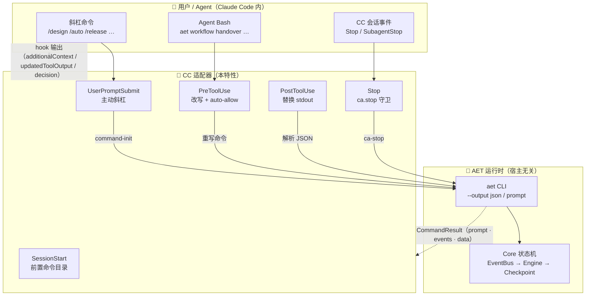

**三层职责划分**：

| 角色层 | 职责 | 与特性的交互方式 |
|---|---|---|
| **用户 / Agent** | 在 CC 里发斜杠命令、执行 `aet workflow …`、在 Stop 后继续工作 | 用户斜杠（主动形态）；agent Bash 调用（被动形态）；agent 停止输出（守卫） |
| **CC 宿主** | hook shell 调度（stdin/stdout + `hook_event_name`）；`hookSpecificOutput` 注入 additionalContext / 替换 stdout / auto-allow；Stop 决策 API（`{"decision":"block","reason":"…"}`，stderr + exit 2）；`reloadSkills` 信号 | 五类 hook 事件；每 hook 返回 `hookSpecificOutput` JSON 或 `{}` |
| **CC 适配器** | 把 canonical 事件名归一化；主动形态 `command-init` 注入 step1；被动形态重写命令、替换 stdout；能力矩阵逐事件降级；Stop 守卫会话匹配校验 | 经 `node aet_handler.js`（stdin JSON → stdout JSON）；`AET_DEBUG` 审计日志 |

### 1.2 总体设计原则

本特性遵循 AET 底座的全局不变量（事件协议单一真相、薄 CLI + Stateful Core、插件永不直连 Core、能力矩阵梯度降级），并**新增三条 CC 特有的接线不变量**：

1. **一套 handler，全家族复用**（canonical claude 语义）：所有 handler 逻辑只认 canonical 事件名（`UserPromptSubmit / PreToolUse / PostToolUse / Stop / SessionStart …`），host 差异（hook 命名 / 输出字段 / 命令目录）全部收敛到 `hosts.json` 的 dialect 与 distribution 声明——codeagent3 / codex 与 claude 对齐时 **extends: claude 零覆盖**；这套"canonical 事件名 + 声明式方言表"正是 §3.12 面向**任意**编码 Agent 的通用接线基础；
2. **双形态一次接线**：主动形态（斜杠 → `command-init` 一步启动）、被动形态（Bash 重写 → stdout 替换）两条路径共用同一 `aet` CLI 子进程约定，**绝不各自实现一套 Core 调用**；
3. **降级给交代、错误绝不静默**（CC 特有）：`context.clear` / `prompt.inject_system` / `interrupt_execution` / `hook.func` 全都有可见的 CC 降级机制；`error` 永远可见；`omit_prompt` 只会"不替换"而不会静默（agent 读到的是原始 JSON 而非空）。

### 1.3 架构设计（4+1 视图）

#### 1.3.1 逻辑视图（自下而上）

CC 适配器横跨四个逻辑层，依赖方向自下而上（上层引用下层、下层不依赖上层）：

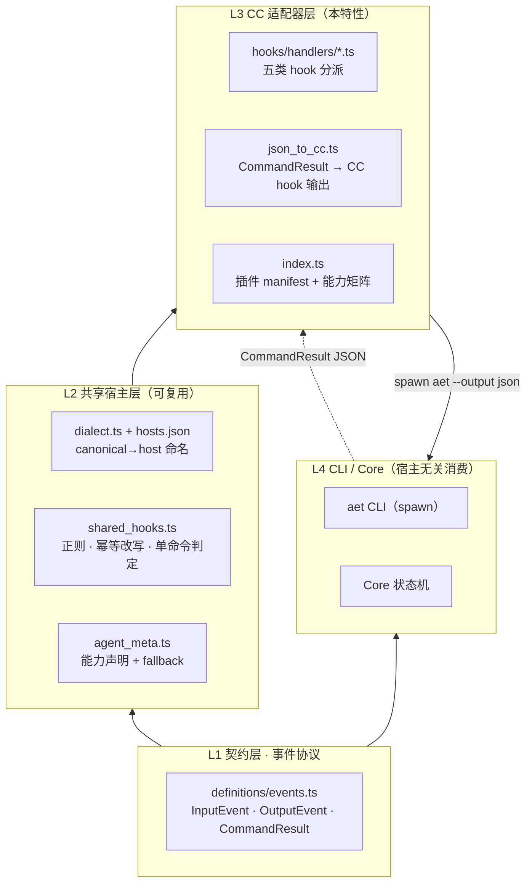

- **L1 契约层**：纯类型事件定义，CC 适配器经 `import type` 引用（编译期擦除，bundle 零运行时依赖），契约漂移在编译期暴露。
- **L2 共享宿主层**：`dialect` + `hosts` 表是"canonical → host 命名"单一真相；`shared_hooks` 是宿主无关的匹配 / 改写 / 安全判定；`agent_meta` 声明 CC 的 `partial` 能力档。
- **L3 CC 适配器层**：一个入口 `aet_handler.js`（CC 所有 hook 指向同一路径），内部按 canonical 事件分派到五个 handler；`json_to_cc` 把 `CommandResult` 翻成 CC hook JSON。
- **L4 CLI / Core**：适配器永不直连 Core——`runAet` spawn `aet --output json`，依赖方向单向。

**分层不变量**：新增一个 CC 家族宿主 = `hosts.json` 一个 block（dialect 对齐则零覆盖 + distribution/agent 各一行），L3 各 handler 不感知；改 Core 事件协议不牵连 CC 适配器——它只翻译 `CommandResult`。

#### 1.3.2 进程视图

**CC 五 hook 时序**（Mermaid sequence），展示主动 / 被动 / 守卫三条路径与五类 hook 的完整触点：

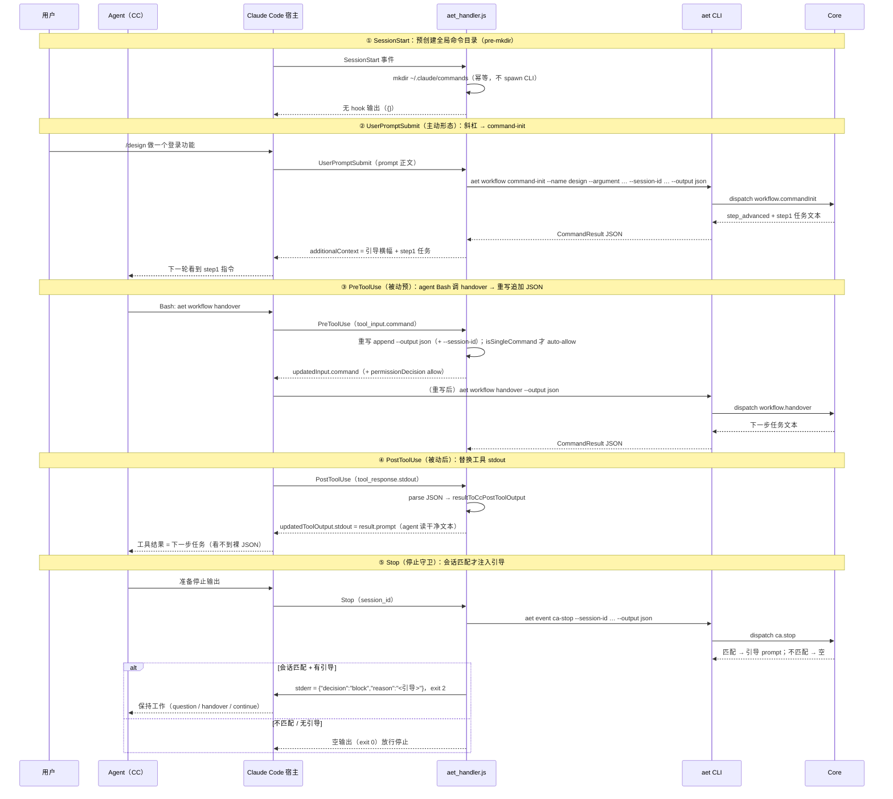

**五个 hook 的进程形态**：
- **SessionStart**：只做 `mkdir ~/.claude/commands`（或 `~/.cac/commands`），不 spawn CLI、不发 `reloadSkills`——为 hosts 发现全局命令目录"先有目录再看变化"的 watcher 留出窗口；
- **UserPromptSubmit**：斜杠 → `command-init` 一次子进程完成 init + 进 step1，把 `--argument`（初始需求）落进 checkpoint；
- **PreToolUse**：只做命令改写（幂等 append flag），`.md` 命令体的动作全部发生在会话内 -> 通过重写驱动而非额外 spawn；
- **PostToolUse**：解析 JSON、以 `updatedToolOutput { stdout, stderr:'', interrupted:false }` 替换工具结果（shape 不配会整体失败）；`prompt.inject` 事件按 b3 设计近乎不出现（都在顶层 prompt）；
- **Stop**：走**决策 API**（stderr + exit 2）而非 additionalContext——这是 CC 唯一可靠的阻止停止通道。

#### 1.3.3 开发视图（组件与文件映射）

| 组件 | 路径 | 职责 |
|---|---|---|
| CC 插件入口 | `src/plugins/claude_code/index.ts` | `CcPluginManifest`（settings + commands + handlers + capabilities）+ 重导出 `json_to_cc` |
| 事件分派 | `src/plugins/claude_code/hooks/handlers/aet_handler.ts` | 读 stdin JSON → 按 `hook_event_name` 归一化 → 分派五 handler → 写 stdout；误入 **catch** 走 `emitError` |
| UserPromptSubmit | `hooks/handlers/user_prompt_submit.ts` | 主动形态：斜杠 → `workflow command-init`；`UNKNOWN_WORKFLOW` → pass-through |
| PreToolUse | `hooks/handlers/pre_tool_use.ts` | 被动预：重写 `--output json` / `--session-id` / `--agent`；isSingleCommand → auto-allow |
| PostToolUse | `hooks/handlers/post_tool_use.ts` | 被动后：解析 JSON → 替换 stdout；`plugin init` 触发 reloadSkills |
| Stop | `hooks/handlers/stop.ts` | 守卫：`aet event ca-stop` → 会话匹配才 emitStopBlock |
| SessionStart | `hooks/handlers/session_start.ts` | 预创建全局命令目录（mkdir only） |
| 共享管线 | `hooks/handlers/shared.ts` | stdin/spawn/emit/emitError/emitStopBlock/AET_DEBUG、`AET_AGENT_ID`/`AET_COMMANDS_DIR` build-time 注入 |
| CC 翻译器 | `src/plugins/claude_code/json_to_cc.ts` | `CommandResult → CcHookOutput`（resultToCcOutput / resultToCcPostToolOutput） |
| CC 类型 | `src/plugins/claude_code/types.ts` | `CcHookInput` / `CcHookOutput` / `CcPluginManifest` |
| 插件设置 | `src/plugins/claude_code/hooks/settings.json` | 五类 hook → `node "$CLAUDE_PROJECT_DIR/node_modules/@aet/workflow-core/dist/plugins/claude_code/handlers/aet_handler.js"` |
| 宿方言 | `src/plugins/dialect.ts` · `src/plugins/hosts.json` | canonical → host 命名；hosts 三视角声明 |
| 命令行生成 | `src/cli/commands/plugin/{init,generator,templates,default_agents}.ts` | `aet plugin init --agent claude-code` 生成 `.claude/commands/aet/`；cc-flat profile |
| 安装脚本 | `src/scripts/install.sh` | 一键安装（`--plugins claude` → `claude plugin marketplace add` + `install`） |
| 构建扩展 | `src/scripts/build.mjs` · `src/extensions/` | CC 分发 bundle；extensions 并入所有 host |

**安装流（plugin init + install.sh）**：
```
CLI 生成：aet plugin init --agent claude-code
  → .claude/commands/aet/design.md（cc-flat profile + frontmatter + 引导体）
  → .claude/commands/aet/release.md（单次派发命令体）
Shell 安装（install.sh → 数字选 claude）：
  claude plugin marketplace add ./dist/plugins/claude-code
  claude plugin install aet@aet
  （codeagent：检测 codeagent / codeagentcli，找不到交互问）
```

#### 1.3.4 物理视图（部署形态）

| 部署件 | 说明 |
|---|---|
| CC 宿主 | Claude Code CLI（`~/.claude/`）；安装 AET plugin（`~/.claude/plugins/aet`） |
| 插件产物 | `dist/plugins/claude_code/handlers/aet_handler.js`（**单文件 CJS bundle**，零外部依赖，CC hook 指向同一路径） |
| 插件设置 | `~/.claude/settings.json` 合并 `hooks/settings.json` 五段 hook |
| 命令目录 | `.claude/commands/aet/*.md`（项目）+ 全局 `~/.claude/commands/`；`SessionStart` 预创建全局目录 |
| AET CLI | `dist/bin/aet.js`（ESM 单文件），`AET_BIN` 可覆盖 |
| 盘上状态 | 复用底座 `.aet/core-checkpoint/`（checkpoint / 归档） |
| 调试 | `/tmp/aet-plugin.log`（`AET_DEBUG=1` 时写）· `/tmp/aet-*.json` 审计 |
| 同级分发 | codeagent3 → `.cac/commands/aet` + `~/.cac/plugins/aet`（同 profile 不同 destDir） |

#### 1.3.5 场景视图（+1）· 驱动架构的关键用例

| 场景 | 行为 | 架构为之做出的取舍 |
|---|---|---|
| S1 用户斜杠启动 | `/design <需求>` → UserPromptSubmit → `command-init` 一次性 init + 进 step1 | `command-init` 一步 + 引导横幅 + `--argument` 落 checkpoint |
| S2 agent 阶段推进 | agent 调 `aet workflow handover` → PreToolUse 重写 + PostToolUse 替换 stdout | 双通道信封：agent 只见干净文本，events[] 由插件处理 |
| S3 能力缺口降级 | `context.clear` 到 CC 无 `session.create` → 降级为 `[AET] Context cleared (reason…)` 文本 | 逐事件能力矩阵 + 一击降级给交代 |
| S4 Stop 守卫 | agent 想停 → Stop 钩子报 `ca.stop` → 会话匹配才 block 决策 API | 会话绑定校验 + 决策 API stderr+exit2 + stop-guard 预算 |
| S5 命令 pass-through | `/auto` / `/release` → `command-init` 返回 `UNKNOWN_WORKFLOW` → CC 原生扩展 | UNKNOWN_WORKFLOW 即 workflow-vs-command 分类器 |
| S6 注入风险 | `aet workflow status && curl …` 链 → 只重写不 auto-allow | `isSingleCommand` 安全判定：链式命令走宿主正常权限流 |
| S7 新增家族宿主 | codeagent3 / codex 与 claude 对齐 → `extends:'claude'` 零覆盖 | 方言继承机制 + hosts 声明式三视角 |

### 1.4 用户执行流程

特性由 CC 内两种入口驱动。**标注 ✅ 的步骤为用户可见交互点**，其余由 hook 自动完成。

| # | 步骤 | 执行内容 | 对应实现 | 输入 | 输出 | 用户交互 |
|---|---|---|---|---|---|---|
| 1 | 会话启动 | 每次 CC 会话开始，SessionStart 预创建全局命令目录（mkdir only，不 spawn） | `session_start.ts` | 无 | `~/.claude/commands/` 存在 | ❌ 透明 |
| 2 | 斜杠启动工作流 | 用户输 `/design […]` → `command-init` 一步 init + 进 step1；`UNKNOWN_WORKFLOW` → pass-through | `user_prompt_submit.ts` | 斜杠 + 可选参数 | 引导横幅 + step1 任务注入 | ✅ 用户发起 |
| 3 | 阶段推进 | agent 完成阶段后自调 `aet workflow handover` → 重写 JSON → 下一阶段任务替换 stdout | `pre_tool_use.ts` + `post_tool_use.ts` | 无（Core 读 checkpoint） | 下一步任务文本 | ❌ agent 内完成 |
| 4 | 断点恢复 | 中断后 `/aet:continue` → `command-init` 返回 `UNKNOWN_WORKFLOW`（continue 为单次命令）→ pass-through 渲染 `continue.md` → 引导执行 `aet workflow status` / `continue` 重发当前步 + 初始需求回显 | `user_prompt_submit.ts`（pass-through 分支）+ `continue` 命令文件 + `pre_tool_use.ts` 改写 | checkpoint | `step_resumed` + 原始需求 | ✅ 用户发起 |
| 5 | 自动路由 | `/auto` → `workflow status` 判断 active → `workflow list` 展示候选 → question 征求意图 | `auto` 命令文件 | 用户意图 | 路由到对应 workflow / command | ✅ 意图问答 |
| 6 | 停止守卫 | agent 想停 → Stop 钩子报 `ca.stop`，会话匹配 → block 决策 API | `stop.ts` + `handleCaStop` | session_id | 引导（question/handover/continue） | ❌ 透明 |
| 7 | 单次派发 | `/release` / `/doc` → `UNKNOWN_WORKFLOW` → CC 原生扩展命令文件 | 生成的 `<id>.md`；pass-through | 斜杠 | 命令体原样注入 | ✅ 用户发起 |
| 8 | 插件生成 | `aet plugin init --agent claude-code`（幂等，SessionStart 也可触发）→ 写命令目录 + reloadSkills | `plugin/init.ts` + `post_tool_use.ts` | 配置 | `.claude/commands/aet/*.md` | ✅ 用户运行 |

#### 1.4.1 输入 / 输出汇总

| 通道 | 内容 | 消费方 |
|---|---|---|
| CC hook 输入 | `hook_event_name` / `session_id` / `cwd` / `prompt` / `tool_name` / `tool_input` / `tool_response`（snake_case） | aet_handler 分派 |
| CLI spawn | `aet workflow command-init / handover / event ca-stop … --output json` | Core 状态机 |
| `CommandResult.prompt` | agent 直接可见文本（替换 stdout / additionalContext / ERROR 行） | agent（经 updatedToolOutput） |
| `CommandResult.events[]` | plugin-only（`context.clear` / `prompt.inject[_system]` / `hook.prompt` / `hook.func` / `omit_prompt` / `interrupt_execution` / `error`） | `json_to_cc` 逐事件降级 |
| `CommandResult.data` | 生命周期元数据（status / workflow / currentStep / nextStep / checkpointId / argument / sessionId / stopGuardBlocks） | 状态横幅 / 插件分支决策 |

---

## 3. 功能设计

### 3.1 CC 五类 hook 接线

**功能概述**：CC 用「shell command hook」承载全部 AET 交互——五类事件（SessionStart / UserPromptSubmit / PreToolUse / PostToolUse / Stop）都指向同一个 handler 文件 `aet_handler.js`；handler 从 stdin 读 hook JSON、按 `hook_event_name` 归一化到 canonical、分派到具体 handler、把 hook 输出 JSON 写回 stdout。这是 CC 适配的**接入骨架**。

**实现思路**：
- **单文件多 hook**：`settings.json` 五段都指向同一命令，避免 CC 装多个 handler 路径；`aet_handler.js` 是**单文件 CJS bundle**（零外部依赖），由 `build.mjs` 从 `aet_handler.ts` 源码打进 `dist/plugins/claude_code/handlers/`；
- **canonical 归一化**：handler 内部只用 canonical 事件名，经 `dialect.fromHostEvent()` 归一化（claude 家族目前 identity；未来改名 host 用它）；写回 `hookSpecificOutput.hookEventName` 时再 `toHostEvent()` 翻译；
- **snake_case wire**：CC 输入字段是 snake_case（`hook_event_name` 等），类型面 `CcHookInput` 直接对应，不额外转换；post_tool_use 补 unknown-key 兜底（`collectWriter` 风格的宽容解析）；
- **R9 兜底**：`main().catch` 里任何未捕获异常 → `emitError(activeEventName, 'PLUGIN_INTERNAL', message)`——错误永不上抛静默。

**实现设计**（`settings.json` + `aet_handler.ts` + `shared.ts`）：

```
settings.json hooks（每段 matcher + command）：
  SessionStart    matcher ""    → mkdir 全局命令目录
  UserPromptSubmit matcher ""   → 斜杠 → command-init
  PreToolUse      matcher Bash  → 重写 --output json
  PostToolUse     matcher Bash  → 替换 stdout
  Stop            matcher ""    → ca.stop 守卫

aet_handler.ts 分派（switch dialect.fromHostEvent）：
  UserPromptSubmit → handleUserPromptSubmit
  SessionStart     → handleSessionStart
  PreToolUse       → handlePreToolUse
  PostToolUse      → handlePostToolUse
  Stop             → handleStop
  default          → debugLog + emit(null)
约束：
  - 未捕获异常 → emitError（R9）；logging 永不阻塞（AET_DEBUG 才写盘）
```

**五 hook 接线图**：

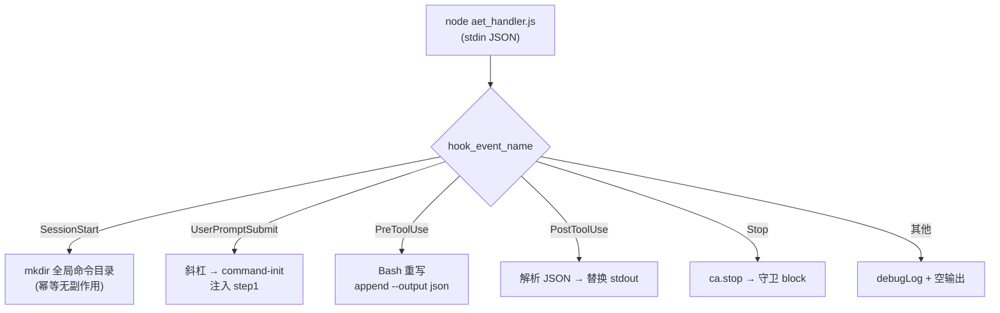

- **用户交互**：无（对用户透明，是插件接线骨架）。
- **输出**：单一 handler 文件服务五类 hook；CC 每次会话 / 每次工具调用都经过它（unconditional，但内部按事件无副作用返回 `{}` 时开销极小）。

### 3.2 主动形态（UserPromptSubmit → command-init）

**功能概述**：用户输入斜杠命令时，CC 的 UserPromptSubmit hook 触发，把 `/design` / `/aet:design` 等解析成 workflow id，**一次性** `aet workflow command-init --name <id> --output json` 完成「init + 进 step 1」，把结果 `prompt`（引导横幅 + step1 任务）作为 additionalContext 注入；非 AET prompt 一律 pass-through。

**实现思路**：
- **前缀无关匹配**：`SLASH_CMD_RE` 捕获 `/xxx` 或 `/aet:xxx`（`/design` 与 `/aet:design` 都解析为 `design`），共享于 CC / OpenCode；`parseSlashArgs` 提取行内剩余文本作为初始需求 → `--argument`；
- **UNKNOWN_WORKFLOW = 分类器**：对 command id（如 `/release`），Core 返回 `UNKNOWN_WORKFLOW` → 插件 `emit(null)` → CC 原生斜杠扩展渲染命令文件（**pass-through**，不建 checkpoint、不 handover）；
- **四支返回分支**（`user_prompt_submit.ts`）：
  - init ok=false → 注入 error；
  - `intervention_required` → 注入干预提示（continue / abort+init 三选一），**不**推进；
  - `step_advanced` → 注入引导 + step1 任务；
  - `hook_pending` → 注入钩子文本（step 未推进，下次 handover 才进）；
- **资源回收**：每分支记录一行 summary debugLog（slash / workflow / commandInitStatus / outcome / note / injectedChars + head）。

**实现设计**（`user_prompt_submit.ts`）：

```
[1] readStdin → prompt → parseSlash
    /design → design；/aet:design → design；非斜杠 → emit(null) 返回
[2] argv = ['workflow','command-init','--name',id,'--output','json']
    + parseSlashArgs → --argument（初始需求落 checkpoint）
    + input.session_id → --session-id（绑定当前会话供守卫）
[3] runAet(argv, cwd) → result
    - spawn fail → finishUpsError('PLUGIN_SPAWN_FAILED')
    - !ok && code==='UNKNOWN_WORKFLOW' → emit(null)（pass-through）
    - !ok → 注入 error prompt
    - status==='intervention_required' → 注入干预 prompt（不推进）
    - status==='step_advanced' → 注入引导 + step1 任务
    - status==='hook_pending' → 注入钩子文本（step 未推进）
约束：/init 不在此处理——走 CC 原生命令扩展（init.md → aet-install skill）
```

**主动形态流程 / 分支图**：

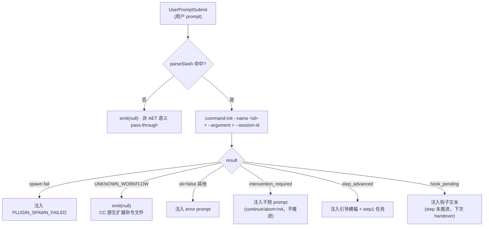

- **用户交互**：用户斜杠即触发（最重的人机入口）；`/auto` 更进一步引导路由选择。
- **输出**：斜杠命令在 CC 里第一次进入 AET 工作流就拿到"启动说明 + 第一份任务"，初始需求落 checkpoint、断点恢复可回显。

### 3.3 被动形态（PreToolUse 重写 + PostToolUse 替换 stdout）

**功能概述**：agent 在阶段内觉得工作完成，自调 `aet workflow handover` 时，PreToolUse 把命令改写为追加 `--output json`（幂等），PostToolUse 解析 JSON、用 `result.prompt` **替换工具 stdout**——agent 读到干净文本，永远看不到裸 JSON；`events[]` 里的 plugin-only 信号只有插件处理。

**实现思路**：
- **重写只用共享函数**：`rewriteAddFlag` 把 flag 插到 `aet workflow <action>` 之后（不是行尾——`aet workflow status | jq .` 会把 flag 放到正确命令上）；幂等（已有 flag 则跳过）；
- **会话自动绑定**：对 `handover` / `continue`，把 CC 的 ambient `session_id` append 成 `--session-id`——Core 落进 checkpoint 当前阶段，供 `ca.stop` 校验"谁在跑这一阶段"；
- **auto-allow 安全闸**：`isSingleCommand` 判定"单条自包含命令"（无 `; && | < > $ 反引号 换行` 等 shell 操作符）才 `permissionDecision:'allow'`；链式 / 管道只重写**不加权**——防 `aet workflow status && curl …` 尾段逃过权限流被执行；
- **stdout 替换的完整 shape**：CC 要求 Bash output 的 `stdout / stderr / interrupted` **全为 non-optional**——替换件必须给 `{stdout:<prompt>, stderr:'', interrupted:false}`，缺字段 CC 会整体兜回原始 JSON；`omit_prompt` 在 events[] 时**不替换**（degrade：让原始 JSON 通过）。

**实现设计**（`json_to_cc.ts` `resultToCcPostToolOutput` + `pre_tool_use.ts`）：

```
PreToolUse（AET_WORKFLOW_RE 命中）：
  1. rewriteAddFlag('--output', 'json')  # 幂等
  2. handover/continue → 追加 --session-id <session_id>
  3. isSingleCommand(command) ? allow : 不加权（走宿主正常权限流）
PreToolUse（AET_PLUGIN_INIT_RE 命中）：
  1. rewriteAddFlag('--agent', AET_AGENT_ID)  # 幂等；建 bundle 烘焙 agent id

PostToolUse（AET_WORKFLOW_RE 命中）：
  1. 解析 stdout JSON → CommandResult
     parse fail → emitError('PLUGIN_PARSE_FAILED')
  2. omit_prompt 在 events[] → 不替换（degrade：原始 JSON 通过）
  3. updatedToolOutput.{stdout: result.prompt, stderr:'', interrupted:false}
PostToolUse（AET_PLUGIN_INIT_RE 命中）：
  → reloadSkills:true + additionalContext 提示 /reload-skills
约束：替换件 shape 必须完整（stderr/interrupted 缺一 → CC 整体拒绝 → 裸 JSON 泄漏给 agent）
```

**被动形态时序图（含安全闸）**：

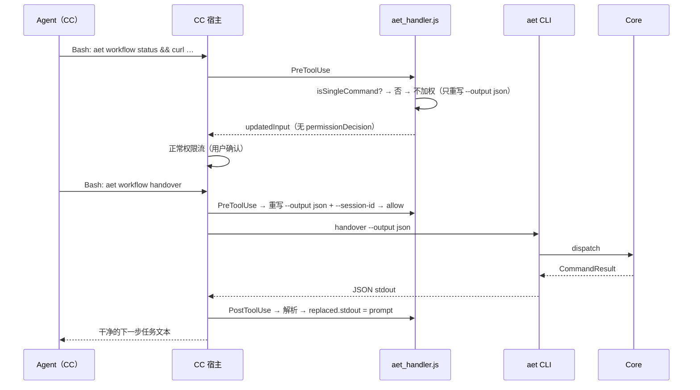

- **用户交互**：链式命令重新进入宿主权限确认（安全）；单命令免确认（便捷）。
- **输出**：agent 全程只见干净文本；`events[]` 不进入任何 agent 可见通道。

### 3.4 双通道翻译器与状态横幅（json_to_cc）

**功能概述**：`json_to_cc` 把 `CommandResult` 翻成 CC 钩子输出。`CommandResult` 的双通道（`prompt` + `events[]`）+ `data` 在这里落实为 CC 可执行的三种产物：**状态横幅**（`data.status`）、**agent 可见文本**（`prompt`）、以及逐事件的 CC 降级。

**实现思路**：
- **resultToCcOutput**（主动 / 注入路径）：先 `hasEvent(result,'omit_prompt')` 闸门（抑制全部注入），再按序组装 fragments——状态横幅 → `[AET ERROR <code>]`（R9 兜底）→ 顶层 prompt → 逐事件降级文本；空则返回 null（caller emit `{}`）；
- **状态横幅**：`statusBanner` 把 10 态压成一行 `[AET] <动作>`（`workflow_started` / `step_advanced` / `step_resumed` / `hook_pending` / `workflow_complete` / `intervention_required`），让 agent 不解析全文便知生命周期状态；
- **resultToCcPostToolOutput**（被动替换路径）：用 `updatedToolOutput` 整体替换工具 stdout（见 3.3），处理 `omit_prompt` degrade 与空 prompt 兜底 error；
- **逐事件降级**（R8 能力矩阵在 CC 的落点）：
  - `context.clear` → `[AET] Context cleared (reason…) 请开启新心智上下文`（CC 无 `session.create`）；
  - `prompt.inject` → 正文（b3 起近乎不出现，多数在顶层 prompt）；
  - `prompt.inject_system` → `[AET system note] …`（无系统提示改写）；
  - `hook.prompt` → 正文（正常到不了 events[]，阻塞路径走顶层 prompt）；
  - `hook.func` → `[AET] hook.func declared (CC 无法进程内执行) 请手动运行 …`；
  - `interrupt_execution` → `[AET] interrupt_execution requested — 暂停当前任务等待指示`（CC 无原生 halt）；
  - `error` → 永可见（双保险：prompt + events 都带）。

**实现设计**（`json_to_cc.ts`）：

```
resultToCcOutput(result, eventName='UserPromptSubmit') → CcHookOutput|null：
  omit_prompt 存在        → null（抑制）
  data.status 存在        → statusBanner（非 null 则加一行）
  !ok && error           → '[AET ERROR <code>] <msg>'（R9 兜底）
  result.prompt          → 加入
  逐事件 eventToText      → 按能力矩阵降级 / 透传 / 忽略
  fragments 空           → null
  else hookSpecificOutput { hookEventName, additionalContext }

resultToCcPostToolOutput(result) → CcHookOutput|null：
  omit_prompt 存在 → null（degrade：原始 stdout 过）
  stdout = result.prompt（空 → error 合成；仍空 → null）
  { updatedToolOutput: { stdout, stderr:'', interrupted:false } }
```

**翻译管道图**：

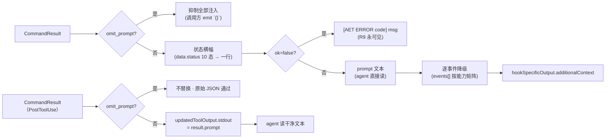

- **用户交互**：降级出的 `[AET]` 文本可见（有交代）；系统提示 / 真会话 / 进程内脚本等无 CC 原生的则以文本形式呈现。
- **输出**：CC 内部 agent 感知 = 状态横幅 + 干净 prompt + 明确降级说明。

### 3.5 能力矩阵与逐事件降级（CC 视角）

**功能概述**：CC 适配层按宿主能力把每个 OutputEvent 分成 **supported / degraded** 两档，这是"不同平台支持的功能有差异"在 CC 侧的具体落实——能做就做，做不到降级给交代，**绝不放水、绝不静默**。`index.ts` 的 `capabilities` 字段是本矩阵的声明面（单点）。

**实现思路**：
- **CC supported**：`prompt.inject`（additionalContext）、`error`（always visible）、`hook.prompt`（被 `updatedToolOutput.stdout` 承载阻塞语义）；
- **CC degraded**：`context.clear` / `prompt.inject_system` / `hook.func` / `interrupt_execution` → 降级为可见文本或警示；`omit_prompt` → 「不替换」的 degrade（CC 无法真抑制 CL 返回）；
- **对照基线**：OpenCode（full）能真 `session.create`、静默注入、走 `system_transform` 改写系统提示——CC 的降级就是「以 OpenCode 为参照，把 Full → Partial 的能力差距逐条降级」；
- **manifest 声明**：`CC_PLUGIN_MANIFEST.capabilities = { 'prompt.inject':'supported', 'prompt.inject_system':'degraded', 'context.clear':'degraded', 'omit_prompt':'degraded', 'interrupt_execution':'degraded', 'error':'supported' }`——文档与 build/install 工具同源。

**实现设计**（`index.ts` capabilities + `json_to_cc.ts` eventToText）：

```
能力矩阵（CC 视角 · 全 8 事件）：

事件                 CC 处置（本特性）               OpenCode 参照（full）
─────────────       ───────────────────────      ─────────────────────
prompt.inject       ✅ supported → additionalContext      文本/静默注入
prompt.inject_system ⚠️ degraded → [AET system note]        system.push
context.clear       ⚠️ degraded → [AET] Context cleared     session.create+tui
hook.prompt         ✅ blocked → updatedToolOutput.stdout   文本 part（阻塞）
hook.func           ⚠️ degraded → 手动运行提示              日志/降级
error               ✅ 永可见（R9）                        永可见（R9）
omit_prompt         ⚠️ degraded → 不替换 stdout            跳过替换
interrupt_execution ⚠️ degraded → 警示文本                  真实 halt
```

**能力降级阶梯图（CC 侧）**：

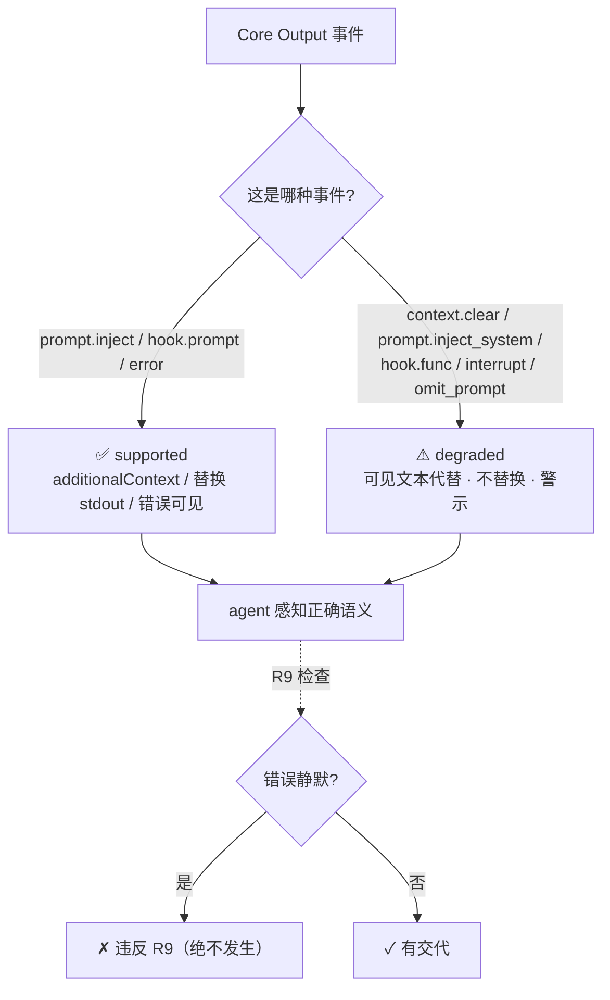

- **用户交互**：降级文本进入 agent 可见通道（用户能感知"为什么没有原生实现 + 语义仍在"）。
- **输出**：单点能力矩阵；新增事件只需在 `json_to_cc` 加一行 eventToText，Core 不感知。

### 3.6 会话停止守卫（Stop → ca.stop）

**功能概述**：CC 的 Stop / SubagentStop 钩子触发时，把停止会话报给 Core（`aet event ca-stop --session-id <id>`），Core 解析 active 工作流并**比对会话归属**——只有当前阶段绑定的会话停止才返回引导，插件用**决策 API** block 让 agent 继续；否则放行。绑定会话缺失 / 不匹配一律放行，绝不给无关会话 AET 引导。

**实现思路**：
- **决策 API 是唯一可靠通道**：`{"decision":"block","reason":...}` 写 **stderr** + 进程 **exit 2**（exit 0 = 放行）；不能用 additionalContext 堵——那是 deprecated 的 stop 机制；
- **会话匹配 = 安全闸**：无 active / `checkpoint.sessionId` 缺失 / `payload.sessionId !== checkpoint.sessionId` → `ok('')` 空返回 → `emit(null)` 放行；
- **stop-guard 预算**：同阶段同会话最多被拦 3 次（Core 计数器），到顶放行——一个反复想停的 agent 不值得继续绑；阶段推进 / 换会话重置计数；
- **引导三档**：提问 → 用 question 工具（别停止）；阶段完成 → 调 handover；否则 → 继续到工作流结束。

**实现设计**（`stop.ts` + `shared.ts emitStopBlock` + Core `handleCaStop`）：

```
[1] Stop 钩子 → session_id（无 → emit(null)）
[2] runAet(['event','ca-stop','--session-id',id,'--output','json'], cwd)
[3] result.ok ? prompt : '' ; 空 → emit(null)（放行）
[4] 非空 → emitStopBlock(text)：
      stderr JSON: {"decision":"block","reason": text}
      process.exitCode = 2
约束：spawn 失败 → emit(null)（守卫失败不能阻塞停止，宁可放行）
```

**停止守卫流程 / 决策线**：

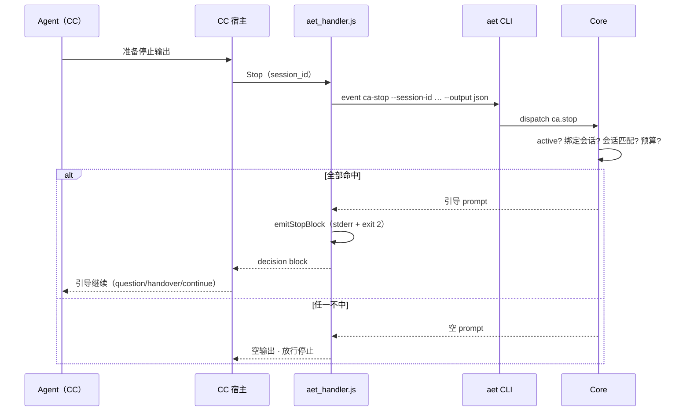

- **用户交互**：用户主动 `workflow abort` 不受影响（守卫只拦"agent 自己停下"）；被拦时 agent 看到引导文案。
- **输出**：AET 工作流进行中 agent 不会无引导停下；无关会话永不被喂 AET 指令。

### 3.7 会话启动预创建（SessionStart → 全局命令目录）

**功能概述**：SessionStart hook 在每次会话启动时确保全局 slash 命令目录（`~/.claude/commands` / `~/.cac/commands`）存在。hosts 只发现**已存在**的全局命令目录，所以 `aet plugin init -g`（全局安装）需要目录先到位再写文件；本 hook 只做 `mkdir`，**不 spawn CLI、不发 reloadSkills**，保持极轻。

**实现思路**：
- **watcher 头-start**：对 codeagent3 等 watch commands 目录并自动 reload 的 hosts，`aet plugin init` 在子进程里"建目录 + 写文件"亚毫秒完成，watcher 来不及挂上；SessionStart **先** mkdir，给 watcher 留出整个 spawn + node 启动 + 配置加载窗口；
- **build-time 注入**：`AET_COMMANDS_DIR` 由 esbuild define 按分发烘焙（claude-code → `.claude/commands`，codeagent3 → `.cac/commands`），同一份代码服务两个 host；
- **best-effort**：mkdir 失败只 `debugLog`，绝不让 hook 失败。

**实现设计**（`session_start.ts`）：

```
handleSessionStart(input)：
  1. path = homedir()/<AET_COMMANDS_DIR>
  2. mkdirSync(path, { recursive: true })
  3. catch → debugLog（不失败）
约束：无 spawn · 无 CLI · 无 reloadSkills（纯净 mkdir）
```

**SessionStart 预创建时序**：

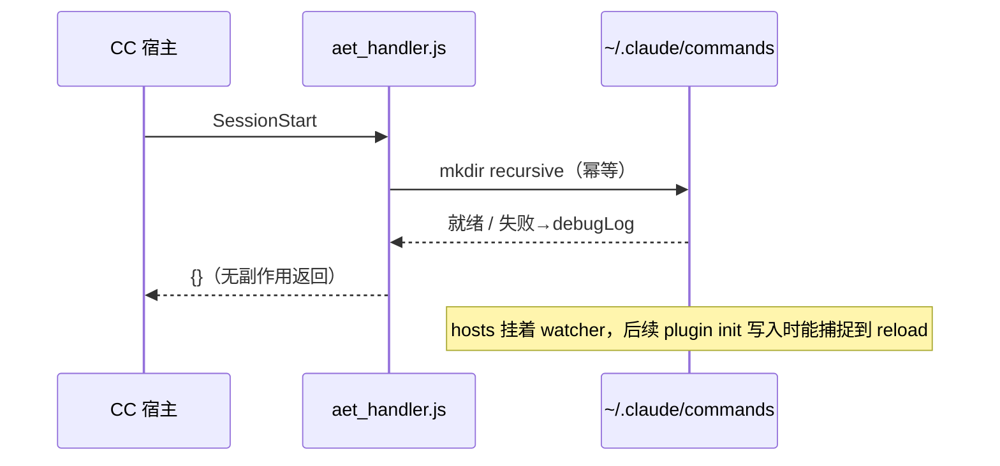

- **用户交互**：无（透明；保证全局命令目录就位）。
- **输出**：全局命令目录存在性前置保证；`aet plugin init -g` 的写入不会被目录缺失所困。

### 3.8 斜杠命令生成与单次派发（aet plugin init）

**功能概述**：`aet plugin init --agent claude-code` 把配置里的 workflow / command 渲染成 CC 可加载的 `.claude/commands/aet/<id>.md`。**workflow 有生命周期**（经 checkpoint + handover）；**command 无生命周期**（命令文件即命令体，宿主原样注入）。`UNKNOWN_WORKFLOW` 由 Core 注册表天然分类。

**实现思路**：
- **cc-flat profile**：markdown-flat `<id>.md`，frontmatter 带 `description` + `disable-model-invocation:true`，正文 `/<id> $ARGUMENTS` + 介绍 + 工作流阶段列表 + `init_guidance`（hasPlugin=true → 空，插件自动启动；无插件 host → 引导 bash init+handover）；
- **单次派发命令体**：`command.md` = 核心 skill 列表 + `command.prompt`（config 无 prompt 则回落到 description）——**命令体本身就是执行指令**；
- **frontmatter 透传**：`effort` / `allowed-tools` / `argument-hint` 从配置渲染进 `<id>.md`（CC 语义；OpenCode 忽略）；
- **幂等 + 清 stale**：每次全量重写当前条目 + 扫 dir 清掉不再在配置里的 `aet-*`（保留 `aet-` 前缀命名空间，其它工具文件不动）；
- **reloadSkills**：PostToolUse 命中 `aet plugin init` 时给 `reloadSkills:true` + 提示 `/reload-skills`。

**实现设计**（`default_agents.ts` ccFlatAgent + `generator.ts` + `templates.ts`）：

```
模板（cc-flat）：
  /{{id}} $ARGUMENTS
  ## 介绍
  {{workflow.description}}
  ## 工作流概览
  本工作流共 {{workflow.steps_count}} 个阶段：{{workflow.steps_list}}
  阶段切换：每完成一个阶段，通过 bash 执行 `aet workflow handover` 进入下一阶段。
  {{init_guidance}}

命令模板：
  /{{id}} $ARGUMENTS
  {{command.skills_list}}{{command.prompt}}     # 单次派发，无生命周期

生成目标：.claude/commands/aet/<id>.md（项目）
  全局：aet plugin init -g → ~/.claude/commands/aet/<id>.md
运行时分类：
  /design  → command-init → step_advanced（生命周期）
  /release → command-init → UNKNOWN_WORKFLOW → pass-through（CC 原生渲染）
```

**命令生成 → CC 加载活动图**：

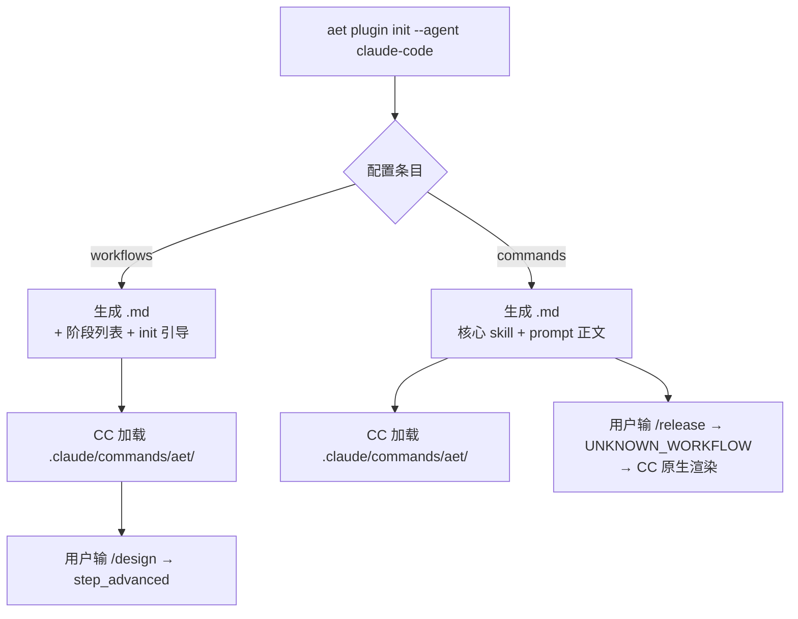

- **用户交互**：`/reload-skills` 提示在 PostToolUse 后出现；`SessionStart` 预建目录保证 watcher 可加载。
- **输出**：CC 侧完整斜杠命令面（生命周期工作流 + 单次派发命令），与配置同源演变。

### 3.9 安装与分发（settings.json + install.sh + 平行 host）

**功能概述**：把适配器装进 CC 需两件事——**插件产物**（`dist/plugins/claude_code/handlers/aet_handler.js` + `settings.json` 合并进 `~/.claude/settings.json`，五段 hook 全指向同一路径）+ **CLI 可用**（`dist/bin/aet.js`）。同一套代码还服务 codeagent3 / codex 等平行分发（dialect extends claude、commandsDir / installPath 各不同）。

**实现思路**：
- **manifest 驱动**：`CC_PLUGIN_MANIFEST`（settings + commands + handlers + capabilities）被 install 工具与 build 消费，是 CC 侧安装的唯一来源；
- **settings.json 五段同名 hook**：SessionStart / UserPromptSubmit / PreToolUse / PostToolUse / Stop → 同一 `node "$CLAUDE_PROJECT_DIR/node_modules/@aet/workflow-core/dist/plugins/claude_code/handlers/aet_handler.js"`；
- **install.sh 数字选装**：`claude` → `claude plugin marketplace add ./dist/plugins/claude-code` + `claude plugin install aet@aet`；检测 `codeagent` / `codeagentcli` / `~/codeagentcli`，找不到交互问；
- **扩展点**：`src/extensions/` 的自定义 skills/commands/runtime 在 build 时并入所有 host 的 dist（同名扩展优先覆盖），`runtime-meta.json` 的 `whitelist` 保护 `config/repository.json`。

**实现设计**（`install.sh` + `build.mjs` + `hosts.json`）：

```
CC 分发：
  build.mjs CC_DISTRIBUTIONS：
    claude-code → dialectId 'claude' · agentId 'claude-code' · targetDir dist/plugins/claude-code
    codeagent3  → dialectId 'codeagent' (extends claude) · agentId 'codeagent3' · targetDir dist/plugins/codeagent3
  settings.json → 合并进 ~/.claude/settings.json（各 host 自己的 hooks 段）
  aet_handler.js → ~/.claude/handlers/aet_handler.js（或经 CC plugin 安装）

平行 host：
  codeagent3：.cac/commands/aet + ~/.cac/plugins/aet（destDir 不同，避免共装互撞）
  codex：.agents/skills/<id>/SKILL.md（skill profile，hasPlugin:false → 引导 self-init）

命令目录 pre-create：SessionStart（AET_COMMANDS_DIR 按分发烘焙）
```

**安装拓扑 / 分发树**：

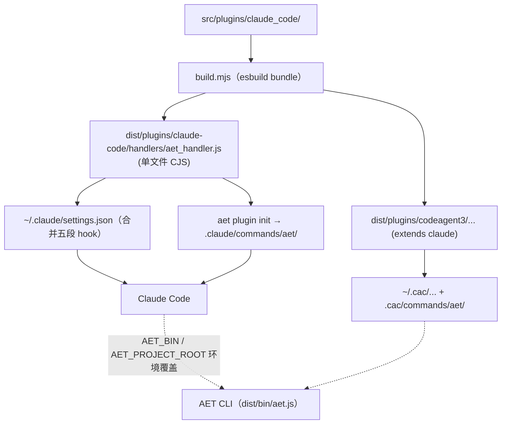

- **用户交互**：`bash src/scripts/install.sh` 数字选 claude；`AET_DEBUG=1` 查 `/tmp/aet-plugin.log`。
- **输出**：CC 一次安装得到完整适配器（五 hook + CLI + 命令面）；codeagent3 平行可用。

### 3.10 宿方言与主机声明（CC 家族）

**功能概述**：让一套 handler 逻辑服务整个"类 Claude"宿主家族。canonical claude 事件名是唯一真相；`hosts.json` 一处声明每个 host 的 dialect / distribution / agent 三视角；host 命名与 claude 对齐时 `extends:'claude'` **零覆盖**，真正分化（未来再改名）只需列 rename。这是"不同平台支持的功能有差异"在**接入面**上的收敛点——差异全部是声明数据，不是程序分支。

**实现思路**：
- **canonical 词汇表**：handler 只认 canonical（`UserPromptSubmit / PreToolUse / PostToolUse / Stop / SessionStart …`），`dialect.fromHostEvent()` 归一化输入、`toHostEvent()` 翻译输出；
- **继承**：`codex extends claude` 与 `codeagent extends claude` 全零覆盖（对齐 1:1，机器留存未来差异化）；`postToolUseOutput` 字段各异时经 `hookSpecificOutput` 声明；
- **三视角一处**：`dialect`（hook 命名）+ `distribution`（构建目标）+ `agent`（文件层入口）都在 `hosts.json` 一个 block；`default_agents.ts` 只存共享 profile（cc-flat / skill），从 hosts 表派生 `DEFAULT_AGENTS`；
- **file-only host 无 dialect**：Trae / Qwen / OpenCode(file-only) / Codex 无运行时 hook 总线 → 无 dialect，只有文件层（命令文件照用）。

**实现设计**（`hosts.json` + `dialect.ts` + `default_agents.ts`）：

```
hosts.json（claude 家族相关）：
  claude-code: dialect 'claude'（identity）· distribution claude · agent cc-flat
  codeagent3:  dialect 'codeagent'（extends claude）· distribution codeagent · agent cc-flat(.cac)
  codex:       dialect 'codex'（extends claude）· distribution codex · agent skill(.agents/skills)

dialect.ts：
  resolveDialect(id) → flatten(extends) → toHostEvent / fromHostEvent / postToolUseOutput / permissions
  DIALECT_ID 构建期 esbuild define 烘焙当前分发；dev/test 兜底 'claude'

default_agents.ts：
  DEFAULT_AGENTS = Object.fromEntries(hosts with agent facet → entryFromHost)
  ccFlatAgent（claude-code / codeagent3 / opencode）· skillAgent（codex）
```

**方言继承图**：

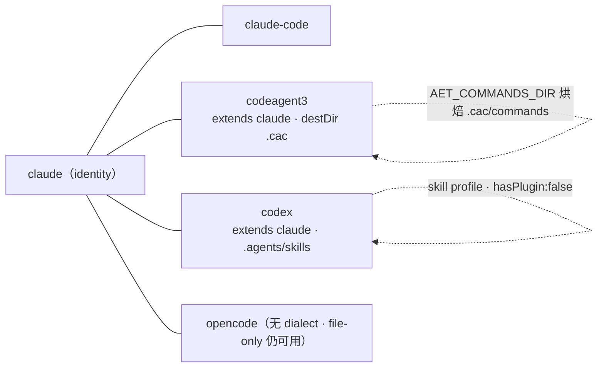

- **用户交互**：无（对用户透明；是宿主接入的工程契约）。
- **输出**：一处 hosts 表 ↔ 全套分发 / 方言 / 命令生成；CC 家族和平共存不串目录。

### 3.11 调试与审计（AET_DEBUG / emit 管线）

**功能概述**：CC hook 每轮会话都触发（unconditional），需要**按需**审计。`AET_DEBUG` 门控写 `/tmp/aet-plugin.log`：每个 hook 事件、每次 `runAet` spawn、每次注入（additionalContext **全文**）、每次替换（replaced stdout **全文**）、每次 auto-allow 决策、每次 stop block——全量可查，默认零开销（环境变量未设则写盘关断）。

**实现思路**：
- **统一 emit 管线**：`emit()` 按产物类型打点——`inject`（additionalContext 全文）/ `replace_stdout` / `pretool_decision` / `pretool_rewrite_no_decision` / `reload_skills` / `emit_noop`；`emitError` 打 `emitError`；`emitStopBlock` 打 `stop_block`；
- **敏感信息完整记录**：inject / replace 的**完整文本**都记录（不截断）——让用户能审计到底喂给了 agent 什么；
- **summary 一行式**（UserPromptSubmit）：`slash / workflow / commandInitStatus / outcome / note / injectedChars / injectedTextHead`——回答用户"`/aet-X` 之后插件做了什么"；
- **best-effort**：`appendFileSync` 失败吞掉（日志绝不阻塞 handler）。

**实现设计**（`shared.ts debugLog / emit / emitError / emitStopBlock`）：

```
AET_DEBUG=1 node aet_handler.js
  → /tmp/aet-plugin.log 行式 JSON（ts + event + …）
生产（无 AET_DEBUG）：
  debugLog no-op；emit 只写 stdout JSON（每条都极轻）
约束：日志永远不阻塞 handler；inject/replace 不截断；spawn 信息含 exit code + stderr 预览
```

- **用户交互**：排障时 `AET_DEBUG=1` 重开会话 → 查 `/tmp/aet-plugin.log`；生产零开销。
- **输出**：可审查的完整轨迹——从斜杠到注入 / 替换 / block 的每一步都有记录。

### 3.12 适配其它编码 Agent（扩展性）

**功能概述**：CC 适配器不是孤立代码，而是 AET「事件协议 → 宿主实现或降级」扩展性的**样本实现**。任何编码 Agent —— OpenCode（full 插件 API）、omp（tool-only）、Cursor / codex（文件层）、乃至未知 agent —— 都可以用同一套方法接入：**宿主能力决定适配器档位，Core 永不感知宿主**。本节给出完整适配方法，让读者从 CC 样本出发，能自行接出下一个编码 Agent。

**实现思路**：

> 一个编码 Agent 接入 AET 的完整路径就是「**CC 样本 → 能力面盘点 → 逐事件决策 → 形态接线 → 声明落盘**」。

- **宿主能力面（决定档位的上限）**：
  | 能力维度 | 说明 | 影响哪个形态 |
  |---|---|---|
  | 有无 in-process 插件 API | OpenCode 有（`command.execute.before` 等）；CC 只有 shell hook；omp 只有 `tool_call/tool_result` | 主动形态（斜杠启动）from scratch / 命令文件承载 |
  | 能否重写 CLI 参数 | CC PreToolUse `updatedInput`；OpenCode `tool.execute.before` 改 `args`；omp `tool_call` 改输入 | 被动形态（`--output json` 注入） |
  | 能否替换工具的 stdout | CC `updatedToolOutput`；OpenCode `tool.execute.after` 改 `output.output`；omp `tool_result` | 被动形态（agent 读到干净文本） |
  | 能否创建 / 切换会话 | OpenCode `client.session.create`；CC / omp 无 | `context.clear` 事件：真新会话 vs 降级文本 |
  | 能否改写系统提示 | OpenCode `experimental.chat.system.transform` | `prompt.inject_system` |
  | 能否静默注入 | OpenCode `output.parts` push | `prompt.inject` |
  | 能否中断当前 turn | OpenCode 决策 / CC 有限 | `interrupt_execution` |
  | 能否阻止停止 | CC Stop 决策 API（stderr + exit 2）；OpenCode `session.idle` 观察者 | `ca.stop` 守卫 |

- **能力档位（`agent_meta.ts` + `PLUGINS.capabilityLevel`）**：
  | 档位 | 定义 | 现有宿主 | 主动形态 | 被动形态 | 便捷能力 |
  |---|---|---|---|---|---|
  | **full** | in-process 插件 API，几乎全事件可原生 | opencode | `command.execute.before` 一步 command-init | 重写 + 替换 | 真 `session.create` / 静默注入 / 系统提示改写 |
  | **partial** | 只有宿主 hook / 事件面，部分事件降级 | claude-code · omp · codex | CC：`UserPromptSubmit`；omp：命令文件承载 | 重写 + 替换 | `context.clear` 等降级为可见文本 + Stop 决策 API |
  | **none / bash-prompt** | 无插件，只有 bash + prompt | cursor · fallback | 命令文件引导 `init + handover` | 不重写（agent 用默认 prompt 输出） | 完整生命周期文本交互，events[] 不感知 |

- **`--output json` 双档约定**：能配插件的宿主走 JSON（适配器消费 events[] + 替换 prompt）；裸 bash / 无插件宿主走 **prompt**（`encodePrompt` 只输出 `result.prompt` 字段，events[] 忽略）——**降级链终点就是 CLI 基础功能**，任何编码 Agent 至少能靠命令文件 + `aet workflow` 文本交互完整走完生命周期。

**实现设计（COPY CC 样本的五步法）**：

```
[A1] 能力面盘点 —— 对照上表，列出目标宿主 hook / 插件 API 面
  → 确定档位上限（full / partial / none）与每类 OutputEvent 的 supported/degraded
[A2] 逐事件决策 —— 仿照 §3.5 能力矩阵：
  prompt.inject        → 有注入面？supported；否则靠 prompt 文本兜底
  context.clear        → 有会话面？真新会话；否则 `[AET] Context cleared …` 文本
  prompt.inject_system → 有系统面？改系统提示；否则 `[AET system note]` 前缀
  hook.func            → 有进程内 spawn？执行；否则「请手动运行」提示
  ca.stop              → 有会话 id + 能 block？守卫；否则放行
[A3] 形态接线 —— 对应 CC 的 `user_prompt_submit.ts` / `pre_tool_use.ts` / `post_tool_use.ts` / `stop.ts`：
  - 主动：宿主有命令前钩子 → 仿 UserPromptSubmit 一步 command-init；
         没有 → 仿 omp，用生成命令文件引导 init+handover
  - 被动：能重写参数 → 仿 PreToolUse 幂等 append --output json；
         能替换 stdout → 仿 PostToolUse 用 result.prompt 顶替工具结果
  - 守卫：能报会话 → 仿 stop.ts 走 ca.stop；不能 → 让 Core 静默放行（不注入）
[A4] 声明落盘 —— 两处声明，程序零改动：
  hosts.json 一个 block：
    dialect（与 claude 对齐则 extends:'claude' 零覆盖；改名则列 rename）
    distribution（构建目标）· agent（文件层 profile + destDir）
  agent_meta.ts（若需要被 CLI 识别）：BUILTIN_AGENTS 加一行 或 依赖 fallback
[A5] 验证—— 跑最小闭环：
  <host> 里 /design → step1 注入 → agent 完成 → handover → 下一步
  → context.clear 事件 → 看降级还是原生；错误注入 → 确认绝不静默
```

**适配路径总览图（CC 样本 → 各档位编码 Agent）**：

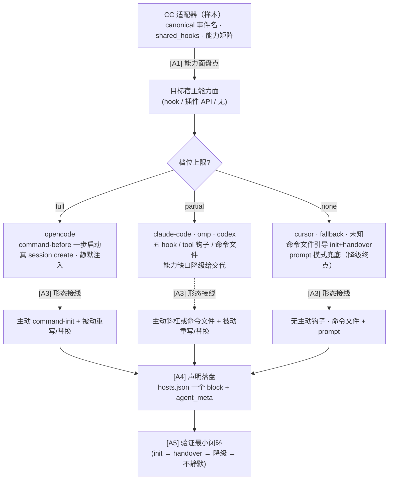

**各编码 Agent 适配差异速查表**（对照 CC 样本逐项覆盖）：

| 宿主 | 档位 | 主动形态（斜杠启动） | 被动形态（阶段推进） | `context.clear` | `prompt.inject_system` | Stop 守卫 |
|---|---|---|---|---|---|---|
| opencode | full | `command.execute.before` 一步 command-init | `tool.execute.before/after` 重写 + 替换 | ✅ 真 `session.create` + `tui.publish` | ✅ `system.push` | `session.idle` 观察者（stub） |
| claude-code（本特性） | partial | `UserPromptSubmit` → command-init | `PreToolUse/PostToolUse` | ⚠️ 降级 `[AET] Context cleared …` | ⚠️ `[AET system note]` | ✅ Stop 决策 API block |
| omp | partial | 命令文件承载（`hasPlugin:false`） | `tool_call` 重写 + `tool_result` 替换 | ⚠️ 降级文本指令 | ⚠️ 降级文本 part | 无（放行） |
| codex | partial/file-layer | `.agents/skills/<id>/SKILL.md` 描述触发 | 无重写（skill 自触发 + bash） | ⚠️ 降级 | ⚠️ 降级 | 无 |
| cursor | none / bash-prompt | 命令文件引导 init+handover | prompt 模式 | ⚪ 兜底（prompt 文本） | ⚪ 兜底 | 无 |
| 未知 agent | fallback | `resolveAgentMeta → fallback`（prompt-only） | prompt 模式 | ⚪ 兜底 | ⚪ 兜底 | 无 |

> **扩展性结论**：Core 永不感知宿主 —— 它只发事件；每个编码 Agent 的适配器 = **能力面档位 + 逐事件决策 + 形态接线 + hosts 声明**。CC 是 partial 档的样本、OpenCode 是 full 档的上限参照，其余宿主对照落地即可。降级永远是**显式、有交代**的（R9），降级终点是 CLI 的 prompt 模式——「不同平台支持的功能有差异、各自提供额外便捷内容」的架构落点。

---

> **一句话总结**：把 AET 事件驱动运行时接入 Claude Code，做成 **五类 hook 单文件接线（canonical 语义 + hosts 方言继承）→ 主动斜杠 command-init 一步启动 → 被动 Bash 重写 + stdout 整体替换（agent 只见干净文本，events[] 只有插件读）→ 双通道翻译器 + 状态横幅 → 能力矩阵逐事件降级（CC 的 context.clear 等降级给交代不放水）→ Stop 停止守卫（决策 API stderr+exit2 · 会话匹配才 block · stop-guard 预算）→ SessionStart 预创建命令目录 → aet plugin init 生成 `.claude/commands/aet/` → install.sh 一键安装 + codeagent3/codex 平行分发 → 调试审计（AET_DEBUG）→ §3.12 以 CC 为样本示范适配任意编码 Agent（能力档位 · 五步接线 · 降级链终点为 CLI prompt 模式）** 的安全、可审查、可扩展适配器；新增宿主只在 `hosts.json` 一个声明块 + 一份档位级适配器，规则全部落盘为 hook / 能力矩阵 / 声明式 hosts 表。