# AET 特性设计文档 · 需求分析与设计

## 需求描述

**背景与问题**：单个 AI Agent 直接面对"原始需求 → 结构化规格 → 可落地设计"的长程任务时，普遍存在四类失效：
1. **歧义未穷尽就产出** —— 需求没搞清楚就按步骤机械执行，把假设当结论带进下游；
2. **上下文爆炸与漂移** —— 整库/整仓库一次性灌入主上下文，关键信息被稀释，越往后越漂移；
3. **层级识别错误与编造** —— 一次性吞入整棵库树，分不清目录/叶子/功能，凭印象"编造"场景与功能；
4. **一次生成不完备、反复返工** —— 复杂任务难一次成形，漏掉边缘行为与不可行点，到实现调试阶段才暴露。

**特性目标**：把"需求分析 → 需求分析评审 → 功能设计 → 功能设计评审"这条链做成**结构化、可交互、可评审、不漂移**的流水线 —— 输入原始需求与项目代码库，输出需求分析说明书（IR）与功能设计说明书（SDD），并在关键节点通过 Agent 评审门禁与用户参与保证质量，为下游开发计划（DPS）与实现提供精确依据。

**范围**：
- **含**：需求澄清、场景/用例建模、需求分解（FR/NFR/EARS）、功能影响分析、SDR 多类型影响分析、模板/检查清单动态组装、文档生成、Agent + 人工评审门禁、并行代码库探索、对抗式（红队）设计方案验证、FMEA 故障模式分析、架构围栏契约。
- **不含**：实现域（编码/TDD/开发计划 DPS 的完整机制）、测试域、发布域、运维域、漂移检测与变更流程（由 `aet-req-drift-detect` / `aet-req-refine` 承担）。

**价值主张**：Agent 只回答"What，不回答 How"在分析阶段被硬约束；设计阶段每项决策锚定 IR 与真实代码；评审不再依赖单一自审，而是"独立子代理 + 用户批注"双门禁。**doc 是特性的载体**，规则、流程、检查项全部落盘为可执行的 Skill / SOP / 模板与 checklist，而不是靠口头约定。

---

## 1. 总体方案

### 1.1 特性位置总览

特性位于 AET 设计域，由三层协作构成：**设计人员**（关键节点审核修订与设计资产维护）、**AI Agent**（编排执行核心设计流程）、**领域资产**（场景 / 功能 / SDR / FMEA 库，上游沉淀）。核心设计流程为「需求分析 → 需求分析 Review → 功能设计 → 功能设计 Review」；**架构上下文构建**（前置）与**开发 / 设计实现一致性评审**（后置）以虚线框标示，不属于设计流程本体。总览如下：

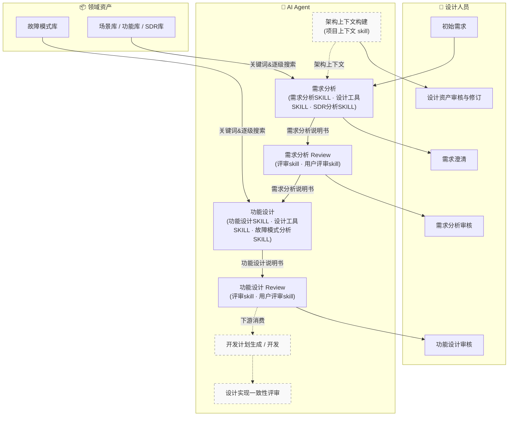

**三层职责划分**：

| 角色层 | 职责 | 与特性的交互方式 |
|---|---|---|
| **设计人员** | 初始需求输入、需求澄清问答、场景/功能确认、Agent 评审后的批注修订、设计资产审核与修订 | 对话框交互（单批问题 + 选项）、文档内批注（`aet-req-user-review` 快照机制） |
| **AI Agent** | 承载全部 Skill 编排：架构上下文构建（前置·虚线）→ 需求分析 → 需求分析 Review → 功能设计 → 功能设计 Review → 生成交付物；开发 / 设计实现一致性评审（后置·虚线）属下游消费 | 主 Agent 执行编排，SubAgent 承担探索与评审，防止上下文污染 |
| **领域资产** | 场景库 / 功能库 / SDR 库 / 规范库 / FMEA 库 / 项目分析文档 | 存在性感知（`context`）+ 逐级浏览（`library`），**禁止直读** |

### 1.2 总体设计原则

本特性遵循 AET 设计域的三条正交原则（在架构上下文特性中同样成立），所有 Skill / SOP / 脚本都按此组织：

1. **Skill 分层建模**（`<>` 包裹）：每个 SKILL.md 用 `<role>` / `<policy>` / `<guideline>` / `<instruct>` / `<constraint>` / `<condition>` / `<patch>` 等标签分离"角色、目标、边界、步骤、红线、路由、强化建议"。
   - **分离角色**：执行主体（分析师 / 设计师 / 评审员）彼此独立，生成偏好发散、评审偏好收敛；
   - **更新与维护简单**：改角色不动步骤，改约束不动流程；
   - **减少冲突与霰弹式修改**：一处方法论只在一处声明，避免同类规则散落多处互相打架。

2. **SOP 拆分、按需加载**：SKILL.md 只保留编排骨架（阶段序列与完成标准），具体执行步骤拆到 `workflows/sop-*.md`，**每阶段执行时才加载对应 SOP**。
   - 避免上下文爆炸：主上下文常驻的只有骨架，细则用完即弃；
   - 避免干扰与约束冲突：不同执行阶段的方法论互不叠加；
   - 提升稳定性：单条 SOP 出问题只影响一个阶段，可独立修复。

3. **脚本构建为无依赖 mjs**：所有工具脚本（`aet-design-env.mjs`、用户评审 bootstrap）由 `scripts/src/*.ts` 经 `build.mjs` 构建为**零第三方依赖的单文件 mjs**。
   - 主机无需联网装库即可运行；
   - 单一执行入口，路径稳定（`skills/<skill>/scripts/*.mjs`）；
   - bundle 是编译产物，源码可读可测（vitest 覆盖）。

### 1.3 架构设计（4+1 视图）

#### 1.3.1 逻辑视图（自下而上）

本特性横跨设计域支撑栈的下五层，依赖方向自下而上（下层被上层引用，上层编排下层）：

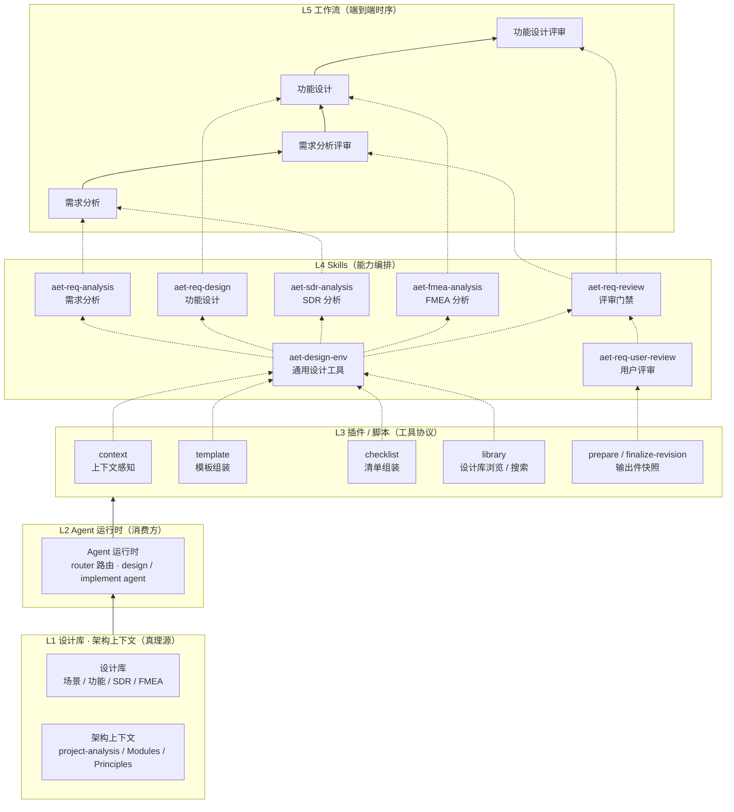

- **L1 设计库 · 架构上下文**：唯一持久化真理源，只读不写；`context` 探测存在性、`library` 逐级浏览。
- **L2 Agent 运行时**：最终消费方；接收注入的"摘要 + 路径"，详情按需载入；**永不直读整库**。
- **L3 插件 / 脚本**：把"上下文感知（context）、模板组装（template）、清单组装（checklist）、库浏览（library）、输出件快照（prepare/finalize-revision）"固化为确定性脚本协议，Agent 通过 bash 调用并读 stdout，而非靠提示词劝说。
- **L4 Skills**：本特性的七个技能，各自持有一到多个片段的 SOP；
- **L5 工作流**：`需求分析 → 评审 → 功能设计 → 评审` 的阶段链，产出物（IR → SDD）作为阶段间契约。

**分层不变量**：下层是真理源与确定性协议，上层是编排与消费；改动下层协议时上层无需变化（如 SDR 库拆安全/可靠性，`context sdr-lib` 输出结构变化但下游仍读 `<sdr>` 块；`aet-sdr-analysis` 的 A0 自动发现类型，新增类型无需改技能代码）。

#### 1.3.2 进程视图

**主流程时序**（Mermaid sequence），展示用户（设计人员）在链路上的全部触点：

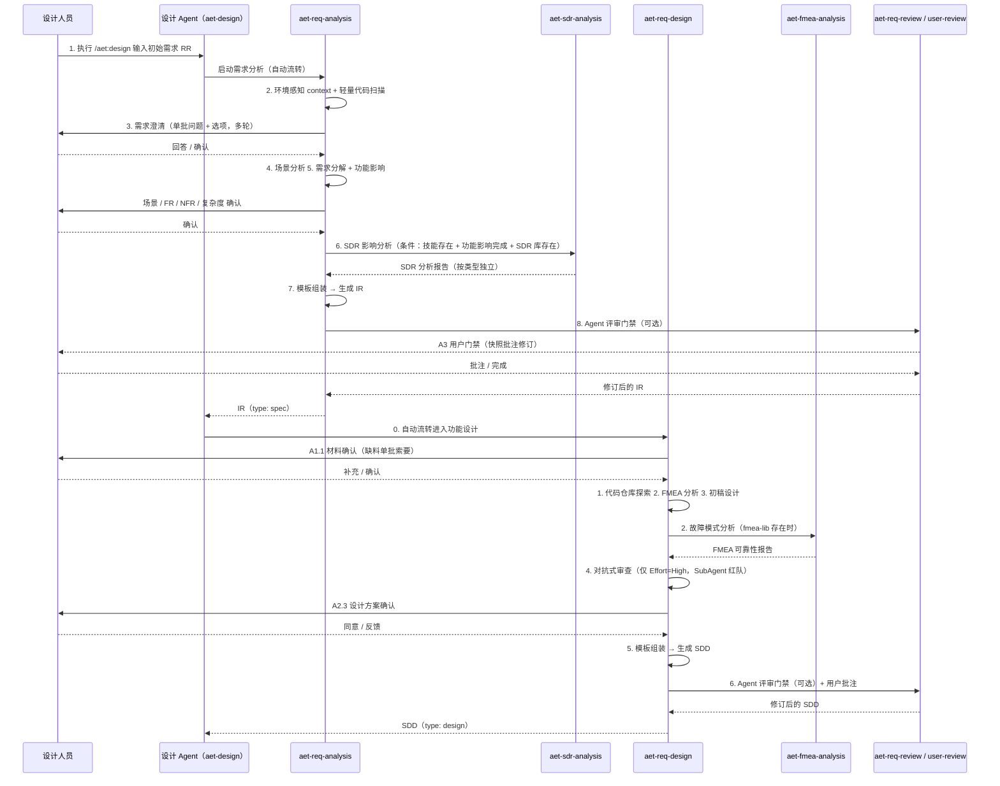

**上下文感知与库浏览的进程形态**：`context` 每个库插件独立探测 `.aet/*.yml`，输出 `<exists>/<path>/<instruction>` XML 元数据驱动技能**存在性二分支**（存在 → 进入该库分析流程；缺失 → 降级跳过，不放水）。`library` 每次只返回一层的折叠视图，**感知 ≠ 浏览**（感知阶段只告知存在性，浏览需在后续明确指令后执行）。

**并行进程**：代码探索、评审门禁、红队验证均可委派 SubAgent（主 Agent 只保留结论性摘要），代码探索按复杂度委派 1~4 个子代理、探索类任务限定输出密度（`Key: Value` + `[file:line]`），把整文件挡在主上下文之外。

#### 1.3.3 开发视图（组件与文件映射）

| 组件 | 路径 | 职责 |
|---|---|---|
| 需求分析技能 | `skills/aet-req-analysis/SKILL.md` | pipeline(3)：S1 澄清（Inversion）→ S2 生成 → S3 评审；Iron Rule：澄清未完成禁止产出文档 |
| 需求分析 SOP | `skills/aet-req-analysis/workflows/sop-{elicitation,scenario-analysis,requirement-decomposition,functional-impact,generation,load-template,review}.md` | 每阶段的执行细则，按需加载 |
| 功能设计技能 | `skills/aet-req-design/SKILL.md` | pipeline(4)：A1 探索 → A2 草案与验证 → A3 生成 → A4 评审 |
| 功能设计 SOP | `skills/aet-req-design/workflows/sop-{exploration,design,verification,generation,load-template,review}.md` | 解剖、四问设计框架、红队验证（仅 High）、生成、评审 |
| 评审门禁 | `skills/aet-req-review/SKILL.md` | pipeline(5)：A1 子代理门禁 → A2 修订 → A3 用户门禁 → A4 复审 → A5 结束；>2 轮熔断 |
| 用户评审 | `skills/aet-req-user-review/SKILL.md` | pipeline(4)：prepare（快照）→ guide → finalize（毁快照）→ process hunk；Node bootstrap |
| 通用设计工具 | `skills/aet-design-env/SKILL.md` + `scripts/aet-design-env.mjs` | tool-wrapper；6 子命令 `setup / context / template / checklist / library / check`；无依赖 bundle |
| SDR 影响分析 | `skills/aet-sdr-analysis/SKILL.md` + `scripts/cli.mjs` | pipeline(5+1)：A0 类型发现 → A1 候选提取（按类型）→ A2 规范级详情 → A3 状态传播 → A4 报告生成 → A5 全局检查；每种 SDR 类型独立执行 A1-A4；CLI 子命令 `analyze / index / analyze-obj / detail / report`；无依赖 bundle |
| FMEA 分析 | `skills/aet-fmea-analysis/SKILL.md` | pipeline(3)：准备 → 四维遍历 → 报告；`assets/output.md` 输出模板 |
| 需求分析模板集 | `references/_templates/req-analysis/{artifact,checklist,components/}` | 骨架 + 占位符 + 可插拔组件 + 组件内嵌 `checklist:` |
| 功能设计模板集 | `references/_templates/req-design/{artifact,checklist,components/}` | 同上，含围栏 Mermaid 组件（module-changes） |
| 评审规则 | `references/deliverable-review.md` | 三级严重度计分（ERROR −5 / WARNING −2 / INFO −0）与结论格式 |
| 红队清单 | `references/feasibility-checklist.md` | Fact / Omission / Feasibility / Alternatives 四维攻击面 |
| 入口 Agent | `commands/design.md` → `agents/design/prompts/main.md` | `/aet:design` 命令路由到 aet-design agent；prompt 约定文档优先、代码为真理 |

**模板/清单同源**：`artifact.md`（生成骨架）与 `checklist.md`（审查清单）共用同一批组件文件，组件 frontmatter 的 `checklist:` 字段与正文**共址演化** —— 生成时组装 `artifact.md`，审查时组装 `checklist.md`，两路共享同一方法论，避免"模板一套检查项另一套"的漂移。

#### 1.3.4 物理视图（部署形态）

| 部署件 | 说明 |
|---|---|
| 编码 Agent 宿主 | Skills 以目录形态装入 OpenCode / Claude Code / xiaoo 等宿主；`/aet:design` 由宿主插件注入命令 |
| Node.js 运行时 | ≥ 18；执行 `aet-design-env.mjs`、`bootstrap.mjs` 等无依赖 bundle |
| Git 仓库 | 提供代码真理、`base_commit` 基线（供后续漂移检测） |
| 盘上资产库 | `.aet/*_library.yml`（scenario / function / sdr_security / sdr_reliability / security_spec / fmea）与 `.aet/project-analysis/`（可选） |
| 输出落盘 | `ai_assistance/features/{feature-name}/design/` 或 `.aet/{task-id}/design/`，命名 `{YYYYMMDD-HHMMSS}-{description}.md` |

#### 1.3.5 场景视图（+1）· 驱动架构的关键用例

| 场景 | 行为 | 架构为之做出的取舍 |
|---|---|---|
| S1 有场景库 → 场景化需求分析 | `context scenario-lib` 存在 → 进入 S1.3 场景化分支；用 `library` 逐级展开，`Actor + 业务问题`锚定，不字面匹配关键词 | 存在性条件分支 + 逐级展开协议 |
| S2 无 FMEA 库 → 跳过可靠性分析 | `context fmea-lib` 缺失 → A2.1 FMEA 流程跳过；但 `FMEA 库存在时必做且与 Effort 无关` | 条件注入二分支；"有库才分析" |
| S3 复杂任务（Effort=High） | S1.4 评估 High → A2.2 必须红队验证、模板全量、评审完整（子代理门禁 + 用户门禁 + 可选复审） | Effort 驱动分级验证与评审力度 |
| S4 用户批注修订 | A3 用户门禁通过快照机制引导用户在文档内批注，A4 按 hunk 链式一致性处理并全局扫描 | 快照安全机制 + 链式影响修订 |
| S5 模板定制（中软/RTOS 体例） | 项目 `.aet/design/` 插件覆盖基线组件；`shield` 屏蔽；`plugin` 激活链 | 插件分层查找 + 屏蔽 + 激活四机制 |

### 1.4 用户执行流程

特性由设计 Agent（`/aet:design`）驱动，全程分**两段用户流程**，各自明确输入输出与用户触点。**标注 ✅ 的步骤为用户交互点**，其余为 Agent 自动执行。

#### 1.4.1 需求分析流程（输入：初始需求 → 输出：需求分析说明书 IR）

| # | 步骤 | 执行内容 | 对应实现 | 输入 | 输出 | 用户交互 |
|---|---|---|---|---|---|---|
| 1 | 启动需求分析 | 用户以自然语言输入**原始需求（RR）**，执行 `/aet:design` 进入设计 Agent 并触发需求分析 | `commands/design.md` → `agents/aet-design` | RR（Issue / 口头 / 会议纪要 / 工单） | 任务上下文 | ✅ 用户发起 |
| 2 | 领域知识感知与代码库探索 | 感知四库 + 项目分析存在性（`context`），对代码库做**轻量扫描**（广度优先，只建立初步技术上下文，不深度探索） | A1.0 `context scenario-lib function-lib sdr-lib` + A1.1 轻量扫描 | 设计库、代码库 | XML 库元数据 → 条件分支路由；初步技术上下文 | ❌ |
| 3 | **需求澄清** | Agent 主导**多轮追问**：先陈述"已理解"与"仍不明确"清单，单批给出选项化问题，直至**所有歧义消除且用户确认**；绝不带着未澄清的假设进入下一步 | S1.2 `sop-elicitation`（Inversion） | 用户对问题的回答 | 澄清记录（`clarification-records`）、明确的需求边界 | ✅ 多轮问答 |
| 4 | 场景分析 | 基于**业务本质**识别场景并映射用例，逐级展开场景库对齐粒度，挖掘易被忽略的备选/异常/边界行为 | S1.3 `sop-scenario-analysis` | 澄清后的需求、场景库 | 场景-用例清单（含主成功/备选/异常） | ✅ 场景选择与用例确认 |
| 5 | 需求分解与功能影响 | 基于场景分解需求，**判定功能 vs 规格**，按 EARS 约束输出 FR/NFR/破坏性变更，评估复杂度（Effort）；**按场景驱动**分析功能树受影响的 Add/Delete/Modify 增量 | S1.4 `sop-requirement-decomposition` + S1.5 `sop-functional-impact` | 场景用例、功能库 | FR / NFR / Breaking changes、Effort 评估、功能影响表 | ✅ FR/NFR/复杂度/功能影响确认 |
| 6 | 非功能性正交分析（SDR） | 自动发现 SDR 类型（安全/可靠性等），按类型独立执行 A1-A4 流水线：候选提取→规范详情→状态传播→报告生成；采用 CLI 生成中间文件 + 增量标注 + 自动汇聚模式 | S1.6 `aet-sdr-analysis`（条件：skill 存在 + 功能影响完成 + SDR 库存在） | SDR 库、功能库、规范库 | 各类型独立 SDR 分析报告（`sdr_report_<类型名>.md`） | ❌（一般） |
| 7 | 生成需求分析说明书 | 加载模板并组装（`template` 子命令 → 占位符内联 + 自动编号），将澄清与分析结果填充为结构化 IR | S2 `sop-load-template` + `sop-generation` | 组装模板 + 分析内容 | **IR 需求分析说明书**（`type: spec`） | ❌ |
| 8 | Agent 评审 + 人工评审（可选） | 先按**动态组装检查表**自动评审（`checklist` 子命令 → SubAgent 打分级），用户可参与人工批注修订；评审不入流程则不进入下一步 | S3 → `aet-req-review` | IR、`deliverable-review.md`、动态 checklist | 修订后的 IR | ✅ 可选参与 |

**Iron Rule**：直到 S1 的澄清/场景/分解/功能影响/SDR 全部完成且满足反演完成标准前，**禁止生成任何文档**（`SKILL.md <constraint>` 明文）。

#### 1.4.2 功能设计流程（输入：IR + 代码库 → 输出：功能设计说明书 SDD）

| # | 步骤 | 执行内容 | 对应实现 | 输入 | 输出 | 用户交互 |
|---|---|---|---|---|---|---|
| 0 | 自动流转进入功能设计 | 承接上一阶段 IR（设计流水线输入**必须** IR + 代码库）；确认设计材料齐备，缺料**单批索要** | A1.0 `context fmea-lib` + A1.1 材料确认 | IR、代码库 | 材料确认清单 | ✅ 缺料时补交 |
| 1 | 代码仓库探索 | **深度解剖**代码库（每个相关模块内部直至原语操作），代码为唯一真理；项目分析文档/需求文档仅是加速材料 | A1.2 `sop-exploration`（SubAgent ≤4，按复杂度委派） | 代码库、`project-analysis/` | 探索结论（`Key: Value` 高密度摘要） | ❌ |
| 2 | 故障模式分析 | 对照 FMEA 库四维评估（影响/原因/措施/新增），产出可靠性分析，供可靠性与 DFx 设计引用 | A2.1 `aet-fmea-analysis`（fmea-lib 存在则**必做**，与 Effort 无关） | FMEA 库、功能影响 | FMEA 可靠性分析报告 | ❌ |
| 3 | 初稿设计 | 四问框架（Codebase Grounding / Requirements Mapping / Architecture Design / Runtime Analysis）完成设计草案，不产出文档 | A2.2 `sop-design` | 探索结论 + IR | 设计草案（内存态） | ❌ |
| 4 | 设计方案对抗性评审 | 草案委派**红队 SubAgent** 按 `feasibility-checklist` 四维攻击（Fact/Omission/Feasibility/Alternatives），只修订一次，修复目标是最终方案 | A2.2 `sop-verification`（**仅 Effort=High**；Low/Medium 跳过） | 设计草案 + `feasibility-checklist.md` | 验证结论（Pass/Conditional/Failed）+ 修订后的方案 | ❌（SubAgent 执行，主 Agent 不读清单） |
| — | 设计方案用户确认 | 总结最终设计思路，征询用户同意 | A2.3 | 修订后的方案 | 用户确认 | ✅ |
| 5 | 生成功能设计说明书 | 模板组装填充，输出 SDD 文档 | A3 `sop-load-template` + `sop-generation` | 组装模板 + 设计内容 | **SDD 功能设计说明书**（`type: design`） | ❌ |
| 6 | Agent 评审 + 人工评审（可选） | 同需求分析：先按动态 checklist 自动评审，再用户批注修订（快照机制） | A4 → `aet-req-review`（A1-A5 门禁） | SDD、`deliverable-review.md`、动态 checklist | 修订后的 SDD | ✅ 可选参与 |

#### 1.4.3 两阶段输入输出汇总

| 阶段 | 必须输入 | 推荐/可选输入 | 输出 | 下游消费 |
|---|---|---|---|---|
| 需求分析 | 用户初始需求（RR） | 项目代码库（推荐）；领域素材、场景库/功能库/SDR 库（可选，存在即接入）；规范库（可选，SDR 分析使用） | 需求分析说明书 IR（`type: spec`）+ SDR 分析报告（可选，按类型独立） | 功能设计流水线、评审门禁、漂移检测 |
| 功能设计 | IR、项目代码库 | 项目分析文档（推荐）；FMEA 库（可选，存在即必做 FMEA）；参考项目代码库与设计参考 | 功能设计说明书 SDD（`type: design`）+ FMEA 报告（可选） | 开发计划 DPS、实现、评审、refine |

---

## 3. 功能设计

### 3.1 需求澄清（Elicitation）

**功能概述**：Agent 主导的多轮对话式需求澄清。输入**初始需求（RR）**，模型先梳理"已理解什么、还不明确什么"，通过 Socratic 对话穷尽歧义，直到用户确认后才进入下一步。是反演模式（Inversion）的核心载体——**先穷尽歧义、后产出交付**。

**实现思路**：
- 避免机械跑检查单：以 Shoshin（初学者心态）提问，每次只发**单批**确认问题；
- 防"没搞清就执行"：未澄清的假设会污染下游场景分析与规格设计，故设置硬性完成标准（无残余歧义 + 用户确认）；
- 只问 What 不问 How：不问技术栈、架构、模块划分，尊重问题域 / 解决方案域边界。

**实现设计**（`sop-elicitation.md`）：

```
[A1] Socratic Dialogue
  - 输出"我目前的理解是：[...]" + "目前还不够明确的是；"（含候选理解 1a/1b...）
  - 提供选项化问题（含推荐项），避免开放式空谈
  - 仍有缺口 → 继续追问，直至歧义彻底消除
[A2] Scope and Context
  - 输出"我理解的需求边界不做：[...]" + "业务背景与动机为：[...]"
  - 请求确认边界与背景动机
完成标准：所有歧义完全澄清；DO NOT proceed to the next phase until fully clarified
```

**澄清循环活动图**：

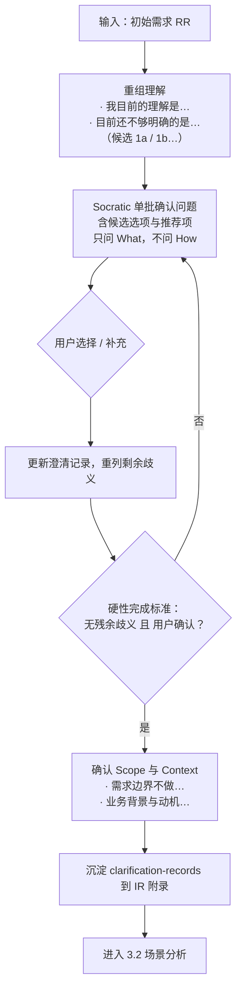

- **用户交互**：每轮"单批问题 + 候选选项（含推荐项）"，用户只做选择或补充；支持多个维度的选项批量确认。
- **防漂移机制**：对话记录沉淀到 IR 的 `clarification-records` 附录组件，下游可追溯每条结论的由来。

### 3.2 场景分析（Scenario Analysis）

**功能概述**：基于业务本质识别用户场景并映射用例。输入澄清后的需求与可选场景库，输出"场景 → 用例（主成功 / 备选 / 异常）"清单，重点**挖掘用户可能忽略但系统必须支撑的边缘行为**，为能力推导与需求分解提供骨架。

**实现思路**：
- **关键词陷阱防御**：按 `Actor + 业务问题` 锚定，不做字面关键词匹配；即时命中也须再验证 Actor 与业务问题是否真对齐；
- **粒度对齐防编造**：新增场景必须显式挂接父节点、匹配存量粒度；无对应节点才允许新增且须说明；
- **逐级展开协议**：库一层一层看，杜绝"目录当叶子读"的层级识别错误；
- **一场景一业务目标**：不按 API/模块 1:1 映射，动宾命名。

**实现设计**（`sop-scenario-analysis.md`）：

```
[A1] 场景库分析（库存在则强制）
  1. Grasping the Essence：先解构业务本质（Who/Why/What），再查树
  2. Breadth Search：根级浏览 → 按 Actor+业务问题 批量展开候选目录 →
     尽量扫全子类不提前定格 → 收敛到叶子场景（用例挂载点）
[A2] 用户确认
  - 相关场景 + 需新增场景 → Q1 选择合适场景（可多选）
  - 最重要用例（主成功 ≤20 字）→ Q2 主用例是否准确
  - 易忽略的扩展/备选/异常（≤3 个关键事件）→ Q3 是否准确无遗漏
分支：库不存在 → 跳过 [A1] 直接生成场景与用例
硬约束：`-s` 关键词搜索 ≤3 次，之后必须回根逐级展开；禁止直读库 YAML
```

**场景分析流程图**：

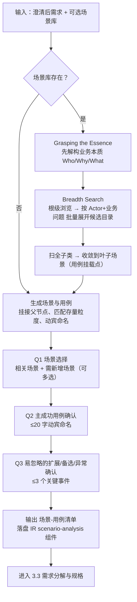

- **用户交互**：场景选择（可多选）、主用例确认、关键扩展/异常确认（只展示关键子集，不倾倒整个文档包）。
- **输出**：场景-用例清单（含完整树路径），作为 3.3 需求分解与 3.4 功能影响的基线，落盘到 IR 的 `scenario-analysis` 组件。

### 3.3 需求分解与规格（分解 + 覆盖判定 + 功能影响分析）

**功能概述**：把场景/用例/行为路径分解为结构化需求规格，判定"功能 vs 规格"，评估复杂度，并按场景驱动分析既有功能树受影响的增量（Add/Delete/Modify）。输入场景用例与可选功能库，输出 FR/NFR/Breaking Changes、Effort、功能影响表。

**实现思路**：
- **怎么覆盖场景**：遍历全部行为路径（主成功、备选、异常、失败），每条路径识别三类规格——功能需求（系统必须提供的能力）、非功能需求（DFx）、破坏性变更（不兼容影响须显式标注）；
- **怎么判定是功能还是规格**：
  - *功能（FR）* = 支撑同一业务闭环/数据流的一组能力，聚合不拆分（同一核心业务回路内的多种支付方式 → 归并为一个 FR）；
  - *规格* = 归属于某功能的具体细则，含分支/异常流——性能约束、重试、降级、错误处理、大小限制都作为**主需求下的规格**，不独立成需求；
  - *同一数据流*（同源同目的的图像/视频/文件发送）也并入同一需求；
- **怎么进行功能影响分析**：功能树为 `function（动词+名词）→ function_spec / function_constraint / function_point` 三级；**按场景驱动**，以该场景行为路径与功能树节点的相交判定影响，三层（功能级规格/约束、功能点级规格/约束）分别判 Add/Modify/Delete，禁止无库时一律归 Add。

**实现设计**：

`requirement-decomposition.md`：
```
[A1] Traverse All Paths → 推导规格并聚合为 FR
  Q1: 预估实现难度 Low/Medium/High 是否要改（四维评估）
  Q2: 功能性需求 FR-00x - 规格1[EARS]; 规格2[EARS]...（≤3 关键规格）是否遗漏
  Q3(低速+无DFx影响则跳过): 非功能需求（可用性/可靠性/性能…）是否合理或遗漏
新不变量：FR 用 EARS 句式（当[触发]发生时，系统应[动作]）；全部可测试
复杂度四维：代码量 / 非功能约束强度 / 架构变更范围 / 代码库熟悉度 → Effort
```

`functional-impact.md`：
```
[A1] Function Library Mapping（库存在则强制）
  1. 按场景（含备选/异常路径）追踪相交的功能树节点
  2. 根级浏览 → 广扫子功能比较 → 收敛到受影响 function → 展开子节点审计基线
[A2] Impact Analysis & Confirmation
  - 定位受影响功能 + 高层影响（Add/Delete/Modify）→ Q1 定位与影响类型是否准确
  - 影响明细（增删改功能点/规格/约束；仅汇总不展开细节）→ Q2 变化描述是否准确
降级：功能库缺失 → 对代码库做轻量功能识别输出候选功能清单，[A2] 仍强制
硬约束：不改库文件（库是不可变基线，影响仅记录在设计文档）；禁直读；禁关键词搜索替代逐级
```

**需求分解 → 影响分析时序图**：

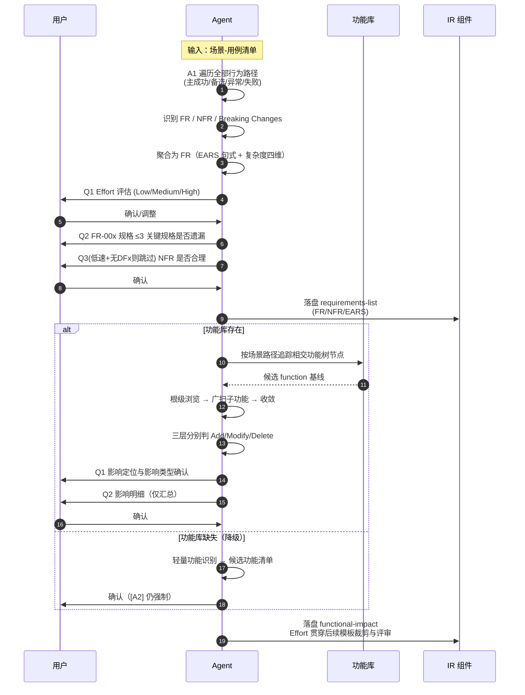

- **用户交互**：Effort 评估确认、FR/NFR 清单确认、功能影响定位与明细确认。
- **输出**：IR 的 `requirements-list`（FR/NFR/EARS）、`functional-impact` 组件；Effort 值贯穿后续模板裁剪与评审力度。
- **输出**：IR 的 `requirements-list`（FR/NFR/EARS）、`functional-impact` 组件；Effort 值贯穿后续模板裁剪与评审力度。

### 3.4 非功能性需求正交分析（SDR）

**功能概述**：从安全/可靠性等非功能维度对需求做**正交分析**，对照 SDR 库输出结构化 SDR 影响评估报告。支持多种 SDR 类型（安全设计需求、可靠性设计需求等），每种类型独立分析并输出独立报告。采用"CLI 生成中间文件 + Agent 增量标注 + 自动化汇聚"模式，避免 Agent 全量重写、避免直读大型库文件。

**执行条件**：`aet-sdr-analysis` 技能存在 AND 功能影响分析完成 AND SDR 库存在。三个条件任一不满足则跳过，不放水。

**实现思路**：
- **多类型自动发现**：扫描任务输入目录，按文件命名模式（`sdr_<类型名>.yml`）自动识别所有 SDR 类型及对应的规范库文件，无需硬编码类型列表；
- **安全 vs 可靠性双路径候选提取**：安全 SDR 通过功能 ID 回溯功能树路径匹配 SDR（`analyze` 命令），可靠性 SDR 通过架构元素索引 + Agent 选择匹配（`index` + `analyze-obj` 命令）；
- **判定传导逻辑**：SDR 的涉及状态由下属规范决定——只要有一条规范涉及则 SDR 涉及，全部不涉及则 SDR 不涉及；无下属规范时由 Agent 直接判定；
- **两轮自问自答机制**：`rel_qa`（相关性问答）判断"是否涉及"，`sat_qa`（满足性问答）判断"是否满足"，确保判定有据可依；
- **CLI 中间文件驱动**：每步由 CLI 脚本生成 YAML 中间文件，Agent 仅增量修改 `is_affected` 和 `notes` 字段，报告由脚本渲染，中间文件生成后自动清除。

**实现设计**（`aet-sdr-analysis` A0–A5）：

```
[A0] 前置校验与 SDR 类型发现
  1. 校验前置条件（功能影响分析已完成、功能库完整）
  2. 扫描输入目录，发现所有 SDR 库文件（sdr_<类型名>.yml）
     及对应规范库文件（<类型名>_spec_library.yml）
  3. 输出 SDR 类型列表 {类型名, sdr库路径, 规范库路径(可选)}
  4. 若无 SDR 库文件 → 跳过后续全部步骤

以下 A1-A4 对每种 SDR 类型分别执行一轮：

[A1] SDR 候选提取（按类型）
  A1-a 安全SDR：
    node cli.mjs analyze -f <功能ID列表> -l <功能库.yml> -s <SDR库.yml>
    → 生成 sdr_overview_<类型名>.yml，筛选候选 SDR ID 列表
  A1-b 可靠性SDR：
    node cli.mjs index -s <SDR库.yml>     → 查看 obj_type 及 obj 列表
    Agent 判断选择受影响的 obj 名称
    node cli.mjs analyze-obj --objs <架构元素列表> -s <SDR库.yml>
    → 生成 sdr_overview_<类型名>.yml，筛选候选 SDR ID 列表

[A2] SDR 规范级详情分析（条件：有规范库 AND A1 有候选 SDR）
  node cli.mjs detail --sdrs <SDR_ID列表> -l <SDR库.yml> -p <规范库.yml>
  → 生成 sdr_detail_<类型名>.yml
  Agent 批量研判：
    - is_affected: true/false（涉及/不涉及）
    - 不涉及时 notes 必须填写原因
    - 批量脚本修改，避免逐条 Edit

[A3] 状态向上传播与概览更新
  - 有规范 SDR：下属存在涉及规范 → SDR 涉及；全部不涉及 → SDR 不涉及（补 notes）
  - 无规范 SDR：Agent 直接根据 SDR 内容判定
  - 批量脚本更新 sdr_overview_<类型名>.yml

[A4] 生成报告
  有规范库：node cli.mjs report -a sdr_overview_<类型名>.yml -d sdr_detail_<类型名>.yml -o <输出目录>/sdr_report_<类型名>.md
  无规范库：node cli.mjs report -a sdr_overview_<类型名>.yml -o <输出目录>/sdr_report_<类型名>.md
  清理中间文件（sdr_overview_*.yml, sdr_detail_*.yml）

[A5] 全局完成检查
  - 所有类型均已生成 sdr_report_<类型名>.md
  - 所有中间 .yml 文件已清除

约束：
  - 禁止跳过工具直读 SDR 库或规范库（文件极大且层级不清）
  - 无涉及 SDR 时仍须完成 A3（补 notes）和 A4（生成报告），禁止跳过
  - 每种 SDR 类型独立完成 A1-A4，不可合并
  - is_affected: false 时 notes 必须填写不涉及原因
```

**判定推理机制**：

| 机制 | 问题 | 判定原则 | notes 填写 |
|---|---|---|---|
| **rel_qa**（相关性问答） | 1. 功能变更内容是什么？2. 该规范要求什么？3. 二者是否存在因果关系？ | 只有功能变更**直接导致**规范约束对象发生实质变化才涉及；间接影响、同模块但无交集、无因果链均不算 | `is_affected: false` 时：不涉及：[规范约束对象]与[本次变更内容]无交集/无因果关系 |
| **sat_qa**（满足性问答） | 1. 规范具体要求？2. 现有设计已覆盖？3. 差距是什么？ | 只有**已有明确机制**满足才算满足；"可能满足"但无依据、部分满足未覆盖完整、未达量化指标均不算 | `is_affected: true` 且不满足时：不满足：[差距描述] |

**SDR 分析时序图**：

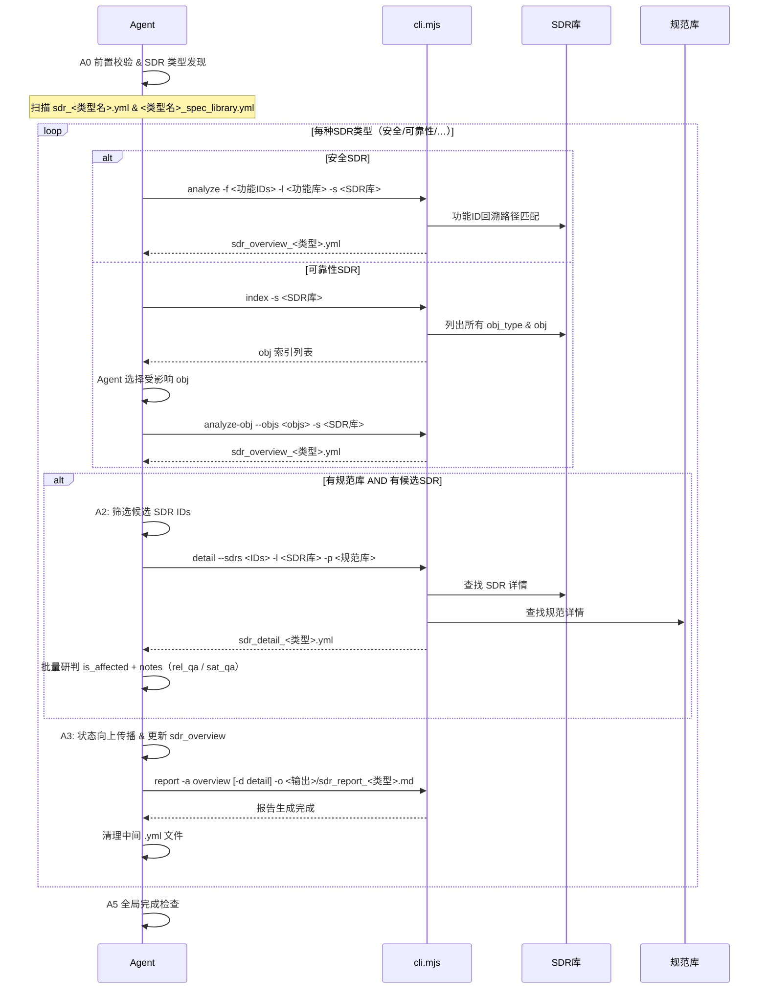

- **用户交互**：无直接交互（随需求分析流程自动执行）；SDR 分析报告作为 IR 的非功能需求章节依据，参与 3.6 门禁评审。
- **库升级路径**：SDR 库为不可变基线，分析结果以报告形式输出，不直接改库。

### 3.5 模板 / 检查清单动态组装

**功能概述**：把"方法论（组件正文）— 实际输出内容（组装后的模板）— 评审检查项（组件 `checklist:` 字段）"三者解耦又同源，动态组装出**生成模板**与**评审清单**。输入模板集路径，输出组装好的 Markdown 到 stdout。是多级、可配置、用占位符串联的组装器，也让审查评分更准确（checklist 与组件正文天然共址演化）。

**实现思路**：
- **多级组装**：组件可插拔（`{{component.aet,heading_level}}` 占位符内联 + 头部层级调整 + 章节自动编号），组件自身的 `checklist:` 做为审查项被 `checklist` 子命令单独组装；
- **可配置使用哪个模板**：插件分层查找（项目 `.aet/design/` → home `~/.aet/design/` → skill 自带 `_templates/` 兜底）+ `plugin.json` 的 `depends_on / shields` + `design.json` 的 `active` 链，实现"蓝区基线 + 黄区定制各维护同一套代码"；
- **方法论 ↔ 实际输出 ↔ 检查项关联**：同一组件文件的正文（方法论）、组装后章节（输出）、`checklist:`（评分项）三份内容围着一个组件演化，评审时按组件逐项打分，评分粒度对齐生成内容；
- **占位符约定**：`[[PH:id | rec:值 | why:理由]]` 兜住一切无来源数值；`<!-- condition: -->` 按 Effort 裁剪章节；`<!-- xxx -->` 指令禁止进入最终文档。

**实现设计**（`aet-design-env` `template` / `checklist` 子命令 + `sop-load-template` / `sop-review`）：

```
组装模板（生成）：node aet-design-env.mjs template <template-set-path>        # 走 artifact.md
组装清单（审查）：node aet-design-env.mjs checklist <template-set-path>        # 走 checklist.md
约束：
  - 未加载模板禁止生成任何文档
  - 禁止直接 read 模板组件文件，一律经子命令组装（统一编号/层级/剥离注释）
  - checklist 组装只允许在评审 SubAgent 中执行（主 Agent 不读，防上下文污染）
```

- **用户交互**：无（对用户透明，是 Agent 内部工具能力）；模板定制由设计人员在 `.aet/design/` 插件层完成。
- **评分准确性联动**：`deliverable-review.md` 的 ERROR −5 / WARNING −2 / INFO −0 计分按组装出的检查项逐条扣；≥85 Pass、70–84 Conditional、<70 Fail。

### 3.6 审查（Agent 评审 + 人工评审）

**功能概述**：交付物（IR / SDD）产出后的质量门禁。先由**子代理按动态检查表独立评审**，再走**用户门禁**（文档快照批注修订），修改量大且用户授权时可**复审**。是一个"判分 → 修订 → 再判"的循环，处理错误、结构化评审维度与打分均有确定协议。

**实现思路**：
- **为什么要 SubAgent 委派（两条根因）**：
  1. **避免 LLM 自我确认偏差** —— 生成者沿用自身生成逻辑、或被错误信息污染，难以发现自己产物的问题；独立评审子代理不知道生成过程，只按检查表收敛判分；
  2. **角色偏好差异** —— 生成 Agent 发散、创作；评审 Agent 收敛、稳定，二者角色分离（生成 Skill 不评审、评审 Skill 不生成）；
- **错误处理**：SubAgent 返回非法档位按 failed 处理并重跑一次；若循环超过 2 轮 → 熔断交还用户（忽略继续 / 继续循环重置计数）；Skill 或 SubAgent 崩溃 → 捕获部分结果、设 state=error、通知用户选择重试/跳到 A5/中止，**绝不静默绕过**；
- **结构化评分维度**：三级严重度（ERROR/WARNING/INFO）+ 固定扣分 + 档位阈值（≥85 / 70–84 / <70）+ 最差结果原则（多交付物并行评审时以最差档位路由下一步）；
- **修订不是表面补丁**：诊断式修复——追踪问题回产生它的方法步骤并**重执行**（重新探索代码 / 重新访谈用户 / 重新设计），修源头不修表面；并同步全局术语、交叉引用等**链式影响**。

**实现设计**（`aet-req-review` A1–A5 + `aet-req-user-review` A1–A4）：

```
[A1] SubAgent Gate     只确认路径存在（不读内容）→ 委派子代理按动态 checklist 评分
[A2] Deliverable Revision  逐项修复：诊断式修复 + 全局链式一致性；不引入新不合规
[A3] User Gate         强制加载 aet-req-user-review：
  A1 prepare-revision（快照）→ A2 引导用户文档内批注（4 种批注方式）→
  A3 finalize-revision（提取 diff + 销毁快照，破坏保护）→ A4 按 hunk 处理 + 链式修订
[A4] Re-gate           仅当 A3 修改量 >100 字符 且 用户授权 → 询问"需要复审/跳过复审"，语义同 A1/A2
[A5] End               输出"文档审查结束，再见。"

循环规则：Pass → 跳过下一轮；Fail → 强制下一轮；任一循环 >2 轮 → 熔断交还用户
```

**审查状态流转图 / 审查时序图**：

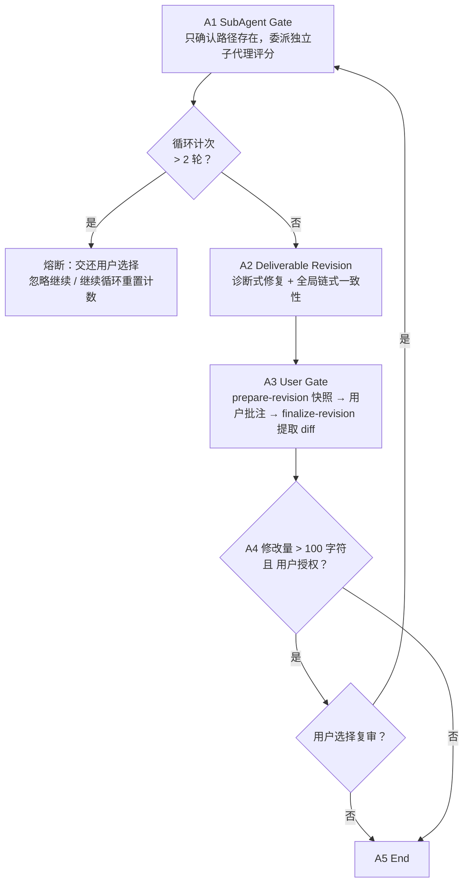
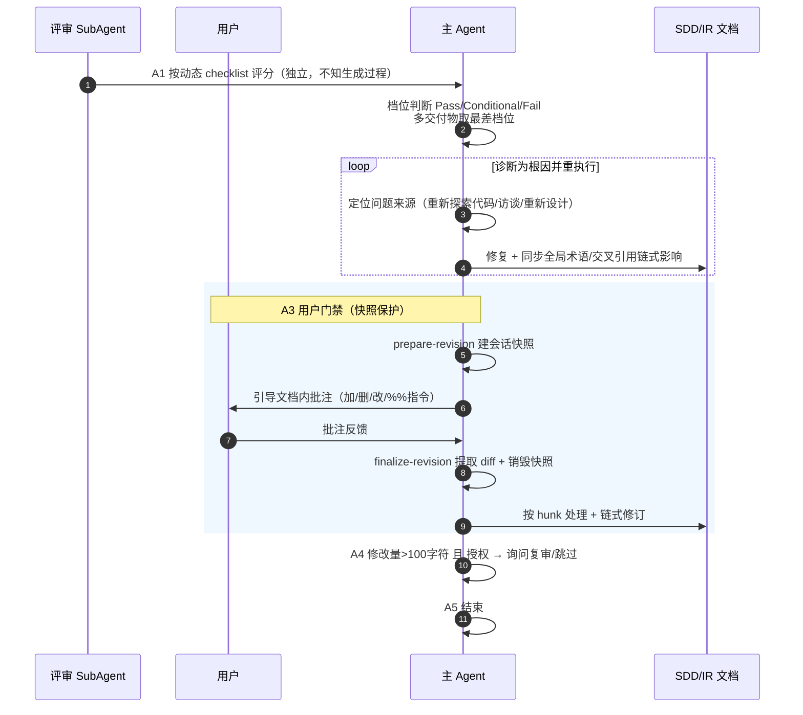

- **用户交互**：A3 用户门禁最重——用户直接在文档快照上批注（加文本 / 删文本 / 改文档 / `%%指令`），Agent 自动润色、定位引用处同步修订、跨文件链式一致性扫描；A4 复审由用户决定。
- **快照机制**（输出件快照）：prepare-revision 为每份交付物建会话快照，任何崩溃/超时（TTL）都有兜底 finalize；A3 之后快照销毁，下轮必须重跑 A1 —— 是文档安全的唯一保护层。

### 3.7 并行代码库探索

**功能概述**：在大仓库中**按复杂度委派 SubAgent** 并行探索，把"深度解剖"从主上下文搬走，加速探索同时控制上下文体积。两个阶段用法不同：需求分析只需**广度**（轻量扫，主 Agent 亲自做）；功能设计需要**深度**（委派探索），按 Effort 决定委派力度。

**实现思路**：
- **结构化委派规范**：按复杂度（Effort）决定委派层级——Low 直接读相关文档与代码；Medium 按需委派；High **必须**委派 SubAgent；
- **子代理上限与节俭**：最多 4 个，能用 1 个不用 2 个（探索不是并发竞赛，是必要覆盖）；
- **输出密度约束**（防主上下文爆炸）：`Key: Value` 高密度句式、代码引用 ≤10 行且带 `[file:line]`、Mermaid 而非 ASCII；
- **代码为唯一真理**：项目分析文档只是加速材料，冲突时活代码胜出；探索不停在接口，要追到原语操作。

**实现设计**（`aet-req-design` A1.2 `sop-exploration.md`）：

```
[A1.2] 深度探索
  1. 从本特性相关实现入手（入口点 / 执行路径 → 一直追到底层真实完成工作的原语操作）
  2. 按 Effort 委派：Low=直读 / Medium=按需 / High=SubAgent 强制
约束：
  - 不基于抽象假设设计：未透彻理解系统实现细节不开始设计
  - 探索子代理 ≤4，首选 1 个
降级：无代码库（绿地）→ 跳过既有系统分析直接设计
```

**并行探索时序图**：

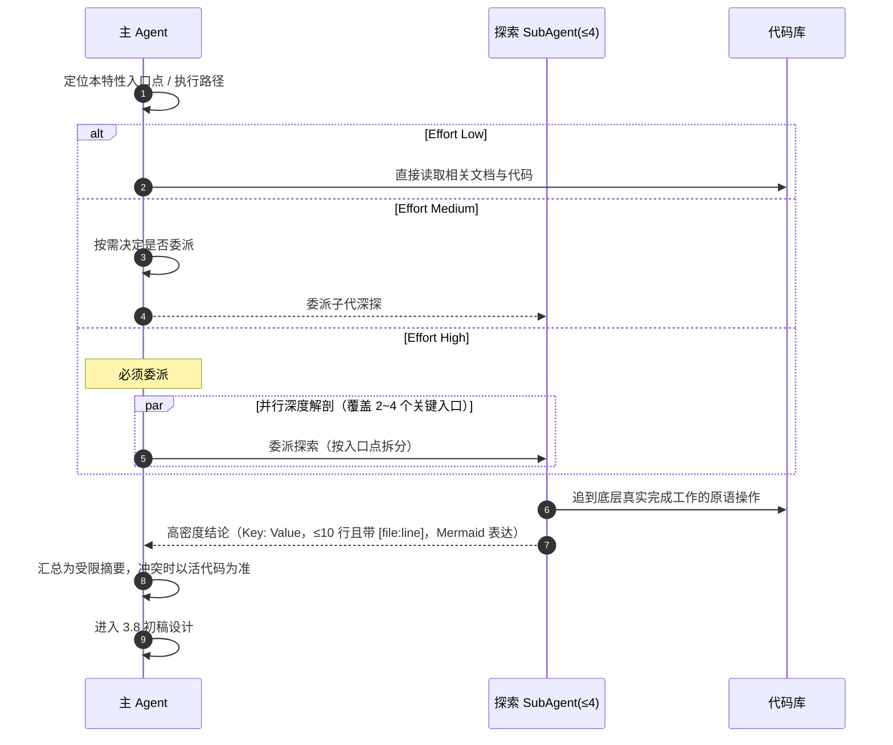

- **用户交互**：无（对用户透明，仅影响耗时与结论密度）。
- **输出**：探索结论密度受限的摘要集合，主 Agent 据此进入 3.8 初稿设计。

### 3.8 对抗式设计方案审查（红队验证）

**功能概述**：Effort=High 时，把设计草案委派给**红队评审子代理**，按四维攻击面挑刺，只修订一次。输入设计草案 + `feasibility-checklist.md`，输出结论（Fully/Conditionally Pass/Failed）+ 排序问题清单 + Key Attentions。

**实现思路**（三条设计动机）：
1. **早期熔断**：复杂任务在文档化之前发现不可行点，早发现早纠偏，规避后期整体重构的时间与 Token 浪费；
2. **对抗查漏**：解决复杂任务下 Agent 方案不完备——独立红队视角补盲区，完善设计；
3. **弹性触达**：仅 High 触发，Low/Medium 跳过，防止简单需求流程冗余。

**实现设计**（`sop-verification.md` + `feasibility-checklist.md`）：

```
委派模板（SubAgent）：架构总览 / 设计决策(≤3) → 每模块(≤3)职责·核心方法·假设·风险 →
  附 [需求文档路径] 与 [checklist 路径] → 按清单评估
四维攻击面：
  Fact（事实核查）：模块功能描述准确、依赖映射完整、既有约束解读、技术债理解
  Omission（盲区）：触发场景与入口点覆盖（异步/定时/管理接口/跨系统路径）、
                  边界与异常（极端数据/依赖失效降级/并发冲突/回滚补偿）
  Feasibility（可行性）：核心算法实证、性能瓶颈预案、技术栈成熟度、运维/监控/容量
  Alternatives（备选路线）：备选技术路线对比与拒绝理由
输出：Conclusion(≥档位) + Core Issue + 排序问题清单(每类≤5, KeyAttentions≤3)
约束：
  - 主 Agent 不读 checklist 与需求文档（只确认路径），只回收验证结果并修订
  - 只修订一次，目标是最终方案而非修补过程
  - High 必做；Low/Medium 跳过
```

**红队验证时序图**：

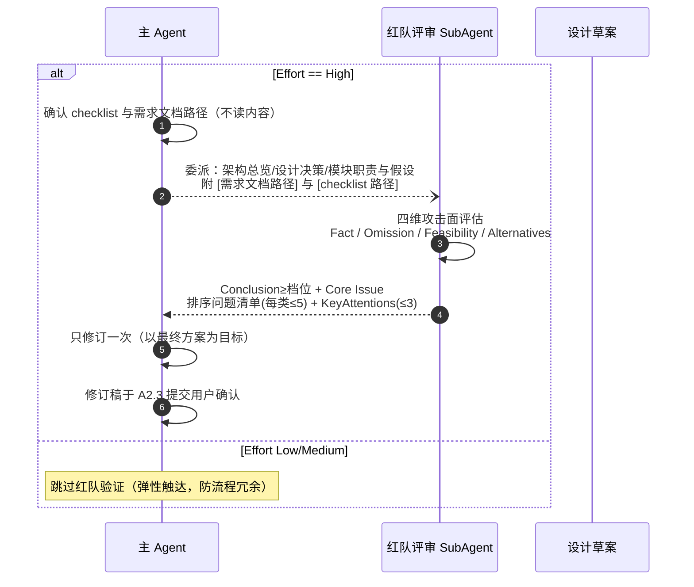

- **用户交互**：无直接交互（SubAgent 执行）；但修订后的最终方案在 A2.3 提交用户确认。

### 3.9 架构围栏（Fence）

**功能概述**：把设计方案转化为可视化围栏图，**明确控制设计实现范围**——不同颜色标识不同模块的可修改状态。采用 one-shot 策略（一次组装成图）与少量指令（少量约束文内嵌），把"能改 / 不能改"从口头约定变成文档契约，供下游开发计划（DPS）三连校验。

**实现思路**：
- **四色围栏**：新增（🟢 Add）/ 修改（🟡 Modify，须标明精确范围）/ 保护（🔴 Protected，相关但禁止改代码）/ 不涉及（⚪ Not Involved，关系近、有误改风险须显式声明）；
- **围栏不得冲突**：同一元素不得同时出现在不同类型；同一文件不得同时"修改"与"保护"；接口图节点必须有连线，孤儿节点须注释理由；
- **one-shot + 少量指令**：Mermaid 围栏图由模板组件一次生成（`module-changes.aet.md` 嵌入 classDef 四色定义），注释给出范畴化指令（每模块"新增/修改/保护/不涉及"少量约束），不在大段 prompt 里反复劝说；
- **下游消费**：DPS 每个任务携带精确文件路径 + Must NOT do（引用 Protected/Not-Involved），质量自查"每 Protected/Not-Involved 模块零任务命中"，计划触及围栏外时把矛盾回抛给用户。

**实现设计**（`module-changes.aet.md` 组件）：

```
Mermaid 变更图：外部参与者 + 模块分组 + 四色 classDef + 带接口编号的连线（IF-E/N/M/R）
模块变更表：模块 / 变更 / 职责 / 接口 / 依赖 / 约束（六列），粒度到"足以说明影响范围"
接口命名：IF-E(External)/N(New)/M(Modified)/R(Reuse)
评审锚定：checklist["架构变更图是否绘制 (ERROR)"] / ["变更类型分类准确 (ERROR)"] /
          ["单文件唯一归类"] / ["孤儿节点须注释理由"]
```

**组件变更依赖-围栏关系图**：

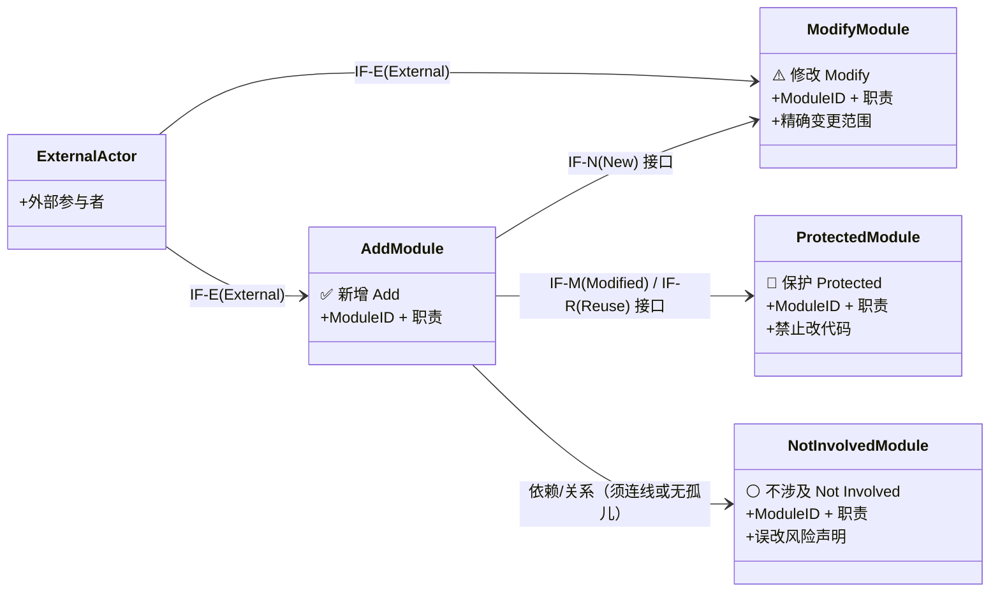

**围栏图生成 → 下游 DPS 审计活动图**：

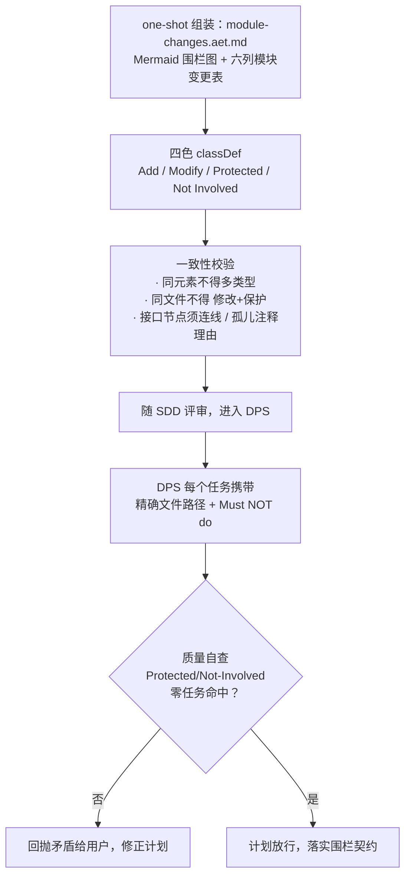

- **用户交互**：无直接交互；围栏随 SDD 一起评审、由 DPS 消费审计。

### 3.10 FMEA 故障模式库分析

**功能概述**：对照故障模式库，识别新增需求所影响功能点相关的故障模式，判断故障影响/原因/改进措施是否需要补充、是否需要新增故障模式。输入需求简介 + 功能影响分析 + FMEA 库，输出对齐库结构的 FMEA 可靠性报告，供设计参考。`fmea-lib` 存在时在 A2.1 **必做，与 Effort 无关**。

**实现思路**：
- **四维评估**：既有效果描述（effects）是否覆盖变更后的新后果；既有触发路径（causes）是否含新增业务逻辑/接口变动；既有检测/隔离/恢复手段（improvements）是否生效；仅当现有库彻底无法归类该失效机制才**新增故障模式**（小概率，保持审慎）；
- **抽象通用性**：补充/新增必须是抽象、可复用的通用故障模式与机制，严禁绑定本次需求特有的业务代码逻辑、变量名或临时实例化描述；
- **依据唯一性**：每项结论必须精准对应【功能设计说明】变更点与【故障模式库】具体节点字段，禁止泛泛而谈（"XX 与 XX 相关"）；
- **token 约束**：单一功能点 `-s` 检索 ≤3 次近义词，无果必须切回目录树逐级展开；库中不存在的节点 ID 必须先验证存在，新增显式标注 `新增`。

**实现设计**（`aet-fmea-analysis` A1–A3）：

```
[A1] 准备：校验 需求简介 + 功能影响分析 + 故障模式库 三要素，缺一即报错终止
          → 校验库文件存在性 → 提取受影响功能清单及数量
[A2] 遍历分析（对每个受影响功能）：
  1. 精确检索：library -s 关键词（≤3 个近义词）
  2. 结构化补漏：无果/不全 → 按业务模块拓扑逐级展开目录树
  3. 四维分析：逐项评估 causes/effects/improvements 是否涉及、覆盖是否完全
  4. 通用化缺口提炼：未覆盖场景 → 提炼为通用故障原因/影响/措施，或新增通用故障模式
  完成标准：全部功能点完成四维判定（不涉及/涉及/新增），每条对齐到具体字段与变更点
[A3] 输出：读取 assets/output.md 模板 → 填充 → 落盘唯一 Markdown 报告
约束：
  - 严禁直读 FMEA YAML（必须 library 子命令）
  - 严禁编造节点 ID / 内容；新增内容显式标注"新增"
```

**FMEA 遍历分析活动图**：

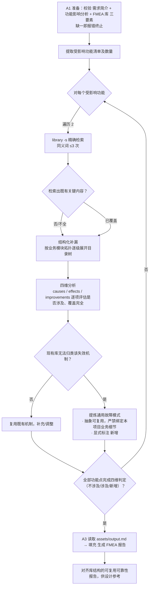

- **用户交互**：无（随设计流程自动执行）；FMEA 报告作为 SDD 的可靠性章节依据，参与 3.6 门禁评审。
- **库升级路径**：FMEA 库为不可变基线，新增/补充内容以"抽象通用"形式存在于分析报告并由独立库维护流程回收，不直接改库。

---

> **一句话总结**：把"需求 → 设计"的整条链做成 **反演澄清（先穷尽歧义）→ 场景锚定（防编造）→ 规格分解（EARS + 功能/规格判定）→ 多类型 SDR 影响（CLI 驱动，条件）→ 动态模板组装（方法/输出/检查项三源同构）→ 双门禁评审（独立子代理 + 用户批注）→ 探索委派（防上下文爆炸）→ 红队验证（仅 High 熔断）→ 围栏契约（管住实现边界）→ FMEA 补漏（可靠性必做）** 的可执行流水线，规则全部落盘为 Skill / SOP / 模板与 checklist。