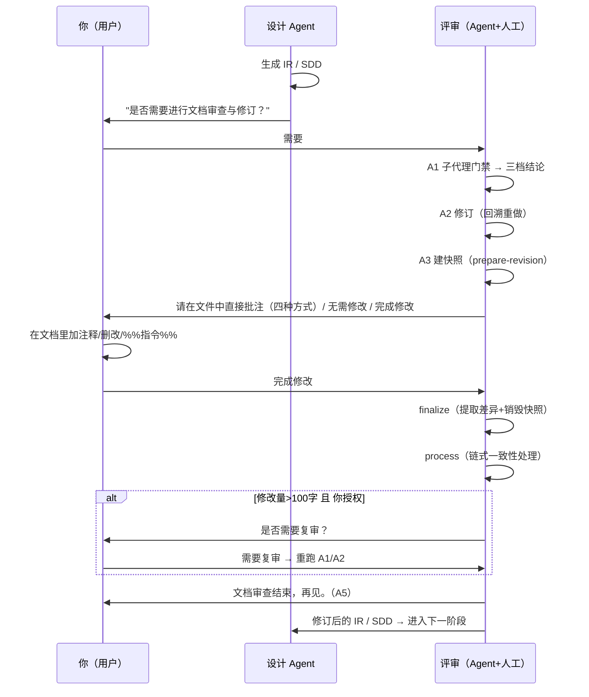

# Agent + 人工评审

## 1. 是什么

评审是"Agent 生成文档"与"文档正式流向下一阶段"之间的**质量门禁**，由两层组成：

**① Agent 评审门禁**（`aet-req-review`，pipeline 5 阶段）：

```
A1 子代理门禁 ──→ A2 修订 ──→ A3 用户门禁 ──→ A4 复审(可选) ──→ A5 结束
```

- **A1 子代理门禁**：把"交付物 + 评审规则（`deliverable-review.md`）+ 动态 checklist"交给**独立子代理**打分，输出三档结论：`fully passed`（≥85）/ `conditionally passed`（70–84）/ `failed`（<70）。多份交付物并行评审，路由按**最差结果**为准；
- **A2 修订**：打回后不是"表面补丁"，而是**回溯文档生成方法论**——影响到的生成步骤被重新执行（重新探索、重新追问、重新设计）；
- **A3 用户门禁**：加载 `aet-req-user-review` 技能，创建**快照**，引导你在原文档上直接批注/修改，然后提取差异并链式一致地处理；
- **A4 复审（可选）**：若 A3 修改量大（>100 字符）且你授权，重跑 A1/A2；
- **A5 结束**：输出"文档审查结束，再见。"

**② 人工评审/批注**（`aet-req-user-review`，pipeline 4 阶段）：

```
A1 prepare（建快照）→ A2 guide（引导你编辑）→ A3 finalize（提取差异+销毁快照）→ A4 process（链式处理 hunks）
```

---

## 2. 为什么

1. **单一自审不可靠** —— Agent 自己生成又自己审，很容易共享同一套盲区。子代理用**独立上下文评审**（不继承生成记忆），评价更客观；
2. **质量需要硬指标而非感觉** —— 三级严重度计分（ERROR −5 / WARNING −2 / INFO −0），`≥85 Pass、70–84 Conditional、<70 Fail`，结论可复现；
3. **人是需求的最终裁决者** —— 文档最终要反映真实业务；用户在文档内**就地批注**比来回对话高效得多；
4. **保留回滚能力** —— 人工直接改文件很危险。**快照（snapshot）机制保证任何误删/误改都可回滚**，这是"放心批注"的前提；
5. **防"越改越乱"** —— 批注改动会牵一发动全身（改一个 FR 编号要连带改引用、验收准则、追踪矩阵…）。A4 的**链式一致性扫描**负责把这种"牵连修改"一次做全。

---

## 3. 怎么做：人工如何标注与修改

### 3.1 触发用户门禁

在需求分析（S3）或功能设计（A4）阶段结束时，Agent 会询问是否进行文档审查与修订：

> "我已经完成了设计文档的生成。是否需要进行文档审查与修订？"

选择需要 → 进入用户门禁 → 运行 `prepare-revision` 创建快照，然后给出如下编辑界面：

```
快照已创建，请直接在以下文件中进行编辑:
- <FILE_PATH_1>
- <FILE_PATH_2>

批注方式:
1) 直接添加文本（Agent 自动润色）
2) 删除文本（Agent 自动定位引用处并同步修订）
3) 修改原有文档（Agent 自动润色）
4) %% 开头的批注或指令（如 %%增加示例%%）

完成编辑后选择下方选项。
```

完成编辑后选择：`["无需修改", "完成修改"]`。

> ⚠️ **关键安全规则**：快照创建（A1）成功之前，**绝对不要在原文档上编辑**——没有快照就没有回滚，任何误删都不可恢复。

### 3.2 四种批注方式详解

| # | 方式 | 你在文档里做什么 | Agent 会怎么做 |
|---|---|---|---|
| 1 | **直接添加文本** | 在任意位置插入新内容 | 整合进交付物、按文档风格润色（US/UK 拼写、正式/口语、术语表对齐）、检查是否与已有需求冲突 |
| 2 | **删除文本** | 删除不要的内容 | 移除对应内容，**全文档扫描**清理孤立引用、悬空交叉引用、矛盾表述，并重排编号 |
| 3 | **修改原有文档** | 就地改原文（如把"响应时间 <3 秒"改成"<1 秒"） | 以你的修改为新准则，调整上下文；若改动影响需求范围/优先级，同步更新依赖章节 |
| 4 | **`%%指令%%`** | 插入以 `%%` 开头的指令文本 | 识别意图后执行任务再更新文档，详见 3.3 |

### 3.3 `%%` 指令详解

`%%` 开头的批注不是内容，而是**给 Agent 的执行指令**。两类：

**直接修改指令**（就地小改）：

```
%%增加示例%%              → 在当前章节补充一个示例
%%细化验收标准%%           → 展开当前 FR 的验收准则
```

**附加工作指令**（先执行再落笔）：

```
%%调研竞品方案%%           → 先做竞品调研，再把结论写进文档
%%补充技术约束%%           → 先分析技术约束，再补充到文档
%%运行导入脚本验证%%        → 先跑工具验证，再更新文档
```

> **约定**：如果指令需要跑脚本、取数或生成 >200 字符的大段内容（"外部任务"），Agent 会列出要执行的工具与命令；工具缺失时**报告缺什么并中止该指令**，而不是硬编。`%%` 指令执行失败会记入 A3/A4 输出（含错误载荷），**不会半途落笔**。

### 3.4 提交：finalize → 处理 hunks

你选择"完成修改"后：

1. **A3 finalize**：运行 `finalize-revision`，对比"编辑后的文件 vs 快照"提取差异（hunks），然后**销毁快照**。返回 `hasAnyChanges` 与修改统计；
2. **A4 process**：Agent 逐条处理每个 hunk——新增内容按风格整合、删除内容全局清理引用、修改内容同步相邻章节；两种 hunk 冲突时停止并给你明确选项（选 A / 选 B / 手动合并）；
3. **链式一致性**：每个 hunk 处理后，Agent 会**全文档扫描**这些链条：

| 变更源 | 需要连带更新的区域 |
|---|---|
| FR 增加/删除 | FR 编号、交叉引用、验收准则、追踪矩阵 |
| NFR 阈值变更 | 设计约束、验收准则、可行性章节 |
| 术语变更 | 全文出处、术语表 |
| 边界变更 | 纳入/排除范围、优先级、依赖图 |
| 优先级变更 | 路线图、资源分配、里程碑 |

> 这保证"你只改一处，文档却保持一致"——不会留下半截引用或自相矛盾。

---

## 4. 怎么做：多轮修改直到完成任务

评审不是一次性的。`aet-req-review` 门禁循环的设计是：**failed → 必下一轮；Pass / Conditional → 可跳过下一轮；任何一轮循环超过 2 次 → 熔断，由你裁决**。

### 4.1 一轮的完整路径

```
[可选] A1 子代理门禁（failed → 进入）
       │
       ▼
A2 修订（回溯生成方法论重做）
       │
       ▼
A3 用户门禁
   ├─ 快照（prepare-revision）→ 你直接在文件里批注/修改 → 完成修改
   ├─ finalize（提取差异+销毁快照）
   └─ process（链式一致性处理 hunks）
       │
       ▼
[可选] A4 复审（仅当修改量>100字 且 你授权）
       │
       ▼
A5 完成：输出"文档审查结束，再见。"
```

### 4.2 多轮的正确姿势

1. **每轮都从 A1 重新开始（快照必须是新的）**：A3 结束时快照已被销毁，下一轮必须重新 `prepare-revision`。**不存在跨轮持久快照**；
2. **一轮一个心流**：在 A2/A3 之间，你只管把想改的都标在文档里（四种方式混用），一次性提交；Agent 集中做链式处理，避免"改一点、跑一轮"的低效；
3. **大改动授权复审**：如果这一轮你改了 >100 字符（比如整段重写），Agent 会问"是否需要进行复审？"（`需要复审 / 跳过复审`）。选择"需要复审"就再跑一轮 A1/A2 独立审查，确保大改没有引入新的不合格点；
4. **熔断机制**：某轮门禁 loop 超过 2 次仍未全通过 → Agent 停下请你裁决：`忽略并继续` / `继续门禁循环`（计数器重置）。这是一道为了你**不被无限循环消耗注意力**的保护；
5. **完成条件**：文档达到"你确认无需再改 + Agent 门禁通过"即可进入下一阶段。不是必须"毫无瑕疵"，是"达到交付基准"。

### 4.3 常见错误与规避

| 错误 | 后果 | 规避 |
|---|---|---|
| 没等快照建好就编辑 | 无回滚能力，误删不可恢复 | 看到"快照已创建"再动手 |
| 在大改一轮后跳过复审 | 大改可能引入新问题未被发现 | 修改量 >100 字时选择"需要复审" |
| 上一轮的批注没被处理就开新一轮 | 下一轮从旧基线继续，改动丢失 | 每轮都走完 A3 → 确认本轮 hunks 已处理完 |
| 期望一次评审就改完所有问题 | 复杂文档必然多轮 | 按 4.2 的多轮节奏推进，善用"熔断后人工裁决" |

---

## 5. 与你（用户）相关的完整时序图



---

## 6. 常见问题

| 问题 | 处理 |
|---|---|
| 子代理门禁打回的条件 | `< 70 分（Fail）`；检出的每条问题带 `级别 + 位置 + 建议`，可逐条跟踪 |
| 我不想参与人工评审 | A3 用户门禁是强制流程的一部分，但你可选择"无需修改"快速通过；A4 复审只有在你授权时才会跑 |
| 批注冲突了（两处修改打架） | Agent 停止处理、给出选项：选 A / 选 B / 手动合并 |
| 快照丢了 / 会话超时 | 系统自动执行 finalize 捕获"未修改"状态并销毁快照；通知你会话过期，需从 A1 重新开始 |
| 我编辑了不在快照列表里的文件 | 会被标记为 `untracked edits`，不会被处理；提示你先对它们重跑 A1 |