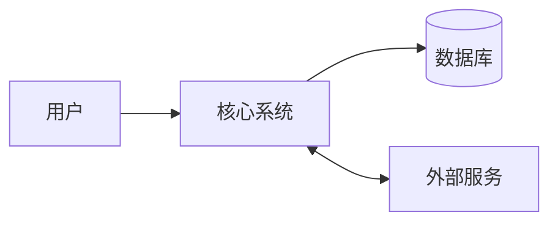
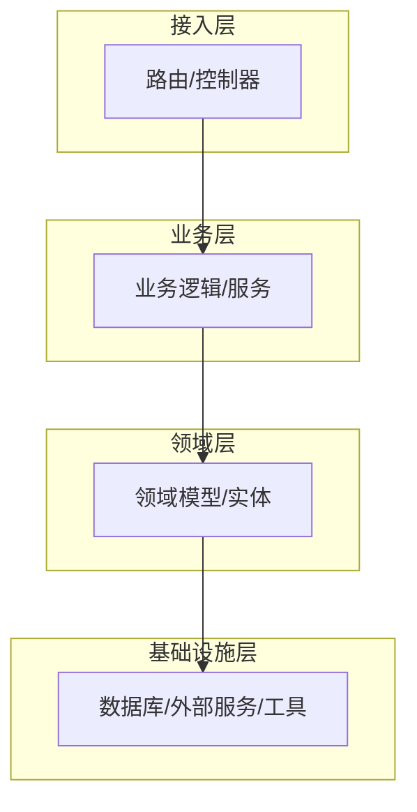
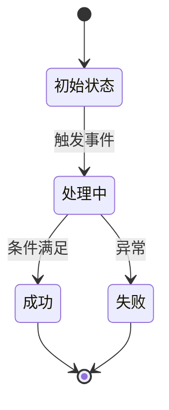
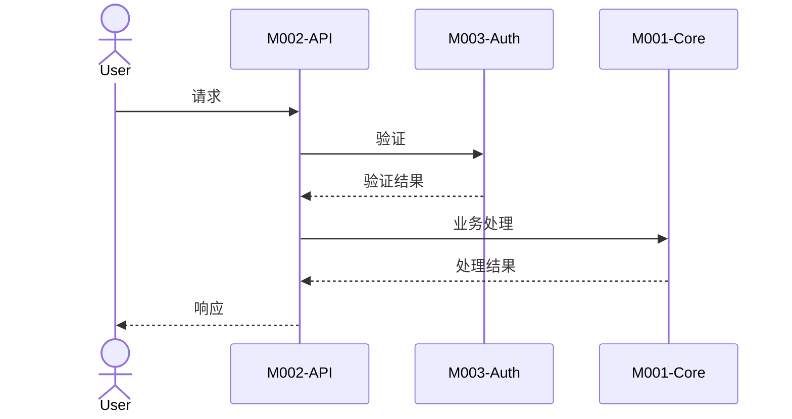

# 系统架构

## 1. 系统边界

### 1.1 系统边界图

<!-- instruction: Show the interaction between the system and external users and external systems. -->

### 1.2 外部参与者与外部系统

<!-- rule: Each external dependency must specify the integration method and key files. -->

|类型|名称|用途|集成方式|关键文件|
|-|-|-|-|-|
|[]|[]|[]|[]|[]|

---

## 2. 系统分层

<!-- instruction: Show the system's layered structure, and mark each layer's responsibility boundaries and constraints. -->

|层次|职责|关键组件|禁止事项|
|-|-|-|-|
|接入层|[]|[]|不得包含业务逻辑|

---

## 3. 跨切面关注点

<!-- instruction: Describe cross-cutting concerns that span multiple modules and their unified handling approach, e.g., error handling, logging, authentication/authorization, configuration management, data validation, etc. -->

|关注点|实现方式|关键文件|说明|
|-|-|-|-|
|错误处理|[]|[]|[]|

---

## 4. 核心业务流程

### 4.1 入口点分析

<!-- instruction: List all entry types of the program (startup entry, request entry, scheduled task entry, etc.). -->

|入口类型|入口文件|触发方式|说明|
|-|-|-|-|
|应用启动|[]|命令行/容器启动|[]|

### 4.2 状态管理策略

<!-- instruction: Describe how different types of state are managed and the direction of data flow (unidirectional/bidirectional). -->

|状态类型|管理方式|存储位置|作用域|关键文件|
|-|-|-|-|-|
|[]|[]|[]|[]|[]|

### 4.3 核心流程

<!-- instruction: Select the most important 3-5 business processes.
                 Each process must include: trigger conditions, state transitions, cross-module collaboration, and key decision points. -->

#### 流程 1：[Process Name]

**触发条件**：[To be filled]
**涉及模块**：M001, M002, ...
**关键文件**：[file1:line], [file2:line]

**状态流转**

**跨模块序列图**

<!-- instruction: Add processes 2–5 in the same format. -->

#### 流程 2：[Process Name]

...

### 4.4 端到端数据流

<!-- instruction: Show the main path of data from input to output and the transformations at each stage. -->

|数据流|输入|输出|经过模块|变换说明|
|-|-|-|-|-|
|[]|[]|[]|[]|[]|

---

## 5. 扩展性与集成能力

### 5.1 插件/扩展机制

<!-- instruction: Check for extension points such as hook registration, plugin loading, middleware pipelines, etc. -->

|扩展点|类型|位置|说明|
|-|-|-|-|
|[]|Hook/Plugin/Middleware/Event|[]|[]|

### 5.2 对外 API 边界

<!-- instruction: Identify externally exposed interface protocols and their documentation completeness. -->

|协议|端点/定义文件|文档化程度|说明|
|-|-|-|-|
|REST/GraphQL/gRPC/WebSocket|[]|完整/部分/无|[]|

---

## 6. 架构风险与技术债务

### 6.1 系统级风险

|风险|影响范围|概率|严重度|优先级|建议措施|
|-|-|-|-|-|-|
|[]|[]|高/中/低|高/中/低|P1–P3|[]|

### 6.2 技术债务

|区域|债务类型|原因|严重度|偿还建议|
|-|-|-|-|-|
|[]|设计债/代码债/测试债/文档债|[]|严重/中等/轻微|[]|

### 6.3 扩展性瓶颈

|瓶颈点|当前限制|触发条件|突破方案|
|-|-|-|-|
|[]|[]|[]|[]|
