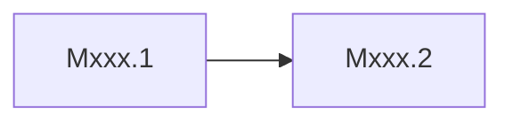
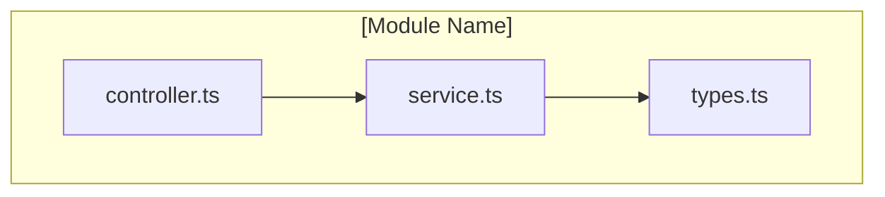
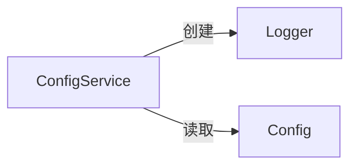
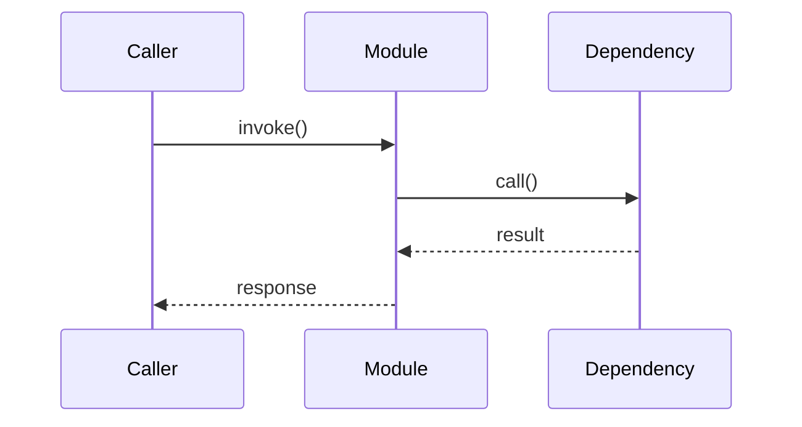

# [Mxxx]-[Module Name]

## 概述

<!-- instruction:
  Answer the following three questions in 2-3 sentences:
  1. What problem does this module solve?
  2. What role does it play in the system architecture? (refer to the layering in Architecture.md)
  3. If it were removed, what capabilities would the system lose?
-->
[To be filled]

---

## 元数据

|字段|值|
|-|-|
|模块 ID|[]|
|路径|[]|
|文件数|[]|
|代码行数|[]|
|主要语言|[]|
|所属层|[]|

---

## 子模块

<!--
  instruction: Keep this section only if this module contains submodules; otherwise delete the entire section.
  rule: Submodules use the same template as this document and are stored under a directory with the same name.
        Example: M001's submodules are stored at references/modules/M001/M001.1-xxx.md
-->

|ID|名称|职责|文档链接|
|-|-|-|-|
|[Mxxx.1]|[]|[]|[Details](./Mxxx/Mxxx.1-yyy.md)|
|[Mxxx.2]|[]|[]|[Details](./Mxxx/Mxxx.2-zzz.md)|

### 子模块依赖关系



---

## 文件结构

<!-- instruction:
  Use the Mermaid graph to show dependencies between files within the module (who imports whom), not the directory hierarchy.
  Sort the table by dependency order: files depended on the most should come first.
-->



|文件|职责|行数|主要导出|
|-|-|-|-|
|[]|[]|[]|[]|

---

## 功能树

<!--constraint: Function tree is a structured mapping of what a system *can do*, focusing on business functions and user value. Node must be an independent functional description from the user or business-flow perspective, in the form of "verb + noun" or "noun + function" (e.g., Manage product information, Process order refunds). DO NOT include code-level concepts such as Class, Function, or Method. -->

```text
- [e.g. 电子商城系统]
  - [e.g. 购物车管理]
    - [e.g. 清空购物车]
    - [e.g. 添加商品]
  - [e.g. 订单处理]
    - [e.g. 创建订单]
```

### 功能清单

|名称|类型|文件|行号|描述|
|-|-|-|-|-|
|[]|fn/class/method/const/type|[]|[]|[]|

### 职责边界

**做什么**

- [To be filled]

**不做什么**

- [To be filled]

---

## 公共接口契约

<!-- instruction:
  This section is the only reference for how other modules interact with this module.
  Any changes to the interfaces here must be checked against all modules listed under "被依赖于".
  Completeness requirement: the result of `grep -r "export" {module_path}` must all appear in this section.
-->

### 接口关系图

<!-- instruction: Show the relationships among the classes/functions/types exported by this module. -->



### 类型定义

<!-- rule: Signatures must match the source code. Include file path and line number. -->

```typescript
// [File: src/core/types.ts:15]
export interface Config {
  port: number       // 服务端口
  debug: boolean     // 调试模式
}
```

|类型名|字段/方法|类型|描述|位置|
|-|-|-|-|-|
|[]|[]|[]|[]|path:line|

### 导出函数

#### `functionName()`

```typescript
// [File: src/core/index.ts:28]
export function functionName(param: Type): ReturnType
```

|参数|类型|必需|描述|
|-|-|-|-|
|[]|[]|[]|[]|

- **返回**：`ReturnType` — [具体描述，不能只写"返回结果"]
- **抛出**：`ErrorType` — [触发条件]

**使用示例**：

```typescript
import { functionName } from '@/core'
const result = functionName(param)
```

### 导出类

#### `ClassName`

|方法|签名|描述|位置|
|-|-|-|-|
|[]|[]|[]|path:line|

---

## 内部实现

<!-- instruction:
  This section describes implementation details. Changing internal implementation does not require notifying dependents, but this document must be updated.
  Focus on: why it is implemented this way, rather than only describing what the code does.
-->

### 核心内部逻辑

|函数/类|文件|行号|用途|
|-|-|-|-|
|[]|[]|[]|[]|

### 设计模式

<!-- rule: Each pattern must have code evidence (file:line). Do not just say "we used pattern X".
     Explain: why this pattern was chosen and what problem it solves. -->

|模式|使用位置|使用原因|代码证据|
|-|-|-|-|
|[]|[]|[]|path:line|

### 关键算法 / 策略

<!-- instruction: If there are complex algorithms or business strategies, describe the core idea, boundary conditions, and complexity. -->

|算法/策略|用途|复杂度|文件|
|-|-|-|-|
|[]|[]|[]|[]|

---

## 关键流程

<!-- instruction:
  List 1-3 most important execution flows within this module.
  Each flow includes three views: call chain (quick location), sequence diagram (interaction order), and step table (detailed explanation).
-->

### 流程 1：[Process Name]

**调用链**

<!-- rule: Each node must include file:line. -->

```text
entry.ts:10 → validate.ts:25 → process.ts:42 → store.ts:18
```

**时序图**



**步骤详解**

|步骤|说明|文件位置|
|-|-|-|
|1|[To be filled]|path:line|
|2|[To be filled]|path:line|

---

## 依赖

### 内部依赖（项目内其他模块）

|模块|使用的接口|调用位置|
|-|-|-|
|[]|[]|path:line|

### 外部依赖（第三方包）

|包名|版本|用途|可替代性|
|-|-|-|-|
|[]|[]|[]|高/中/低|

---

## 代码质量与风险

### 代码坏味道

|问题|类型|文件|严重度|建议|
|-|-|-|-|-|
|[]|过大类/过长函数/重复代码/硬编码/过度耦合|path:line|高/中/低|[]|

### 潜在风险

|风险|触发条件|影响|文件|建议|
|-|-|-|-|-|
|[]|[]|[]|path:line|[]|

### 测试覆盖

|测试类型|覆盖情况|测试文件|说明|
|-|-|-|-|
|单元测试|有/无/部分|[]|[]|
|集成测试|有/无/部分|[]|[]|

---

## 开发指南

### 洞察

[To be filled]

### 扩展指南

<!-- instruction: Explain how to add new functionality to this module following existing patterns.
     For example: "To add a new API endpoint you need to: 1) create a route file under routes/ 2) create a handler under handlers/ 3) ..." -->

### 风格与约定

<!-- instruction: Record module-specific coding conventions (beyond project-level conventions).
     For example: naming rules, error handling approach, log format, etc. -->

### 设计哲学

<!-- instruction: Record this module's design principles and key tradeoff decisions.
     For example: "We chose event-driven over direct calls because ___" -->

### 修改检查清单

<!-- instruction: List the items that must be checked when modifying this module. Generate based on actual dependencies and code structure. -->

- [ ] [To be filled]
