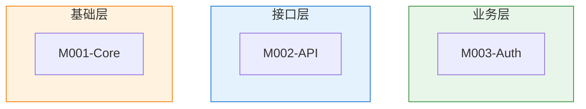
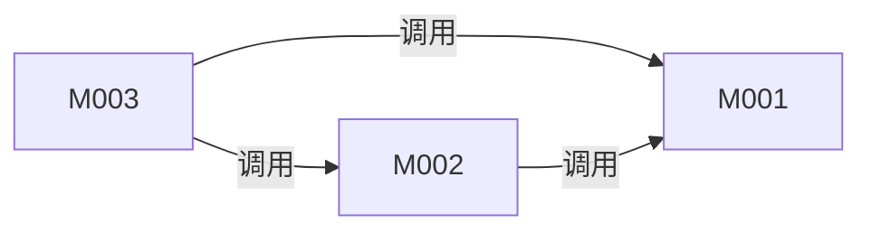

# 模块总览

## 模块划分说明

<!-- instruction: Explain the basis for module decomposition (by business domain / by technical layer / by functional responsibility), and its mapping to the layering in architecture.md. -->

[To be filled]

---

## 模块层次树

<!-- instruction: Use a tree structure to show all modules (including nested ones). Each module should include its ID and a one-sentence responsibility. -->

```text
[Project Name]
├── M001-[Name]          # [One-line responsibility]
│   ├── M001.1-[Name]    # [One-line responsibility]
│   └── M001.2-[Name]    # [One-line responsibility]
├── M002-[Name]          # [One-line responsibility]
└── M003-[Name]          # [One-line responsibility]
```

---

## 模块清单

<!-- rule: For nested modules, use indented IDs to represent hierarchy (M001 → M001.1 → M001.1.1). -->

|ID|名称|职责|路径|所属层|文档链接|
|-|-|-|-|-|-|
|M001|[]|[]|[]|[]|[Details](modules/M001-xxx/M001-xxx.md)|
|M001.1|[]|[]|[]|[]|[Details](modules/M001-xxx/M001.1-yyy.md)|
|M002|[]|[]|[]|[]|[Details](modules/M002-xxx.md)|

---

## 模块分层视图

<!-- instruction: Pure layered view. Only show module layer membership; do not draw dependency arrows. -->



---

## 模块依赖

<!-- instruction: Arrow semantics: A --> B means A depends on B (A calls B's interfaces). -->
<!-- rule: Only show dependencies between top-level modules here; submodule dependencies are described in each module-detail document. -->



### 依赖矩阵

<!-- instruction: Rows = callers, columns = callees; ✓ indicates a dependency. Used to quickly identify coupling hotspots. -->

|↓ 调用 \ 被调用 →|M001|M002|M003|
|-|-|-|-|
|M001|—|[]|[]|
|M002|[]|—|[]|
|M003|[]|[]|—|

### 外部依赖映射

|模块|外部包/服务|版本|用途|风险|
|-|-|-|-|-|
|[]|[]|[]|[]|[]|

### 耦合热点分析

|模块|被依赖次数|风险等级|说明|
|-|-|-|-|
|[]|[]|[]|[]|

---

## 通信模式

<!-- instruction: Analyze communication methods between modules. A project may mix multiple patterns.
                 Patterns include direct function calls, event-driven, message queues, HTTP/RPC, shared state, etc. -->

|模式|使用场景|涉及模块|实现方式|关键文件|
|-|-|-|-|-|
|直接函数调用|[]|[]|import + 函数调用|[]|
