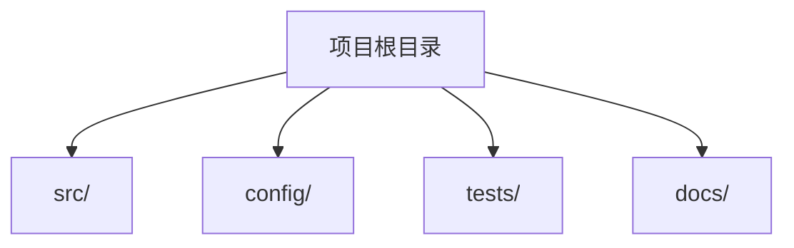

# 概览

## 核心技术栈

<!-- rule: Version numbers must come from lock files or configuration files (package.json, go.mod, pyproject.toml, etc). If a version cannot be confirmed, mark it as "TBD". -->
<!-- instruction: Categories include language, framework, database, package manager, build tools, etc. -->

|类别|名称|版本|用途|
|-|-|-|-|
|语言|[]|[]|[]|

---

## 目录结构

<!-- instruction: Analyze the naming conventions of top-level directories, distinguishing source code, configuration, tests, and build artifacts.
                 Replace the Mermaid graph below with the actual directory structure. -->



|目录|用途|关键文件|
|-|-|-|
|[]|[]|[]|

---

## 快速开始

### 前置条件

<!-- instruction: List prerequisites required to run the project (language version, system dependencies, etc.). -->

- [To be filled]

### 安装

<!-- rule: Installation commands must be traceable to configuration files. -->

```bash
[To be filled]
```

### 运行

```bash
[To be filled]
```

### 测试

```bash
[To be filled]
```

---

## 环境变量

<!-- rule: Each variable must specify its source file (e.g., .env.example, config.ts). -->

|变量名|用途|默认值|必需|来源文件|
|-|-|-|-|-|
|[]|[]|[]|[]|[]|

---

## 部署

<!-- instruction: Identify deployment-related files such as Dockerfile, CI/CD configs, cloud platform configs, etc. -->

|部署方式|配置文件|说明|
|-|-|-|
|[]|[]|[]|
