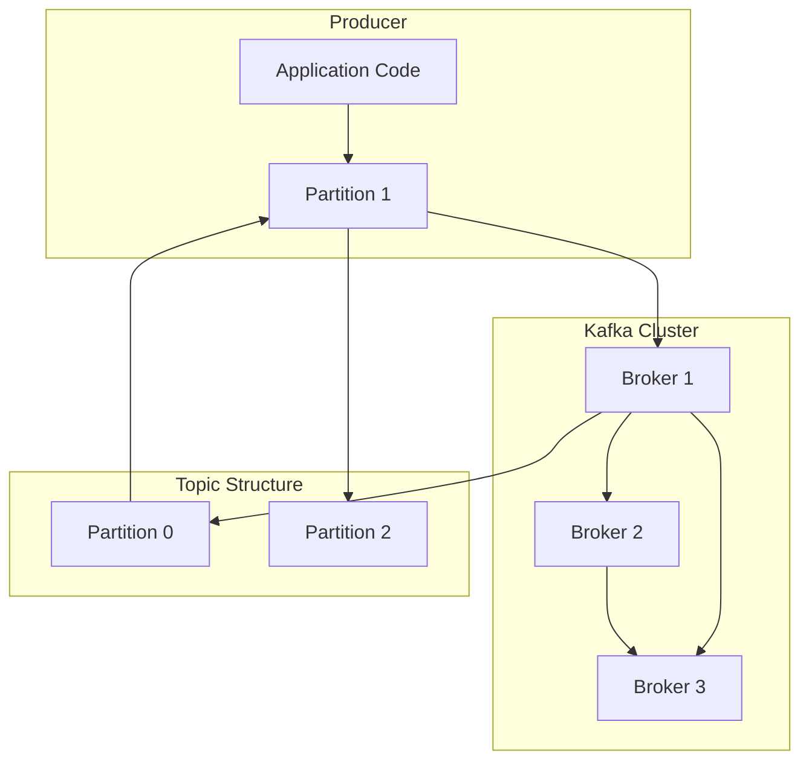

# Tech Infographic Generator

Generate clear, accurate, and easy-to-understand technical infographics with vivid analogies.

## Input Parameters

Users need to provide:

- **Tech Topic**: The technical concept to explain (e.g., "Kafka High Throughput Principles")
- **Theme Color**: HEX format, e.g. `#007AFF` (optional, has default)
- **Output Format**: `png` or `jpg`

### Option Configuration

**Common Theme Colors**:
| Theme Color | Style | Use Case |
|-------------|-------|----------|
| #007AFF | Tech Blue | AI / Cloud / Data |
| #34C759 | Success Green | Finance / E-commerce / Security |
| #FF9500 | Energy Orange | Marketing / Operations / Growth |
| #AF52DE | Dream Purple | Creative / Design / Product |
| #FF3B30 | Alert Red | Monitoring / DevOps / Faults |
| #00D4FF | Cyber Cyan | Blockchain / Web3 / Frontier |

**Output Format**: `png` (default, supports transparency) or `jpg` (smaller file size)

## Content Structure

A complete infographic contains the following sections:

```text
┌─────────────────────────────────────┐
│  [Header]  Tech Name + One-liner    │
└─────────────────────────────────────┘
┌─────────────────────────────────────┐
│  [Background]  Pain points as cards │
└─────────────────────────────────────┘
┌─────────────────────────────────────┐
│  [Core Concepts]  Card grid w/ icons│
└─────────────────────────────────────┘
┌─────────────────────────────────────┐
│  [How It Works]  Deep dive + Diag.  │
└─────────────────────────────────────┘
┌─────────────────────────────────────┐
│  [Pros & Cons]  Two-column table    │
└─────────────────────────────────────┘
┌─────────────────────────────────────┐
│  [Analogy]  Block quote, real-life  │
└─────────────────────────────────────┘
┌─────────────────────────────────────┐
│  [Use Cases]  Icon list presentation│
└─────────────────────────────────────┘
┌─────────────────────────────────────┐
│  [Key Takeaways]  3-column cards    │
└─────────────────────────────────────┘
```

## Workflow

### Step 0: Collect User Preferences

Use the `question` tool to ask the user:

```json
{
  "questions": [
    {
      "header": "Theme Color",
      "question": "Choose a theme color:",
      "options": [
        {"label": "Tech Blue #007AFF (Recommended)", "description": "AI / Cloud / Data Processing"},
        {"label": "Success Green #34C759", "description": "Finance / E-commerce / Compliance"},
        {"label": "Energy Orange #FF9500", "description": "Marketing / Operations / Growth"},
        {"label": "Dream Purple #AF52DE", "description": "Creative / Design / Product"},
        {"label": "Cyber Cyan #00D4FF", "description": "Blockchain / Web3 / Frontier Tech"}
      ]
    },
    {
      "header": "Output Format",
      "question": "Choose output format:",
      "options": [
        {"label": "PNG (Recommended)", "description": "Transparent background, lossless quality"},
        {"label": "JPG", "description": "Smaller file size, suitable for documents"}
      ]
    }
  ]
}
```

> **Note**: Default output is a vertical long-image (auto-height), optimized for social media sharing.

### Step 1: Deep Content Planning

Perform deep analysis on the tech topic to ensure the "How It Works" section has sufficient technical depth:

```text
Topic: [Technology Name]

Background & Problem: [What pain point this technology solves, 2-3 sentences]

Core Concepts (4-6 points):
1. [Concept Name]: [One-sentence explanation]
2. [Concept Name]: [One-sentence explanation]
...

How It Works (Deep Dive):
【Technical Breakdown】
1. [Point 1]: [Detailed explanation of principle/mechanism]
2. [Point 2]: [Detailed explanation of principle/mechanism]
3. [Point 3]: [Detailed explanation of principle/mechanism]
...

【Architecture Diagram - Using Mermaid】
```mermaid
[Generate detailed architecture/process/sequence diagram]
```

Pros:
- [Advantage 1]
- [Advantage 2]

Cons:
- [Limitation 1]
- [Limitation 2]

Analogy: [Real-life example, should be vivid and engaging]

Use Cases (2-3):
- [Scenario 1]
- [Scenario 2]

Key Takeaways (3 items):
- [Core point 1, one sentence summary]
- [Core point 2, one sentence summary]
- [Core point 3, one sentence summary]
```

### Step 2: Generate Mermaid Diagram

The "How It Works" section needs a Mermaid diagram to showcase technical details. Choose diagram type based on the technology:

- **Flowchart** (`flowchart`): Data processing flows, job scheduling
- **Sequence Diagram** (`sequenceDiagram`): Request-response flows, component interaction
- **State Diagram** (`stateDiagram`): State machines, lifecycles
- **Architecture Diagram** (`C4Context`): System architecture, component relationships

Example Mermaid output:



### Step 3: Output Middleware

Generate the following middleware files for the user to customize later:

```
output/
├── {topic}_infographic/
│   ├── generate.js          # Generator script (Node.js)
│   ├── template.html        # HTML template
│   └── config.json          # Content configuration (JSON)
```

### Step 4: Generate Infographic

Generate the image using the Playwright script:

```bash
node generate.js
```

## Middleware Reference

After generation, the Agent outputs complete middleware with 3 core files:

### 1. `config.json` - Content Configuration

```json
{
  "title": "Tech Topic",
  "subtitle": "One-line summary",
  "background": "Background problem description",
  "concepts": [
    {"icon": "🚀", "title": "Concept 1", "desc": "Description 1"},
    {"icon": "📊", "title": "Concept 2", "desc": "Description 2"}
  ],
  "workflow": ["Step 1", "Step 2", "Step 3"],
  "workflowDetail": "Detailed technical explanation...",
  "mermaid": "flowchart TB\n ...",
  "pros": ["Advantage 1", "Advantage 2"],
  "cons": ["Limitation 1", "Limitation 2"],
  "analogy": "Vivid analogy",
  "scenarios": ["Scenario 1", "Scenario 2"],
  "takeaways": ["Takeaway 1", "Takeaway 2", "Takeaway 3"],
  "themeColor": "#00D4FF",
  "layout": "vertical",
  "output": "./output.png"
}
```

### 2. `template.html` - HTML Template

Contains complete CSS styles and placeholders. Can be opened directly in a browser for preview.

**Key Placeholders**:
| Placeholder | Description |
|-------------|-------------|
| `{TITLE}` | Title |
| `{SUBTITLE}` | Subtitle |
| `{BACKGROUND}` | Background description |
| `{CONCEPTS}` | Core concept card HTML |
| `{WORKFLOW}` | Workflow step HTML |
| `{WORKFLOW_DETAIL}` | Detailed technical breakdown |
| `{MERMAID}` | Mermaid diagram code (flowchart syntax only, no tags) |
| `{PROS}` | Pros list |
| `{CONS}` | Cons list |
| `{ANALOGY}` | Vivid analogy |
| `{SCENARIOS}` | Use cases |
| `{TAKEAWAYS}` | Key takeaways |
| `{THEME_COLOR}` | Theme color |

**Note**: Mermaid 10.x requires the `<pre class="mermaid">` tag; the template is already configured correctly.

### 3. `generate.js` - Generator Script

```javascript
const { chromium } = require('playwright');
const path = require('path');
const fs = require('fs');
const { execSync } = require('child_process');
const config = require('./config.json');

function findSystemNode() {
    try {
        const output = execSync('where node', { encoding: 'utf8', timeout: 5000 });
        const match = output.split('\n')[0].trim();
        if (match && fs.existsSync(match)) return match;
    } catch (e) {}
    const commonPaths = [
        'C:\\Program Files\\nodejs\\node.exe',
        'C:\\Program Files (x86)\\nodejs\\node.exe',
    ];
    for (const p of commonPaths) {
        if (fs.existsSync(p)) return p;
    }
    return null;
}

function findSystemChrome() {
    const possiblePaths = [
        'C:\\Program Files\\Google\\Chrome\\Application\\chrome.exe',
        'C:\\Program Files (x86)\\Google\\Chrome\\Application\\chrome.exe',
        process.env.LOCALAPPDATA + '\\Google\\Chrome\\Application\\chrome.exe',
    ];
    
    for (const p of possiblePaths) {
        if (fs.existsSync(p)) return p;
    }
    
    try {
        const output = execSync('where chrome', { encoding: 'utf8', timeout: 5000 });
        const match = output.split('\n')[0].trim();
        if (match && fs.existsSync(match)) return match;
    } catch (e) {}
    
    return null;
}

function checkSystemPlaywright() {
    try {
        require('playwright');
        return true;
    } catch (e) {
        return false;
    }
}

function buildConceptsHTML(concepts) {
    return concepts.map(c => `
        <div class="concept-card">
            <div class="concept-icon">${c.icon}</div>
            <div class="concept-title">${c.title}</div>
            <div class="concept-desc">${c.desc}</div>
        </div>
    `).join('');
}

function buildWorkflowHTML(steps) {
    return steps.map((step, i) => `
        <div class="workflow-item">
            <div class="workflow-num">${i + 1}</div>
            <div class="workflow-text">${step}</div>
        </div>
    `).join('');
}

function buildProsConsHTML(items) {
    return items.map(item => `<li>${item}</li>`).join('');
}

function buildScenariosHTML(scenarios) {
    return scenarios.map(s => `
        <div class="scenario-item">
            <span class="scenario-icon">🎯</span>
            <span class="scenario-text">${s}</span>
        </div>
    `).join('');
}

function buildTakeawaysHTML(takeaways) {
    return takeaways.map((t, i) => `
        <div class="takeaway-card">
            <div class="takeaway-num">${i + 1}</div>
            <div class="takeaway-text">${t}</div>
        </div>
    `).join('');
}

async function generate() {
    let html = fs.readFileSync('./template.html', 'utf8');
    
    html = html.replaceAll('{TITLE}', config.title);
    html = html.replaceAll('{SUBTITLE}', config.subtitle);
    html = html.replaceAll('{BACKGROUND}', config.background);
    html = html.replaceAll('{CONCEPTS}', buildConceptsHTML(config.concepts));
    html = html.replaceAll('{WORKFLOW}', buildWorkflowHTML(config.workflow));
    html = html.replaceAll('{WORKFLOW_DETAIL}', config.workflowDetail);
    html = html.replaceAll('{MERMAID}', config.mermaid);
    html = html.replaceAll('{PROS}', buildProsConsHTML(config.pros));
    html = html.replaceAll('{CONS}', buildProsConsHTML(config.cons));
    html = html.replaceAll('{ANALOGY}', config.analogy);
    html = html.replaceAll('{SCENARIOS}', buildScenariosHTML(config.scenarios));
    html = html.replaceAll('{TAKEAWAYS}', buildTakeawaysHTML(config.takeaways));
    
    fs.writeFileSync('./temp.html', html);
    console.log('HTML template generated');
    
    const systemChrome = findSystemChrome();
    const launchOptions = { headless: true };
    if (systemChrome) {
        launchOptions.executablePath = systemChrome;
        console.log('Using system Chrome:', systemChrome);
    } else {
        console.log('WARNING: System Chrome not found, screenshot may fail');
    }
    
    const browser = await chromium.launch(launchOptions);
    const page = await browser.newPage();
    
    const baseWidth = config.layout === 'vertical' ? 1080 : 1920;
    
    await page.setViewportSize({ width: baseWidth, height: 100 });
    await page.goto(`file://${path.resolve('./temp.html')}`, { waitUntil: 'networkidle' });
    
    try {
        await page.waitForSelector('pre.mermaid svg', { timeout: 20000 });
        console.log('Mermaid rendered successfully');
    } catch (e) {
        console.log('Mermaid render timeout, continuing');
    }
    
    await page.waitForTimeout(2000);
    
    const bodyHandle = await page.$('body');
    const boundingBox = await bodyHandle.boundingBox();
    const contentHeight = Math.ceil(boundingBox.height);
    const contentWidth = Math.ceil(boundingBox.width);
    
    console.log(`Content size: ${contentWidth}x${contentHeight}`);
    
    await page.setViewportSize({ width: contentWidth, height: contentHeight });
    await page.screenshot({ 
        path: config.output, 
        clip: { x: 0, y: 0, width: contentWidth, height: contentHeight }
    });
    await browser.close();
    
    fs.unlinkSync('./temp.html');
    console.log('Generated:', config.output);
}

generate().catch(e => {
    console.error('Generation failed:', e);
    process.exit(1);
});
```

**Key Improvements**:

- `findSystemNode()` prioritizes the system-installed Node.js
- `findSystemChrome()` prioritizes the system-installed Chrome
- `checkSystemPlaywright()` checks whether Playwright is already installed
- Uses `fullPage: true` for screenshots to ensure full content capture
- **Important**: Loads content at a small viewport first, measures actual content height, then sets precise viewport for screenshot

## User Customization Guide

### Edit Content (Simplest)

**Edit `config.json`**:

1. Modify text content (title, description, concepts, etc.)
2. Change theme color (`themeColor`)
3. Change output format (`output` extension)
4. Run `node generate.js` to regenerate the image

### Edit Styles (Intermediate)

**Edit `template.html`**:

1. Modify CSS inside the `<style>` tag
2. Adjust font sizes, colors, spacing, etc.
3. Preview directly in a browser
4. Run `node generate.js` to regenerate the image

### Edit Structure (Advanced)

**Must modify both `template.html` and `generate.js`**:

1. Add or remove sections in the template
2. Update data in the config file accordingly
3. Modify the script to support new placeholders

### Example: Change Theme Color

```json
// config.json
{
  "themeColor": "#FF9500"
}
```

Run `node generate.js` to regenerate.

### Example: Change Title

```json
// config.json
{
  "title": "New Technology Topic",
  "subtitle": "New subtitle"
}
```

### Example: Add a New Concept

```json
// config.json
{
  "concepts": [
    {"icon": "🚀", "title": "Concept 1", "desc": "Description 1"},
    {"icon": "📊", "title": "Concept 2", "desc": "Description 2"},
    {"icon": "⚡", "title": "New Concept 3", "desc": "New Description 3"}
  ]
}
```

## Template Reference

The template uses CSS Grid/Flexbox layout, supporting:

- Custom theme colors
- Embedded Mermaid diagram rendering
- Sci-fi dark theme
- **Auto-height content** (no fixed height, content fully expands)

**Important**: The `body` and container elements in the template must NOT have a fixed height or `overflow: hidden`; they must allow content to expand naturally. Screenshots use JavaScript to measure actual content dimensions and capture the full content.

## Design Guidelines

### Default Color Scheme

| Role | Value | Description |
|------|-------|-------------|
| Primary | #007AFF | Theme accent color |
| Background | #0A0A1A | Dark sci-fi background |
| Secondary BG | #1A1A2E | Card background |
| Accent | #00D4FF | Highlights, icons |
| Success | #34C759 | Pros indicator |
| Danger | #FF3B30 | Cons indicator |
| Text Primary | #FFFFFF | Main text |
| Text Secondary | #A0A0B0 | Auxiliary text |

### Typography

- Title: 56px, bold, gradient color
- Subtitle: 28px, gray
- Card title: 26px, cyan accent
- Body: 22-26px, white/gray
- Line height: 1.6-1.8

## Output Quality

- Format: PNG (default) or JPG
- Text uses system font stack for cross-platform consistency
- Supports custom dimensions and theme colors
- **Auto-adaptive content size**: Image dimensions expand automatically based on actual content, ensuring all modules are fully displayed

## Dependency Installation (Global Reuse)

**Important Principles**:
1. Prioritize using existing system tools (Node.js, npm, Playwright, Chrome)
2. Do not reinstall dependencies in every project directory
3. Only prompt for installation when system tools are not found

### Tool Lookup Priority

**Node.js / npm**:
```bash
# 1. System PATH node
where node
# 2. Common installation paths
C:\Program Files\nodejs\node.exe
C:\Program Files (x86)\nodejs\node.exe
```

**Chrome**:
```bash
# 1. System PATH chrome
where chrome
# 2. Common installation paths
C:\Program Files\Google\Chrome\Application\chrome.exe
C:\Program Files (x86)\Google\Chrome\Application\chrome.exe
%LOCALAPPDATA%\Google\Chrome\Application\chrome.exe
```

**Playwright**:
```javascript
// Check if Playwright is already installed
try {
    require('playwright');
    console.log('Playwright already installed');
} catch (e) {
    console.log('Playwright not found');
}
```

### Recommended Workflow

1. **First use**: Ensure Node.js and Chrome are installed on the system
2. **Install Playwright globally once**:
   ```bash
   npm install -g playwright
   ```
3. **Project directory**: Only `npm init -y` needed; no local Playwright installation required
4. **Generate image**: Run `node generate.js`

### Tool Detection Logic in Generator Script

```javascript
// Check Node.js
function findSystemNode() {
    try {
        const output = execSync('where node', { encoding: 'utf8', timeout: 5000 });
        return output.split('\n')[0].trim();
    } catch (e) {
        return null;
    }
}

// Check Chrome
function findSystemChrome() {
    const possiblePaths = [
        'C:\\Program Files\\Google\\Chrome\\Application\\chrome.exe',
        'C:\\Program Files (x86)\\Google\\Chrome\\Application\\chrome.exe',
        process.env.LOCALAPPDATA + '\\Google\\Chrome\\Application\\chrome.exe',
    ];
    for (const p of possiblePaths) {
        if (fs.existsSync(p)) return p;
    }
    try {
        const output = execSync('where chrome', { encoding: 'utf8', timeout: 5000 });
        return output.split('\n')[0].trim();
    } catch (e) {}
    return null;
}

// Check Playwright
function checkSystemPlaywright() {
    try {
        require('playwright');
        return true;
    } catch (e) {
        return false;
    }
}
```

### Full Content Display Guarantee

**Problem**: Fixed viewport sizes cause content truncation

**Solution**:
1. The HTML template's `body` has no fixed height, allowing content to flow naturally
2. The generator script works in two steps:
   - Step 1: Load the page at a small viewport so content fully expands
   - Step 2: Measure `body` actual dimensions, set precise viewport
   - Step 3: Use `clip` to capture the exact content area

```javascript
// Step 1: Load content
await page.setViewportSize({ width: baseWidth, height: 100 });
await page.goto(`file://${path.resolve('./temp.html')}`, { waitUntil: 'networkidle' });

// Step 2: Measure actual dimensions
const bodyHandle = await page.$('body');
const boundingBox = await bodyHandle.boundingBox();
const contentHeight = Math.ceil(boundingBox.height);
const contentWidth = Math.ceil(boundingBox.width);

// Step 3: Precise screenshot
await page.setViewportSize({ width: contentWidth, height: contentHeight });
await page.screenshot({ 
    path: config.output, 
    clip: { x: 0, y: 0, width: contentWidth, height: contentHeight }
});
```

This ensures the generated image contains exactly all content, with no blanks or truncation.
