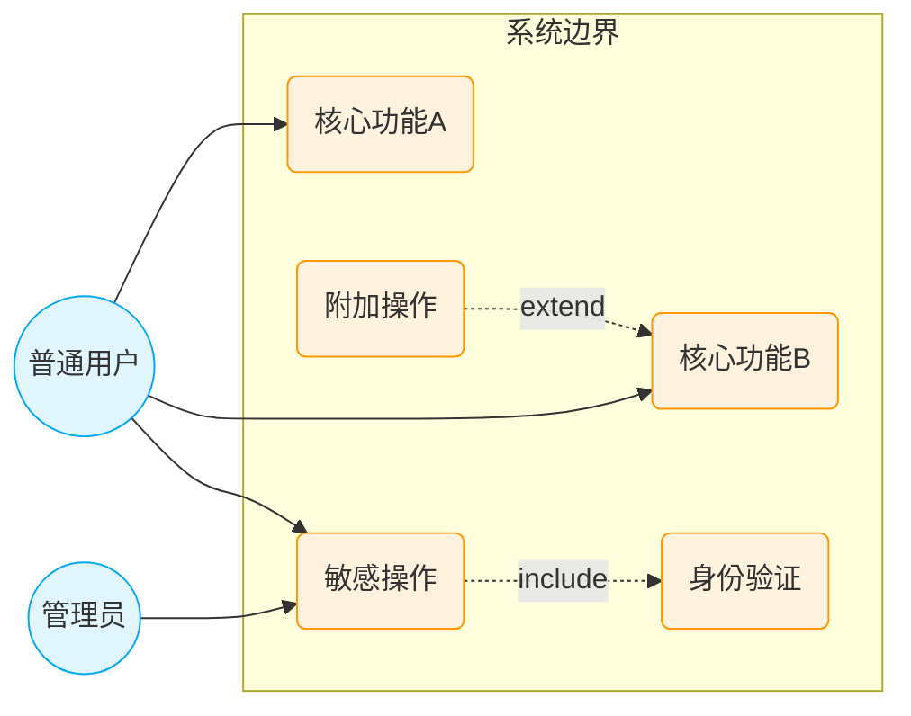

## 场景分析

<!-- policy: Extract scenarios from the business perspective — describe what an actor does to achieve a business goal. One scenario equals one business goal, NOT one API endpoint or code module: group endpoints serving the same user goal into a single scenario; conversely one module may yield several distinct scenarios. -->

<!-- guideline: Name scenarios in verb-object form expressing business intent ("创建订单", "库存盘点", "月度账单生成"). Keep all scenario names in one consistent language matching the business domain. State the business goal and trigger in the description. -->

<!-- guideline: Drop purely technical/internal operations (migrations, log rotation, health checks) unless they are a real business operation. Classify each scenario by business category — 业务 (core business operations), 操作 (daily operational tasks), 维护 (maintenance/admin). -->

<!-- guideline: Align granularity when creating new scenarios. Keep sibling scenarios at roughly the same abstraction level: if one sibling is "管理用户" and another is "重置某用户的密码", flatten or regroup them. -->

<!-- patch: Usually no more than 3 per scenario; mind the decomposition granularity. -->

|编号|类别|名称|是否新增|
|-|-|-|
|SC-001|[业务/操作/维护]|[Verb + Object, describes the scenario goal]|[Leave blank if no scenario library exists]|

## 用例分析

<!-- guideline: Draw ONE use case diagram (no more than the number of scenarios) covering the principal actors and the architecturally significant use cases — those carrying core business goals, sensitive/privileged operations, or key include/extend relationships. Do NOT diagram every use case; the table below is the exhaustive list. Use standard UML use case notation via mermaid. Keep actor names and use-case names consistent with the 场景分析 list above. -->

<!-- instruction: When designing error and exception paths, examine these commonly overlooked scenarios: external dependency failures (network timeout, service unavailable), invalid inputs (out-of-range, malformed), concurrency conflicts (simultaneous data modification), resource exhaustion (file size exceeded, connection pool depletion), dynamic resource changes (hot-plug, online/offline), task/data migration to new locations, mid-operation failures (network/server errors), extreme-scale inputs beyond NFR-defined norms, and privilege-exempt entities that bypass regular constraints (e.g., RT tasks, kernel threads). -->

<!-- patch: Every scenario must have associated use cases. -->

|编号|名称|Actor|触发|基本事件|扩展/备选/异常事件|关联场景|
|-|-|-|-|-|-|-|
|UC-001|[Verb + Noun, describes the actor's goal]|[All executors]|[Must be system-detectable]| [Main success path: a series of actions to achieve the actor's goal, indicating the services provided by the system. e.g. 1 [Step 1] 2 [Step 2] ...]|[1【扩展/备选/异常】[Description], 2 [...], ...]|SC-xxx|
