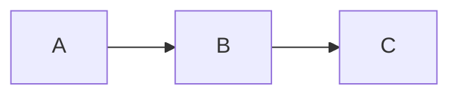
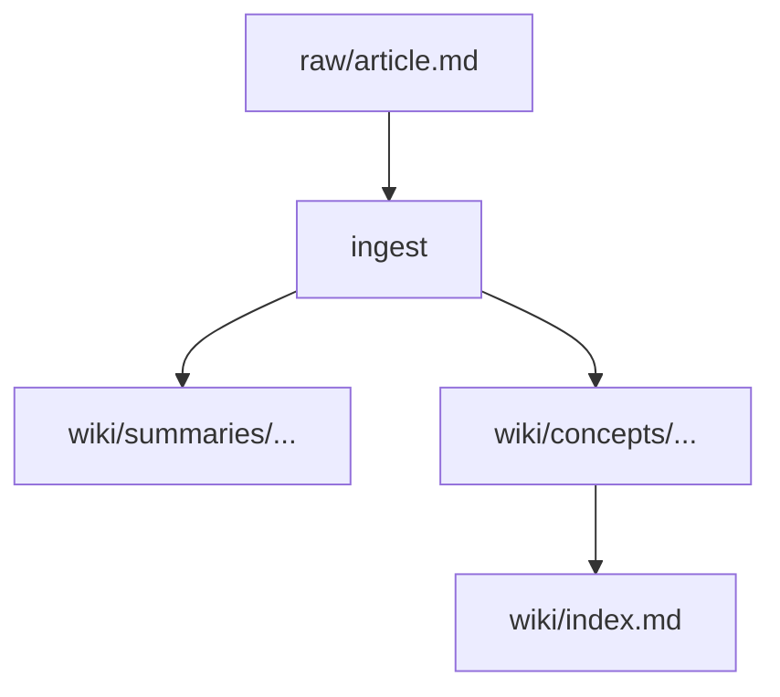

# Wiki Article Writing Guide

Guidelines for writing high-quality wiki articles. Read this before compiling new concept or entity pages.

## Length targets

| Page type | Target length | Notes |
|-----------|---------------|-------|
| Concept page | 400–1200 words | Information-dense, no filler. **Hard cap: 1200.** |
| Folder-split `index.md` | 150–400 words | Definition + sub-page map |
| Sub-page under a folder split | 400–1200 words | Covers one aspect |
| Entity page | 200–500 words | Factual, link-dense |
| Summary page | 150–400 words | Key points, not a rewrite |

Avoid filler. A 400-word, information-dense article beats an 800-word article with fluff.

## Divide and conquer — when to split

If a concept page **might** exceed ~1200 words, do not write it as a single file. Split it:

1. Create `wiki/concepts/<topic>/`.
2. Write `wiki/concepts/<topic>/index.md`:
   ```markdown
   ---
   title: <Topic>
   type: concept
   ...
   ---

   # <Topic>

   <One-sentence definition.>

   ## What it is

   <150–300 word overview.>

   ## Sub-pages

   - [[<Topic>/<aspect-1>]] — <one-line summary>
   - [[<Topic>/<aspect-2>]] — <one-line summary>
   - ...

   ## Sources

   - [[summaries/...]]
   ```
3. Write each `<aspect-N>.md` as a focused 400–1200 word page.
4. Update `wiki/index.md` to show the hierarchy under the folder-split entry using indented
   bullet points.

Signs a page needs splitting:
- Word count is approaching 1000.
- Three or more `##` top-level sections, each with its own `###` subsections.
- It touches multiple distinct concepts but lacks the space to develop them.
- You want to link to a specific section with `[[Page#Section]]` — that section probably
  deserves its own page.

## Concept page structure

```markdown
---
title: <title>
type: concept
created: YYYY-MM-DD
updated: YYYY-MM-DD
sources: [slug1, slug2]
tags: [tag1, tag2]
---

# <title>

<One-sentence definition or core idea.>

## What it is

<Explain the concept clearly. Assume the reader is technically literate but unfamiliar with
this specific topic.>

## How it works

<Mechanism, process, or structure. If it involves a flow, timing, hierarchy, or state, use
a mermaid diagram.>



## Key properties / tradeoffs

<Bullet list or short paragraphs. Use KaTeX for any formulas — inline `$...$` or block
`$$...$`.>

## Relationship to other concepts

- [[related concept A]] — how they relate
- [[related concept B]] — contrast or connection

## Open questions

<What this wiki does not yet know about this concept. Drives future ingestion.>

## Sources

- [[summaries/source-slug-1]] — (date) one-line description
- [[summaries/source-slug-2]] — (date) one-line description
```

## Entity page structure

```markdown
---
title: <name>
type: entity
entity_type: person | tool | paper | organization
created: YYYY-MM-DD
updated: YYYY-MM-DD
sources: [slug1]
tags: [tag1]
---

# <name>

<One-sentence description.>

## Main contributions / features

<What this entity is known for in the context of this wiki's topic.>

## Related concepts

- [[concept A]] — connection

## Sources

- [[summaries/source-slug]]
```

## Summary page structure

Summaries are a concise representation of a single source. They are not rewrites.

```markdown
---
title: summaries/<slug>
type: summary
source_url: https://...
source_type: article | paper | gist | video | podcast | ref
date: YYYY-MM-DD
ingested: YYYY-MM-DD
tags: [tag1]
---

# <source title>

**Source**: [<author/organization>](<URL>) · <date>

## Key takeaways

- <most important insight 1>
- <most important insight 2>
- <most important insight 3>

## Core claim

<2–4 sentences stating the main argument or finding.>

## Notable quotes

> "<original wording>" — <attribution>

## Concepts introduced / referenced

- [[concept A]]
- [[entity B]]
```

## Diagrams — always use mermaid

ASCII art is forbidden. Any flow, timing, hierarchy, or state diagram uses mermaid. Example:

Flow:
````markdown

````

## Formulas — always use KaTeX

Inline: `The loss is $\mathcal{L}(\theta) = \sum_i \ell(f_\theta(x_i), y_i)$.`

Block:
```markdown
$$
\mathcal{L}(\theta) = \frac{1}{N}\sum_{i=1}^{N} \ell\bigl(f_\theta(x_i), y_i\bigr) + \lambda \|\theta\|_2^2
$$
```

The web viewer renders math with KaTeX server-side. Obsidian renders natively.

## Wikilink rules

1. **Link the first mention of every entity or concept** — don't wait for a "natural spot".
2. **Link at most twice per article** — don't over-link the same page.
3. **Link existing concepts** — check `wiki/index.md` before creating new link targets.
4. **For folder-split pages**, link to the index with an alias:
   `[[concepts/Foo/index|Foo]]`.
5. **Backlink audit** — after writing a new article, grep existing articles for the new page's
   title and add inbound links.

## Handling contradictions between sources

When two sources contradict each other:

1. State both claims explicitly.
2. Note which source supports which claim.
3. Add it to the article's "Open questions" section **and** to the wiki's `CLAUDE.md`
   research questions.
4. **Do not** silently pick one — contradictions are valuable signals.

Example:
> Source A (2024) claims X. Source B (2026) claims Y, contradicting A. It is currently unclear
> whether this is a methodological difference or an error in one source. See
> [[summaries/source-a]] and [[summaries/source-b]]. The contradiction is recorded in
> `CLAUDE.md`'s research questions for later resolution.
